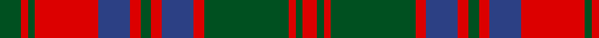

**Bands:** [GRGRBRGRBRGRGR](/stripes/grgrbrgrbrgrgr/) · **Stripes:** [DG R DG R DB R DG R DB R DG R DG R](/stripes/stripes14/) DG R DG R DB R DG R DB R DG R DG R

This was sourced from register-of-tartans.  It is a [14 band tartan](/bands/bands14/).

Original link https://www.tartanregister.gov.uk/tartanDetails.aspx?ref=4021

## Register references

External register numbers recorded for this tartan.

- Scottish Register of Tartans: [4021](https://www.tartanregister.gov.uk/tartanDetails.aspx?ref=4021)
- Scottish Tartans World Register: 898

## Thread count
G/12 R4 G4 R36 B18 R6 G6 R6 B18 R6 G48 R4 G4 R/8

## Palette
Each colour and its ΔE from the base-6 reference it is a variant of.

| Colour | Shade | Base | ΔE (OKLab) |
|---|---|---|---|
| B | <code style="background-color:#2C4084;">#2C4084</code> `#2C4084` | B <code style="background-color:#2A418A;">#2A418A</code> | 0.01 |
| G | <code style="background-color:#005020;">#005020</code> `#005020` | G <code style="background-color:#006100;">#006100</code> | 0.07 |
| R | <code style="background-color:#DC0000;">#DC0000</code> `#DC0000` | R <code style="background-color:#CC0000;">#CC0000</code> | 0.03 |

## Nearest tartans

The nearest existing variants by ΔTartan distance.

1. [Stewart of Urrard (Clan?)](/setts/s14/g6r2g2r18dp9r3g3r3dp9r3g24r2g2r4~x2/) — ΔT 0.42
1. [Frasers Highlanders (Military?)](/setts/s12/r28g2r2g2db12g18r2g18db12r15g2r3~x2/) — ΔT 0.67
1. [Wilson's No.119](/setts/s12/r6g28r6dp2r6dp19r6dp2r6g28r6dp2~x2/) — ΔT 0.74
1. [Inverness, Fencibles](/setts/s12/db10r1db1r1g10r13g2r13g10db10r1db1~x2/) — ΔT 0.77
1. [Stewart of Urrard](/setts/s14/g6r2g2r18db9r3g3r3db9r3g24r2g2r4~x2/) — ΔT 0.79
1. [Fraser, Stewart of Athol](/setts/s12/db16r1db1r1g12r16g2r16g12db12r1db1~x2/) — ΔT 0.82
1. [Fraser, Stewart of Athol](/setts/s12/db28r3db3r3g20r30g4r30g20db22r3db3~x2/) — ΔT 0.82
1. [Fraser Stewart of Athol](/setts/s12/db28r3db3r3dg20r30dg4r30dg20db22r3db3~x2/) — ΔT 0.96
1. [Drummond](/setts/s12/db24r7g7r39db4r2db2r5g42r7db6r7~x2/) — ΔT 1.02
1. [Bruce Old](/setts/s14/r45db4r4dg48r4db4r4db15r4db4r40dg4r4dg30/) — ΔT 1.02

## Neighbour map

Every grey dot is one of 14313 variants placed by the first two principal components of the ΔTartan feature space (44% of its variance). Red is this tartan; blue dots are its nearest — click one to open its page.

<svg viewBox="0 0 640 380" role="img" style="max-width:100%;height:auto;border:1px solid #e0e0e0;border-radius:4px;display:block" xmlns="http://www.w3.org/2000/svg"><image href="/nn/cloud.v1.png" width="640" height="380"/><a href="/setts/s14/g6r2g2r18dp9r3g3r3dp9r3g24r2g2r4~x2/"><circle cx="273.1" cy="169.9" r="4" fill="#3465a4"><title>Stewart of Urrard (Clan?)</title></circle></a><a href="/setts/s12/r28g2r2g2db12g18r2g18db12r15g2r3~x2/"><circle cx="273.5" cy="180.1" r="4" fill="#3465a4"><title>Frasers Highlanders (Military?)</title></circle></a><a href="/setts/s12/r6g28r6dp2r6dp19r6dp2r6g28r6dp2~x2/"><circle cx="305.4" cy="179.4" r="4" fill="#3465a4"><title>Wilson's No.119</title></circle></a><a href="/setts/s12/db10r1db1r1g10r13g2r13g10db10r1db1~x2/"><circle cx="251.7" cy="189.0" r="4" fill="#3465a4"><title>Inverness, Fencibles</title></circle></a><a href="/setts/s14/g6r2g2r18db9r3g3r3db9r3g24r2g2r4~x2/"><circle cx="269.6" cy="172.6" r="4" fill="#3465a4"><title>Stewart of Urrard</title></circle></a><a href="/setts/s12/db16r1db1r1g12r16g2r16g12db12r1db1~x2/"><circle cx="258.5" cy="178.9" r="4" fill="#3465a4"><title>Fraser, Stewart of Athol</title></circle></a><a href="/setts/s12/db28r3db3r3g20r30g4r30g20db22r3db3~x2/"><circle cx="247.5" cy="199.8" r="4" fill="#3465a4"><title>Fraser, Stewart of Athol</title></circle></a><a href="/setts/s12/db28r3db3r3dg20r30dg4r30dg20db22r3db3~x2/"><circle cx="246.3" cy="196.8" r="4" fill="#3465a4"><title>Fraser Stewart of Athol</title></circle></a><a href="/setts/s12/db24r7g7r39db4r2db2r5g42r7db6r7~x2/"><circle cx="307.7" cy="152.8" r="4" fill="#3465a4"><title>Drummond</title></circle></a><a href="/setts/s14/r45db4r4dg48r4db4r4db15r4db4r40dg4r4dg30/"><circle cx="319.7" cy="160.6" r="4" fill="#3465a4"><title>Bruce Old</title></circle></a><circle cx="271.5" cy="171.1" r="5" fill="#c00000"/></svg>

ID: /setts/s14/dg6r2dg2r18db9r3dg3r3db9r3dg24r2dg2r4~x2/
