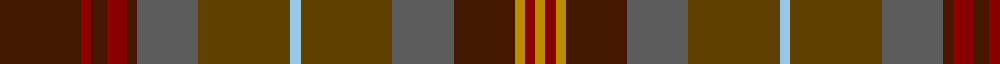

This page is one **sett** — a single exact thread-count. It belongs to the [tartan](/tartans/dr16dra2dr3dra4dr2n12t18lb2t18n12dr12dy2dra2dy2/)
(the same proportion at any scale), whose colour order is pattern [BRBRBBGWGBBYRY](/stripes/brbrbbgwgbbyry/).

Sourced from tartans-authority.  It is a [14 stripe tartan](/stripes/stripes14/).

Original link http://www.tartansauthority.com/tartan-ferret/display/10573/

## Thread count
DR/32 DRa4 DR6 DRa8 DR4 N24 T36 LB4 T36 N24 DR24 DY4 DRa4 DY/4

## Palette
Each colour and the base-6 reference it is a variant of.

| Colour | Shade | Base |
|---|---|---|
| DR | <code style="background-color:#441800;">#441800</code> `oklch(27.3% 0.076 46.3)` <small>#441800</small> | B <code style="background-color:#2A418A;">#2A418A</code> |
| DRa | <code style="background-color:#880000;">#880000</code> `oklch(39.4% 0.162 29.2)` <small>#880000</small> | R <code style="background-color:#CC0000;">#CC0000</code> |
| DY | <code style="background-color:#BC8C00;">#BC8C00</code> `oklch(66.8% 0.137 84.1)` <small>#BC8C00</small> | Y <code style="background-color:#F2BF00;">#F2BF00</code> |
| LB | <code style="background-color:#98C8E8;">#98C8E8</code> `oklch(81.0% 0.068 237.9)` <small>#98C8E8</small> | W <code style="background-color:#F7F7F7;">#F7F7F7</code> |
| N | <code style="background-color:#5C5C5C;">#5C5C5C</code> `oklch(47.5% 0.000 89.9)` <small>#5C5C5C</small> | B <code style="background-color:#2A418A;">#2A418A</code> |
| T | <code style="background-color:#604000;">#604000</code> `oklch(39.8% 0.083 76.8)` <small>#604000</small> | G <code style="background-color:#006100;">#006100</code> |

## Nearest tartans

The nearest existing variants by ΔTartan distance, with this tartan at the top so the swatches line up against it.

ΔTartan

Tartan

Sett

—

<a href="/ttd/edit/#slug=do16r2do3r4do2n12dy18lb2dy18n12do12lo2r2lo2~x2">Allen - 2012 (Personal)</a> <a class="nn-out" href="/setts/s14/do16r2do3r4do2n12dy18lb2dy18n12do12lo2r2lo2~x2/" title="open its dictionary page">↗</a>

1.19

<a href="/ttd/edit/#slug=dg18r3dg3r15y13r14dg3r3dg18y5dg2o5dg3r2dg3n5dg2t5~x2">Ben Murad (Personal)</a> <a class="nn-out" href="/setts/s18/dg18r3dg3r15y13r14dg3r3dg18y5dg2o5dg3r2dg3n5dg2t5~x2/" title="open its dictionary page">↗</a>

1.28

<a href="/ttd/edit/#slug=lo5n2o14dy9dg8n3o3n3o3n3dg19ly3~x2">Meath Irish County Tartan Tartan Number: 2269. Earliest known date: 1996 One of a series of Irish District tartans designed by Polly Wittering of the House of Edgar, with colours reminiscent of the Country with soft warm colours dominating. See products available Copyright © Blair Urquhart, Comrie, 2015</a> <a class="nn-out" href="/setts/s12/lo5n2o14dy9dg8n3o3n3o3n3dg19ly3~x2/" title="open its dictionary page">↗</a>

1.34

<a href="/ttd/edit/#slug=y6dg2y2dg5k20o2k2o25dr2o2dr4dy10k2~x2">Strathtay</a> <a class="nn-out" href="/setts/s13/y6dg2y2dg5k20o2k2o25dr2o2dr4dy10k2~x2/" title="open its dictionary page">↗</a>

1.42

<a href="/ttd/edit/#slug=do6lo4do3dt2do5dt2do3dt2y14r3dt2~x2">Limerick, County</a> <a class="nn-out" href="/setts/s11/do6lo4do3dt2do5dt2do3dt2y14r3dt2~x2/" title="open its dictionary page">↗</a>

1.49

<a href="/ttd/edit/#slug=g7dy1lb1dy1lo1dy7n7dy1n7dy7g7dy1r1~x4">Hash House Harriers Hunting (Corp)</a> <a class="nn-out" href="/setts/s13/g7dy1lb1dy1lo1dy7n7dy1n7dy7g7dy1r1~x4/" title="open its dictionary page">↗</a>

1.54

<a href="/ttd/edit/#slug=dg18r3dg3r15dy13r14dg3r3dg18dy5dg2k5dg3r2dg3db5dg2lg5~x2">Ben Murad (Personal)</a> <a class="nn-out" href="/setts/s18/dg18r3dg3r15dy13r14dg3r3dg18dy5dg2k5dg3r2dg3db5dg2lg5~x2/" title="open its dictionary page">↗</a>

1.56

<a href="/ttd/edit/#slug=n12dy2ly2dy2n2dy10y12dy3y12dy10n11r2ly2~x2">MacVicar, McVicar, McVicker</a> <a class="nn-out" href="/setts/s13/n12dy2ly2dy2n2dy10y12dy3y12dy10n11r2ly2~x2/" title="open its dictionary page">↗</a>

1.56

<a href="/ttd/edit/#slug=dg3r15dg2r2dg2r2dg18do2dg2do2dg2do27k2do2k6lo2~x2">Strathmore</a> <a class="nn-out" href="/setts/s16/dg3r15dg2r2dg2r2dg18do2dg2do2dg2do27k2do2k6lo2~x2/" title="open its dictionary page">↗</a>

1.56

<a href="/ttd/edit/#slug=dr12dy1dg12dy12ly2dy12dg12dy1dr12t2~x2">United Distillers Corporate Tartan Tartan Number: 2098. Earliest known date: 1989 An expression of evocative Scottish colours to reflect the corporate image of quality and style. (weft) lb4 b24 lb2 dg24 g24 r4 See products available Copyright © Blair Urquhart, Comrie, 2015</a> <a class="nn-out" href="/setts/s10/dr12dy1dg12dy12ly2dy12dg12dy1dr12t2~x2/" title="open its dictionary page">↗</a>

1.59

<a href="/ttd/edit/#slug=r15g3r3g19dy6y6o6g19r3g3r15y13~x2">Maple Leaf (District)</a> <a class="nn-out" href="/setts/s12/r15g3r3g19dy6y6o6g19r3g3r15y13~x2/" title="open its dictionary page">↗</a>

## Neighbour map

Every grey dot is one of 14299 variants placed by the first two principal components of the ΔTartan feature space (44% of its variance). Red is this tartan; blue dots are its nearest — click one to open its page.

<svg viewBox="0 0 640 380" role="img" style="max-width:100%;height:auto;border:1px solid #e0e0e0;border-radius:4px;display:block" xmlns="http://www.w3.org/2000/svg"><image href="/nn/cloud.v1.png" width="640" height="380"/><a href="/setts/s18/dg18r3dg3r15y13r14dg3r3dg18y5dg2o5dg3r2dg3n5dg2t5~x2/"><circle cx="246.2" cy="180.7" r="4" fill="#3465a4"><title>Ben Murad (Personal)</title></circle></a><a href="/setts/s12/lo5n2o14dy9dg8n3o3n3o3n3dg19ly3~x2/"><circle cx="211.1" cy="194.2" r="4" fill="#3465a4"><title>Meath Irish County Tartan Tartan Number: 2269. Earliest known date: 1996 One of a series of Irish District tartans designed by Polly Wittering of the House of Edgar, with colours reminiscent of the Country with soft warm colours dominating. See products available Copyright © Blair Urquhart, Comrie, 2015</title></circle></a><a href="/setts/s13/y6dg2y2dg5k20o2k2o25dr2o2dr4dy10k2~x2/"><circle cx="253.7" cy="171.3" r="4" fill="#3465a4"><title>Strathtay</title></circle></a><a href="/setts/s11/do6lo4do3dt2do5dt2do3dt2y14r3dt2~x2/"><circle cx="224.6" cy="228.3" r="4" fill="#3465a4"><title>Limerick, County</title></circle></a><a href="/setts/s13/g7dy1lb1dy1lo1dy7n7dy1n7dy7g7dy1r1~x4/"><circle cx="217.8" cy="214.0" r="4" fill="#3465a4"><title>Hash House Harriers Hunting (Corp)</title></circle></a><a href="/setts/s18/dg18r3dg3r15dy13r14dg3r3dg18dy5dg2k5dg3r2dg3db5dg2lg5~x2/"><circle cx="228.8" cy="175.3" r="4" fill="#3465a4"><title>Ben Murad (Personal)</title></circle></a><a href="/setts/s13/n12dy2ly2dy2n2dy10y12dy3y12dy10n11r2ly2~x2/"><circle cx="200.7" cy="231.9" r="4" fill="#3465a4"><title>MacVicar, McVicar, McVicker</title></circle></a><a href="/setts/s16/dg3r15dg2r2dg2r2dg18do2dg2do2dg2do27k2do2k6lo2~x2/"><circle cx="277.5" cy="153.9" r="4" fill="#3465a4"><title>Strathmore</title></circle></a><a href="/setts/s10/dr12dy1dg12dy12ly2dy12dg12dy1dr12t2~x2/"><circle cx="234.0" cy="226.3" r="4" fill="#3465a4"><title>United Distillers Corporate Tartan Tartan Number: 2098. Earliest known date: 1989 An expression of evocative Scottish colours to reflect the corporate image of quality and style. (weft) lb4 b24 lb2 dg24 g24 r4 See products available Copyright © Blair Urquhart, Comrie, 2015</title></circle></a><a href="/setts/s12/r15g3r3g19dy6y6o6g19r3g3r15y13~x2/"><circle cx="228.4" cy="238.4" r="4" fill="#3465a4"><title>Maple Leaf (District)</title></circle></a><circle cx="216.5" cy="194.7" r="5" fill="#c00000"/></svg>

ID: /setts/s14/do16r2do3r4do2n12dy18lb2dy18n12do12lo2r2lo2~x2/
