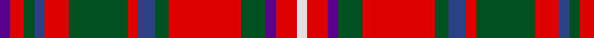

In pattern [BRGBRGRBGRGBRW](/stripes/brgbrgrbgrgbrw/).

This was sourced from register-of-tartans.  It is a [14 stripe tartan](/stripes/stripes14/).

Original link https://www.tartanregister.gov.uk/tartanDetails.aspx?ref=2547

## Also known as

This cloth is also recorded under:

- MacKinnon #3

## Register references

External register numbers recorded for this tartan.

- Scottish Register of Tartans: [2547](https://www.tartanregister.gov.uk/tartanDetails.aspx?ref=2547)
- Scottish Tartans World Register: 542

## Thread count
P/6 R8 G6 B6 R14 G34 R6 B10 G8 R42 G14 P6 R12 LN/6

## Palette
Each colour and its ΔE from the base-6 reference it is a variant of.

| Colour | Shade | Base | ΔE (OKLab) |
|---|---|---|---|
| B | <code style="background-color:#2C4084;">#2C4084</code> `#2C4084` | B <code style="background-color:#2A418A;">#2A418A</code> | 0.01 |
| G | <code style="background-color:#005020;">#005020</code> `#005020` | G <code style="background-color:#006100;">#006100</code> | 0.07 |
| LN | <code style="background-color:#E0E0E0;">#E0E0E0</code> `#E0E0E0` | W <code style="background-color:#F7F7F7;">#F7F7F7</code> | 0.07 |
| P | <code style="background-color:#5A008C;">#5A008C</code> `#5A008C` | B <code style="background-color:#2A418A;">#2A418A</code> | 0.13 |
| R | <code style="background-color:#DC0000;">#DC0000</code> `#DC0000` | R <code style="background-color:#CC0000;">#CC0000</code> | 0.03 |

## Nearest tartans

The nearest existing variants by ΔTartan distance.

1. [MacKinnon #8](/setts/s14/dp2r3dg2db2r6dg16r2db4dg2r16dg8dp2r4w2~x2/) — ΔT 0.48
1. [MacKinnon #5](/setts/s14/k4r3dg2db2r6dg15r2db4dg2r15dg7k2r4w2~x2/) — ΔT 0.55
1. [MacKinnon #2](/setts/s14/t2r3dg2db2r6dg16r2db4dg2r16dg8t2r4w2~x2/) — ΔT 0.61
1. [MacKinnon 10](/setts/s14/p3r4g3db3r7g17r3db5g4r21g7p3r6w3~x2/) — ΔT 0.71
1. [MacKinnon](/setts/s14/dp2r3dg2db2r6dg16r2db4dg2r16dg8dp2r4lb2/) — ΔT 0.74
1. [MacKinnon](/setts/s14/dp2r3g2db2r6g16r2db4g2r16g8dp2r4w2~x2/) — ΔT 0.75
1. [Nicolson/MacNicol](/setts/s13/db2r11dg2r11dg21r2k9t2db11r11dg2r11db2~x2/) — ΔT 0.78
1. [MacDougall #6](/setts/s19/k1r4dg8r2dg1r2db4r2w1r1w1r2dg4r3dg4r1k1r8w1~x2/) — ΔT 0.82
1. [Fitzgerald Red](/setts/s15/k4r4w4r28b4r4g25r4b25r4b4r28w4r4k4~x2/) — ΔT 0.85
1. [Highland Spring (1985)](/setts/s12/r16k2r9g12lo2g10b3k2b3k2b3r10~x2/) — ΔT 0.85

## Neighbour map

Every grey dot is one of 14299 variants placed by the first two principal components of the ΔTartan feature space (44% of its variance). Red is this tartan; blue dots are its nearest — click one to open its page.

<svg viewBox="0 0 640 380" role="img" style="max-width:100%;height:auto;border:1px solid #e0e0e0;border-radius:4px;display:block" xmlns="http://www.w3.org/2000/svg"><image href="/nn/cloud.v1.png" width="640" height="380"/><a href="/setts/s14/dp2r3dg2db2r6dg16r2db4dg2r16dg8dp2r4w2~x2/"><circle cx="215.6" cy="149.5" r="4" fill="#3465a4"><title>MacKinnon #8</title></circle></a><a href="/setts/s14/k4r3dg2db2r6dg15r2db4dg2r15dg7k2r4w2~x2/"><circle cx="192.6" cy="155.8" r="4" fill="#3465a4"><title>MacKinnon #5</title></circle></a><a href="/setts/s14/t2r3dg2db2r6dg16r2db4dg2r16dg8t2r4w2~x2/"><circle cx="215.6" cy="150.6" r="4" fill="#3465a4"><title>MacKinnon #2</title></circle></a><a href="/setts/s14/p3r4g3db3r7g17r3db5g4r21g7p3r6w3~x2/"><circle cx="210.3" cy="162.7" r="4" fill="#3465a4"><title>MacKinnon 10</title></circle></a><a href="/setts/s14/dp2r3dg2db2r6dg16r2db4dg2r16dg8dp2r4lb2/"><circle cx="214.6" cy="152.7" r="4" fill="#3465a4"><title>MacKinnon</title></circle></a><a href="/setts/s14/dp2r3g2db2r6g16r2db4g2r16g8dp2r4w2~x2/"><circle cx="221.4" cy="153.9" r="4" fill="#3465a4"><title>MacKinnon</title></circle></a><a href="/setts/s13/db2r11dg2r11dg21r2k9t2db11r11dg2r11db2~x2/"><circle cx="215.3" cy="156.7" r="4" fill="#3465a4"><title>Nicolson/MacNicol</title></circle></a><a href="/setts/s19/k1r4dg8r2dg1r2db4r2w1r1w1r2dg4r3dg4r1k1r8w1~x2/"><circle cx="210.1" cy="141.4" r="4" fill="#3465a4"><title>MacDougall #6</title></circle></a><a href="/setts/s15/k4r4w4r28b4r4g25r4b25r4b4r28w4r4k4~x2/"><circle cx="211.0" cy="135.9" r="4" fill="#3465a4"><title>Fitzgerald Red</title></circle></a><a href="/setts/s12/r16k2r9g12lo2g10b3k2b3k2b3r10~x2/"><circle cx="194.3" cy="163.3" r="4" fill="#3465a4"><title>Highland Spring (1985)</title></circle></a><circle cx="206.9" cy="158.7" r="5" fill="#c00000"/></svg>

ID: /setts/s14/dp3r4dg3db3r7dg17r3db5dg4r21dg7dp3r6w3~x2/
