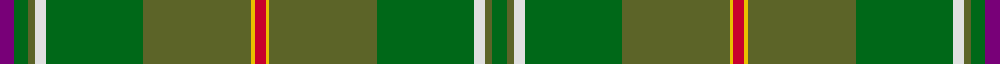

This page is one **sett** — a single exact thread-count. It belongs to the [tartan](/tartans/dp4g4y2w3g27y30ly1r3/)
(the same proportion at any scale), whose colour order is pattern [BGGWGGYRYGGWGG](/stripes/bggwggyryggwgg/).

Sourced from register-of-tartans.  It is a [14 stripe tartan](/stripes/stripes14/).

Original link https://www.tartanregister.gov.uk/tartanDetails.aspx?ref=1590

## Register references

External register numbers recorded for this tartan.

- Scottish Register of Tartans: [1590](https://www.tartanregister.gov.uk/tartanDetails.aspx?ref=1590)
- Scottish Tartans Authority (ITI): 2685
- Scottish Tartans World Register: 2685

## Thread count
P/8 Ga8 G4 LN6 Ga54 G60 Y2 R6 Y2 G60 Ga54 LN6 G4 Ga/8

## Palette

Palette: <strong>Tartan Register</strong> <small style="color:#888">(7 of 8 colours)</small>
<table><thead><tr><th>Colour</th><th>Threads</th><th>Shade</th><th>Base</th><th>OKLCh</th></tr></thead><tbody><tr><td>P/</td><td style="text-align:right;font-variant-numeric:tabular-nums">8</td><td><code style="background-color:#780078;">#780078</code> <small style="color:#888">#780078</small></td><td>B <code style="background-color:#2A418A;">#2A418A</code></td><td><small style="color:#888">oklch(40.2% 0.185 328.4)</small></td></tr><tr><td>Ga</td><td style="text-align:right;font-variant-numeric:tabular-nums">8</td><td><code style="background-color:#006818;">#006818</code> <small style="color:#888">#006818</small></td><td>G <code style="background-color:#006100;">#006100</code></td><td><small style="color:#888">oklch(45.0% 0.142 145.0)</small></td></tr><tr><td>G</td><td style="text-align:right;font-variant-numeric:tabular-nums">4</td><td><code style="background-color:#5C6428;">#5C6428</code> <small style="color:#888">#5C6428</small></td><td>G <code style="background-color:#006100;">#006100</code></td><td><small style="color:#888">oklch(48.3% 0.084 116.0)</small></td></tr><tr><td>LN</td><td style="text-align:right;font-variant-numeric:tabular-nums">6</td><td><code style="background-color:#E0E0E0;">#E0E0E0</code> <small style="color:#888">#E0E0E0</small></td><td>W <code style="background-color:#F7F7F7;">#F7F7F7</code></td><td><small style="color:#888">oklch(90.7% 0.000 89.9)</small></td></tr><tr><td>Ga</td><td style="text-align:right;font-variant-numeric:tabular-nums">54</td><td><code style="background-color:#006818;">#006818</code> <small style="color:#888">#006818</small></td><td>G <code style="background-color:#006100;">#006100</code></td><td><small style="color:#888">oklch(45.0% 0.142 145.0)</small></td></tr><tr><td>G</td><td style="text-align:right;font-variant-numeric:tabular-nums">60</td><td><code style="background-color:#5C6428;">#5C6428</code> <small style="color:#888">#5C6428</small></td><td>G <code style="background-color:#006100;">#006100</code></td><td><small style="color:#888">oklch(48.3% 0.084 116.0)</small></td></tr><tr><td>Y</td><td style="text-align:right;font-variant-numeric:tabular-nums">2</td><td><code style="background-color:#E8C000;">#E8C000</code> <small style="color:#888">#E8C000</small></td><td>Y <code style="background-color:#F2BF00;">#F2BF00</code></td><td><small style="color:#888">oklch(81.9% 0.168 93.7)</small></td></tr><tr><td>R</td><td style="text-align:right;font-variant-numeric:tabular-nums">6</td><td><code style="background-color:#C8002C;">#C8002C</code> <small style="color:#888">#C8002C</small></td><td>R <code style="background-color:#CC0000;">#CC0000</code></td><td><small style="color:#888">oklch(52.6% 0.212 22.0)</small></td></tr><tr><td>Y</td><td style="text-align:right;font-variant-numeric:tabular-nums">2</td><td><code style="background-color:#E8C000;">#E8C000</code> <small style="color:#888">#E8C000</small></td><td>Y <code style="background-color:#F2BF00;">#F2BF00</code></td><td><small style="color:#888">oklch(81.9% 0.168 93.7)</small></td></tr><tr><td>G</td><td style="text-align:right;font-variant-numeric:tabular-nums">60</td><td><code style="background-color:#5C6428;">#5C6428</code> <small style="color:#888">#5C6428</small></td><td>G <code style="background-color:#006100;">#006100</code></td><td><small style="color:#888">oklch(48.3% 0.084 116.0)</small></td></tr><tr><td>Ga</td><td style="text-align:right;font-variant-numeric:tabular-nums">54</td><td><code style="background-color:#006818;">#006818</code> <small style="color:#888">#006818</small></td><td>G <code style="background-color:#006100;">#006100</code></td><td><small style="color:#888">oklch(45.0% 0.142 145.0)</small></td></tr><tr><td>LN</td><td style="text-align:right;font-variant-numeric:tabular-nums">6</td><td><code style="background-color:#E0E0E0;">#E0E0E0</code> <small style="color:#888">#E0E0E0</small></td><td>W <code style="background-color:#F7F7F7;">#F7F7F7</code></td><td><small style="color:#888">oklch(90.7% 0.000 89.9)</small></td></tr><tr><td>G</td><td style="text-align:right;font-variant-numeric:tabular-nums">4</td><td><code style="background-color:#5C6428;">#5C6428</code> <small style="color:#888">#5C6428</small></td><td>G <code style="background-color:#006100;">#006100</code></td><td><small style="color:#888">oklch(48.3% 0.084 116.0)</small></td></tr><tr><td>Ga/</td><td style="text-align:right;font-variant-numeric:tabular-nums">8</td><td><code style="background-color:#006818;">#006818</code> <small style="color:#888">#006818</small></td><td>G <code style="background-color:#006100;">#006100</code></td><td><small style="color:#888">oklch(45.0% 0.142 145.0)</small></td></tr></tbody></table>

## Nearest tartans

The nearest existing variants by ΔTartan distance, with this tartan at the top so the swatches line up against it.

ΔTartan

Tartan

Sett

—

<a href="/ttd/edit/#slug=dp4g4y2w3g27y30ly1r3~x2">Hannigan of Dirleton (Personal)</a> <a class="nn-out" href="/setts/s14/dp4g4y2w3g27y30ly1r3~x2/" title="open its dictionary page">↗</a>

1.40

<a href="/ttd/edit/#slug=dp4g4y2w3g27y30ly1r3~x2">Hannigan of Dirleton (Personal)</a> <a class="nn-out" href="/setts/s8/dp4g4y2w3g27y30ly1r3~x2/" title="open its dictionary page">↗</a>

1.41

<a href="/ttd/edit/#slug=g21k1r4k1dy21g3dy3g3dy21g3ly4g21dy3g3dy3~x2">Ensign of Ontario Canadian Tartan Tartan Number: 2032. Earliest known date: 1965 The Ensign tartan owes its inspiration to the Provincial Coat of Arms which was granted to the province by Royal Warrant of Queen Victoria in 1868. The yellow is taken from the three golden maple leaves of the lower shield and the red from the cross of St George on the upper. The black and brown come from the bear, the moose and the deer. There is also a District tartan called Northern Ontario. See products available Copyright © Blair Urquhart, Comrie, 2015</a> <a class="nn-out" href="/setts/s15/g21k1r4k1dy21g3dy3g3dy21g3ly4g21dy3g3dy3~x2/" title="open its dictionary page">↗</a>

1.73

<a href="/ttd/edit/#slug=n36r2n4w1y14g4ly2g18~x2">Yorkland (Personal)</a> <a class="nn-out" href="/setts/s8/n36r2n4w1y14g4ly2g18~x2/" title="open its dictionary page">↗</a>

1.80

<a href="/ttd/edit/#slug=r3k1y8ly1dy7ly1y19y25k1~x2">Broons, The (DC Thomson)</a> <a class="nn-out" href="/setts/s9/r3k1y8ly1dy7ly1y19y25k1~x2/" title="open its dictionary page">↗</a>

1.81

<a href="/ttd/edit/#slug=dg2lo6g24r2y2dg1y6dg10g2~x2">Fitzgibbon (Name)</a> <a class="nn-out" href="/setts/s9/dg2lo6g24r2y2dg1y6dg10g2~x2/" title="open its dictionary page">↗</a>

1.83

<a href="/ttd/edit/#slug=g6g2r2g30y2g4y2dg2y1dg20y1g2r4~x2">All Ireland Green (Fashion)</a> <a class="nn-out" href="/setts/s13/g6g2r2g30y2g4y2dg2y1dg20y1g2r4~x2/" title="open its dictionary page">↗</a>

1.90

<a href="/ttd/edit/#slug=g44k1g3ly3g3w1g21w1g3w3g3w1g21~x2">Currie (Clan)</a> <a class="nn-out" href="/setts/s13/g44k1g3ly3g3w1g21w1g3w3g3w1g21~x2/" title="open its dictionary page">↗</a>

1.91

<a href="/ttd/edit/#slug=dg21k1r4k1dy21dg3dy3dg3dy21dg3lo4dg21dy3dg3dy3~x2">Ensign of Ontario (Fashion)</a> <a class="nn-out" href="/setts/s15/dg21k1r4k1dy21dg3dy3dg3dy21dg3lo4dg21dy3dg3dy3~x2/" title="open its dictionary page">↗</a>

1.95

<a href="/ttd/edit/#slug=g21k1r4k1o21g3o3g3o21g3ly4g21o3g3o3~x2">Ensign, of Ontario</a> <a class="nn-out" href="/setts/s15/g21k1r4k1o21g3o3g3o21g3ly4g21o3g3o3~x2/" title="open its dictionary page">↗</a>

1.98

<a href="/ttd/edit/#slug=g6g2r2g30o2g4o2dg2o1dg20o1g2r4~x2">All Irish Green Irish District Tartan Tartan Number: 4065. Earliest known date: 1997 Part of a collection produced by Lochcarron in 1997 to acknowledge the early historical and cultural links between the Scots and Irish. See products available Copyright © Blair Urquhart, Comrie, 2015</a> <a class="nn-out" href="/setts/s13/g6g2r2g30o2g4o2dg2o1dg20o1g2r4~x2/" title="open its dictionary page">↗</a>

## Neighbour map

Every grey dot is one of 14299 variants placed by the first two principal components of the ΔTartan feature space (44% of its variance). Red is this tartan; blue dots are its nearest — click one to open its page.

<svg viewBox="0 0 640 380" role="img" style="max-width:100%;height:auto;border:1px solid #e0e0e0;border-radius:4px;display:block" xmlns="http://www.w3.org/2000/svg"><image href="/nn/cloud.v1.png" width="640" height="380"/><a href="/setts/s8/dp4g4y2w3g27y30ly1r3~x2/"><circle cx="333.1" cy="146.4" r="4" fill="#3465a4"><title>Hannigan of Dirleton (Personal)</title></circle></a><a href="/setts/s15/g21k1r4k1dy21g3dy3g3dy21g3ly4g21dy3g3dy3~x2/"><circle cx="366.2" cy="168.1" r="4" fill="#3465a4"><title>Ensign of Ontario Canadian Tartan Tartan Number: 2032. Earliest known date: 1965 The Ensign tartan owes its inspiration to the Provincial Coat of Arms which was granted to the province by Royal Warrant of Queen Victoria in 1868. The yellow is taken from the three golden maple leaves of the lower shield and the red from the cross of St George on the upper. The black and brown come from the bear, the moose and the deer. There is also a District tartan called Northern Ontario. See products available Copyright © Blair Urquhart, Comrie, 2015</title></circle></a><a href="/setts/s8/n36r2n4w1y14g4ly2g18~x2/"><circle cx="364.3" cy="154.6" r="4" fill="#3465a4"><title>Yorkland (Personal)</title></circle></a><a href="/setts/s9/r3k1y8ly1dy7ly1y19y25k1~x2/"><circle cx="321.4" cy="153.7" r="4" fill="#3465a4"><title>Broons, The (DC Thomson)</title></circle></a><a href="/setts/s9/dg2lo6g24r2y2dg1y6dg10g2~x2/"><circle cx="329.0" cy="171.5" r="4" fill="#3465a4"><title>Fitzgibbon (Name)</title></circle></a><a href="/setts/s13/g6g2r2g30y2g4y2dg2y1dg20y1g2r4~x2/"><circle cx="334.8" cy="132.4" r="4" fill="#3465a4"><title>All Ireland Green (Fashion)</title></circle></a><a href="/setts/s13/g44k1g3ly3g3w1g21w1g3w3g3w1g21~x2/"><circle cx="377.0" cy="112.3" r="4" fill="#3465a4"><title>Currie (Clan)</title></circle></a><a href="/setts/s15/dg21k1r4k1dy21dg3dy3dg3dy21dg3lo4dg21dy3dg3dy3~x2/"><circle cx="406.3" cy="190.1" r="4" fill="#3465a4"><title>Ensign of Ontario (Fashion)</title></circle></a><a href="/setts/s15/g21k1r4k1o21g3o3g3o21g3ly4g21o3g3o3~x2/"><circle cx="332.5" cy="147.0" r="4" fill="#3465a4"><title>Ensign, of Ontario</title></circle></a><a href="/setts/s13/g6g2r2g30o2g4o2dg2o1dg20o1g2r4~x2/"><circle cx="328.1" cy="126.4" r="4" fill="#3465a4"><title>All Irish Green Irish District Tartan Tartan Number: 4065. Earliest known date: 1997 Part of a collection produced by Lochcarron in 1997 to acknowledge the early historical and cultural links between the Scots and Irish. See products available Copyright © Blair Urquhart, Comrie, 2015</title></circle></a><circle cx="354.2" cy="138.0" r="5" fill="#c00000"/></svg>

ID: /setts/s14/dp4g4y2w3g27y30ly1r3~x2/
