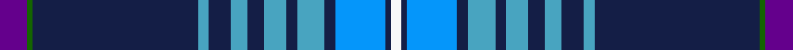

This page is one **sett** — a single exact thread-count. It belongs to the [tartan](/tartans/p5g1db30ba2db4ba3db3ba4db2ba5db2b9db1w2/)
(the same proportion at any scale), whose colour order is pattern [BGBYBYBYBYBBBW](/stripes/bgbybybybybbbw/).

Sourced from register-of-tartans.  It is a [14 stripe tartan](/stripes/stripes14/).

Original link https://www.tartanregister.gov.uk/tartanDetails.aspx?ref=11584

## Register references

External register numbers recorded for this tartan.

- Scottish Register of Tartans: [11584](https://www.tartanregister.gov.uk/tartanDetails.aspx?ref=11584)

## Thread count
P/10 G2 DB60 Ba4 DB8 Ba6 DB6 Ba8 DB4 Ba10 DB4 B18 DB2 W/4

## Palette
Each colour and the base-6 reference it is a variant of.

| Colour | Shade | Base |
|---|---|---|
| B | <code style="background-color:#0596FA;">#0596FA</code> `oklch(66.0% 0.180 248.9)` <small>#0596FA</small> | B <code style="background-color:#2A418A;">#2A418A</code> |
| Ba | <code style="background-color:#48A4C0;">#48A4C0</code> `oklch(67.5% 0.096 221.0)` <small>#48A4C0</small> | Y <code style="background-color:#F2BF00;">#F2BF00</code> |
| DB | <code style="background-color:#141E46;">#141E46</code> `oklch(25.2% 0.076 269.7)` <small>#141E46</small> | B <code style="background-color:#2A418A;">#2A418A</code> |
| G | <code style="background-color:#146400;">#146400</code> `oklch(43.9% 0.144 140.9)` <small>#146400</small> | G <code style="background-color:#006100;">#006100</code> |
| P | <code style="background-color:#64008C;">#64008C</code> `oklch(38.5% 0.193 311.3)` <small>#64008C</small> | B <code style="background-color:#2A418A;">#2A418A</code> |
| W | <code style="background-color:#F8F8F8;">#F8F8F8</code> `oklch(97.9% 0.000 89.9)` <small>#F8F8F8</small> | W <code style="background-color:#F7F7F7;">#F7F7F7</code> |

## Nearest tartans

The nearest existing variants by ΔTartan distance, with this tartan at the top so the swatches line up against it.

ΔTartan

Tartan

Sett

—

<a href="/ttd/edit/#slug=dp5g1db30lg2db4lg3db3lg4db2lg5db2b9db1w2~x2">Crombie, Harry (Personal)</a> <a class="nn-out" href="/setts/s14/dp5g1db30lg2db4lg3db3lg4db2lg5db2b9db1w2~x2/" title="open its dictionary page">↗</a>

0.84

<a href="/ttd/edit/#slug=db76w3r4w3g4w3dg8db19t20db3t8w10">Summerwood (School)</a> <a class="nn-out" href="/setts/s12/db76w3r4w3g4w3dg8db19t20db3t8w10/" title="open its dictionary page">↗</a>

0.93

<a href="/ttd/edit/#slug=db4dp8db3dp2db64t24r4db3t4db3w8r4">Royal Navy</a> <a class="nn-out" href="/setts/s12/db4dp8db3dp2db64t24r4db3t4db3w8r4/" title="open its dictionary page">↗</a>

1.01

<a href="/ttd/edit/#slug=o2dt1b2dt2r1b12dt2r1r10dt28b1dt3b2dt3w1~x2">Northfield Academy</a> <a class="nn-out" href="/setts/s15/o2dt1b2dt2r1b12dt2r1r10dt28b1dt3b2dt3w1~x2/" title="open its dictionary page">↗</a>

1.15

<a href="/ttd/edit/#slug=db48w3db4w3db3b16g2b5g3b4g4b3g5ly2~x2">St. Andrews (District)</a> <a class="nn-out" href="/setts/s14/db48w3db4w3db3b16g2b5g3b4g4b3g5ly2~x2/" title="open its dictionary page">↗</a>

1.22

<a href="/ttd/edit/#slug=lr2db1t2db2k1t12db2k1k10db28t1db3t2db3w1~x2">Northfield Academy Corporate Tartan Tartan Number: 11490. Earliest known date: 2016, March Northfield is built on Freedom Lands gifted by Robert the Bruce to the Burgh of Aberdeen around 1313 and this Academy design is based on the complex 1782 Aberdeen tartan. The dark blue squares number 56 threads for the year 1956 when the Academy was opened; the maroon is from the original 1956 school badge; the predominantly dark blue and light blue colours represent the colours of the school tie in 2016; the four light blue lines around the white represent the four capacities of Scottish education's Curriculum for Excellence in the 21st century. Finally, the grey remembers the 19th century Cairncry Granite Quarry on part of which, Northfield Academy was built. See products available Copyright © Blair Urquhart, Comrie, 2015</a> <a class="nn-out" href="/setts/s15/lr2db1t2db2k1t12db2k1k10db28t1db3t2db3w1~x2/" title="open its dictionary page">↗</a>

1.25

<a href="/ttd/edit/#slug=ly6w2n4lb1db6lb1db40lb1db6lb1n4w4~x2">Moskyok-Collins (Portland) (Personal</a> <a class="nn-out" href="/setts/s12/ly6w2n4lb1db6lb1db40lb1db6lb1n4w4~x2/" title="open its dictionary page">↗</a>

1.27

<a href="/ttd/edit/#slug=db60lo2db10k9lb2k2r2k2g28lo3~x2">Wcwm 9275-1510-1</a> <a class="nn-out" href="/setts/s10/db60lo2db10k9lb2k2r2k2g28lo3~x2/" title="open its dictionary page">↗</a>

1.30

<a href="/ttd/edit/#slug=r3dg1db2dg4db30k2db4k2db30dg27ly3k3w3~x2">Joss (Clan)</a> <a class="nn-out" href="/setts/s13/r3dg1db2dg4db30k2db4k2db30dg27ly3k3w3~x2/" title="open its dictionary page">↗</a>

1.30

<a href="/ttd/edit/#slug=k4n8db54ly6db23n4k4r14k4n2db2k4db4">Blue Brough from Orkney</a> <a class="nn-out" href="/setts/s13/k4n8db54ly6db23n4k4r14k4n2db2k4db4/" title="open its dictionary page">↗</a>

1.30

<a href="/ttd/edit/#slug=db58g28dy4w18db14r3db8k4db8r3db14w18dy4g28db58w4">Scotia (EWM)</a> <a class="nn-out" href="/setts/s16/db58g28dy4w18db14r3db8k4db8r3db14w18dy4g28db58w4/" title="open its dictionary page">↗</a>

## Neighbour map

Every grey dot is one of 14299 variants placed by the first two principal components of the ΔTartan feature space (44% of its variance). Red is this tartan; blue dots are its nearest — click one to open its page.

<svg viewBox="0 0 640 380" role="img" style="max-width:100%;height:auto;border:1px solid #e0e0e0;border-radius:4px;display:block" xmlns="http://www.w3.org/2000/svg"><image href="/nn/cloud.v1.png" width="640" height="380"/><a href="/setts/s12/db76w3r4w3g4w3dg8db19t20db3t8w10/"><circle cx="334.3" cy="82.2" r="4" fill="#3465a4"><title>Summerwood (School)</title></circle></a><a href="/setts/s12/db4dp8db3dp2db64t24r4db3t4db3w8r4/"><circle cx="305.7" cy="70.2" r="4" fill="#3465a4"><title>Royal Navy</title></circle></a><a href="/setts/s15/o2dt1b2dt2r1b12dt2r1r10dt28b1dt3b2dt3w1~x2/"><circle cx="315.5" cy="74.0" r="4" fill="#3465a4"><title>Northfield Academy</title></circle></a><a href="/setts/s14/db48w3db4w3db3b16g2b5g3b4g4b3g5ly2~x2/"><circle cx="304.4" cy="93.4" r="4" fill="#3465a4"><title>St. Andrews (District)</title></circle></a><a href="/setts/s15/lr2db1t2db2k1t12db2k1k10db28t1db3t2db3w1~x2/"><circle cx="309.0" cy="80.8" r="4" fill="#3465a4"><title>Northfield Academy Corporate Tartan Tartan Number: 11490. Earliest known date: 2016, March Northfield is built on Freedom Lands gifted by Robert the Bruce to the Burgh of Aberdeen around 1313 and this Academy design is based on the complex 1782 Aberdeen tartan. The dark blue squares number 56 threads for the year 1956 when the Academy was opened; the maroon is from the original 1956 school badge; the predominantly dark blue and light blue colours represent the colours of the school tie in 2016; the four light blue lines around the white represent the four capacities of Scottish education's Curriculum for Excellence in the 21st century. Finally, the grey remembers the 19th century Cairncry Granite Quarry on part of which, Northfield Academy was built. See products available Copyright © Blair Urquhart, Comrie, 2015</title></circle></a><a href="/setts/s12/ly6w2n4lb1db6lb1db40lb1db6lb1n4w4~x2/"><circle cx="285.3" cy="48.0" r="4" fill="#3465a4"><title>Moskyok-Collins (Portland) (Personal</title></circle></a><a href="/setts/s10/db60lo2db10k9lb2k2r2k2g28lo3~x2/"><circle cx="349.0" cy="97.6" r="4" fill="#3465a4"><title>Wcwm 9275-1510-1</title></circle></a><a href="/setts/s13/r3dg1db2dg4db30k2db4k2db30dg27ly3k3w3~x2/"><circle cx="343.5" cy="97.8" r="4" fill="#3465a4"><title>Joss (Clan)</title></circle></a><a href="/setts/s13/k4n8db54ly6db23n4k4r14k4n2db2k4db4/"><circle cx="348.5" cy="97.3" r="4" fill="#3465a4"><title>Blue Brough from Orkney</title></circle></a><a href="/setts/s16/db58g28dy4w18db14r3db8k4db8r3db14w18dy4g28db58w4/"><circle cx="270.3" cy="99.6" r="4" fill="#3465a4"><title>Scotia (EWM)</title></circle></a><circle cx="304.3" cy="74.1" r="5" fill="#c00000"/></svg>

ID: /setts/s14/dp5g1db30lg2db4lg3db3lg4db2lg5db2b9db1w2~x2/
