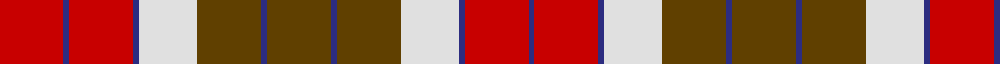

**Bands:** [RBRBWGBGBGWBRB](/stripes/rbrbwgbgbgwbrb/) · **Stripes:** [R DB R DB W DY DB DY DB DY W DB R DB](/stripes/stripes14/) R DB R DB W DY DB DY DB DY W DB R DB

This was sourced from register-of-tartans.  It is a [14 band tartan](/bands/bands14/).

Original link https://www.tartanregister.gov.uk/tartanDetails.aspx?ref=3875

## Also known as

This cloth is also recorded under:

- St. Andrews (Cor

## Register references

External register numbers recorded for this tartan.

- Scottish Register of Tartans: [3875](https://www.tartanregister.gov.uk/tartanDetails.aspx?ref=3875)
- Scottish Tartans Authority (ITI): 1416
- Scottish Tartans World Register: 1416

## Thread count
R/22 DB2 R22 DB2 LN20 T22 DB2 T22 DB2 T22 LN20 DB2 R22 DB/2

## Palette
Each colour and its ΔE from the base-6 reference it is a variant of.

| Colour | Shade | Base | ΔE (OKLab) |
|---|---|---|---|
| DB | <code style="background-color:#2C2C80;">#2C2C80</code> `#2C2C80` | B <code style="background-color:#2A418A;">#2A418A</code> | 0.06 |
| LN | <code style="background-color:#E0E0E0;">#E0E0E0</code> `#E0E0E0` | W <code style="background-color:#F7F7F7;">#F7F7F7</code> | 0.07 |
| R | <code style="background-color:#C80000;">#C80000</code> `#C80000` | R <code style="background-color:#CC0000;">#CC0000</code> | 0.01 |
| T | <code style="background-color:#604000;">#604000</code> `#604000` | G <code style="background-color:#006100;">#006100</code> | 0.14 |

## Nearest tartans

The nearest existing variants by ΔTartan distance.

1. [MacGlashan](/setts/s14/dr10lb1dr3lb6dr1lb3dr1o5ly1o3ly6o1ly3o1~x4/) — ΔT 1.14
1. [Sydney (Nova Scotia) #2](/setts/s14/o16k4w2k4o6o11o2o16~x2/) — ΔT 1.16
1. [St. Andrews (Queens University) (Cor](/setts/s8/dy11db1dy11w10db1r11db1r11~x2/) — ΔT 1.25
1. [Chisholm](/setts/s16/r5g16r5db4w2db4w2db4r22db4w2db4r5g16r5db2~x4/) — ΔT 1.27
1. [Henkel](/setts/s10/y28k3r22k8w3k8r22k3y28k3~x2/) — ΔT 1.28
1. [MacNab (Clan)](/setts/s13/dg16m2dg2m2dg2m15r14m2r14m15dg16m2dg2~x2/) — ΔT 1.34
1. [Highland Village](/setts/s9/ly2do1o10o12do10ly6o10do1ly2~x4/) — ΔT 1.40
1. [Scrimgeour of Glassary](/setts/s12/r32k3lo6g10r6k3lo32~x2/) — ΔT 1.42
1. [Scotland's People](/setts/s12/r7ly3r27k14m5k3m5k3m8g3m4g4~x2/) — ΔT 1.43
1. [Graham Red](/setts/s9/lr1k1r10g10k5lr5r10k1lr1~x4/) — ΔT 1.44

## Neighbour map

Every grey dot is one of 14299 variants placed by the first two principal components of the ΔTartan feature space (44% of its variance). Red is this tartan; blue dots are its nearest — click one to open its page.

<svg viewBox="0 0 640 380" role="img" style="max-width:100%;height:auto;border:1px solid #e0e0e0;border-radius:4px;display:block" xmlns="http://www.w3.org/2000/svg"><image href="/nn/cloud.v1.png" width="640" height="380"/><a href="/setts/s14/dr10lb1dr3lb6dr1lb3dr1o5ly1o3ly6o1ly3o1~x4/"><circle cx="127.8" cy="143.8" r="4" fill="#3465a4"><title>MacGlashan</title></circle></a><a href="/setts/s14/o16k4w2k4o6o11o2o16~x2/"><circle cx="203.8" cy="180.2" r="4" fill="#3465a4"><title>Sydney (Nova Scotia) #2</title></circle></a><a href="/setts/s8/dy11db1dy11w10db1r11db1r11~x2/"><circle cx="200.6" cy="190.2" r="4" fill="#3465a4"><title>St. Andrews (Queens University) (Cor</title></circle></a><a href="/setts/s16/r5g16r5db4w2db4w2db4r22db4w2db4r5g16r5db2~x4/"><circle cx="209.7" cy="148.5" r="4" fill="#3465a4"><title>Chisholm</title></circle></a><a href="/setts/s10/y28k3r22k8w3k8r22k3y28k3~x2/"><circle cx="226.4" cy="180.6" r="4" fill="#3465a4"><title>Henkel</title></circle></a><a href="/setts/s13/dg16m2dg2m2dg2m15r14m2r14m15dg16m2dg2~x2/"><circle cx="220.9" cy="188.2" r="4" fill="#3465a4"><title>MacNab (Clan)</title></circle></a><a href="/setts/s9/ly2do1o10o12do10ly6o10do1ly2~x4/"><circle cx="173.6" cy="182.8" r="4" fill="#3465a4"><title>Highland Village</title></circle></a><a href="/setts/s12/r32k3lo6g10r6k3lo32~x2/"><circle cx="212.0" cy="149.3" r="4" fill="#3465a4"><title>Scrimgeour of Glassary</title></circle></a><a href="/setts/s12/r7ly3r27k14m5k3m5k3m8g3m4g4~x2/"><circle cx="171.7" cy="138.9" r="4" fill="#3465a4"><title>Scotland's People</title></circle></a><a href="/setts/s9/lr1k1r10g10k5lr5r10k1lr1~x4/"><circle cx="201.2" cy="171.6" r="4" fill="#3465a4"><title>Graham Red</title></circle></a><circle cx="170.1" cy="155.7" r="5" fill="#c00000"/></svg>

ID: /setts/s14/dy11db1dy11w10db1r11db1r11~x2/
