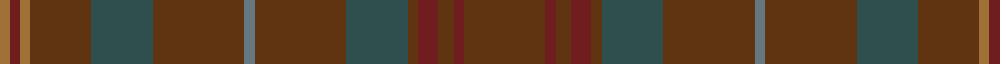

**Bands:** [GRGRGBGBGBGRRR](/stripes/grgrgbgbgbgrrr/) · **Stripes:** [DY O DY O DY N DY N DY N DY O O O](/stripes/stripes14/) DY O DY O DY N DY N DY N DY O O O

This was sourced from register-of-tartans.  It is a [14 band tartan](/bands/bands14/).

Original link https://www.tartanregister.gov.uk/tartanDetails.aspx?ref=10573

## Register references

External register numbers recorded for this tartan.

- Scottish Register of Tartans: [10573](https://www.tartanregister.gov.uk/tartanDetails.aspx?ref=10573)

## Thread count
LT/4 DR4 LT4 T24 N24 T36 Na4 T36 N24 T4 DR8 T6 DR4 T/32

## Palette
Each colour and its ΔE from the base-6 reference it is a variant of.

| Colour | Shade | Base | ΔE (OKLab) |
|---|---|---|---|
| DR | <code style="background-color:#6F1D1F;">#6F1D1F</code> `#6F1D1F` | R <code style="background-color:#CC0000;">#CC0000</code> | 0.19 |
| LT | <code style="background-color:#9F7136;">#9F7136</code> `#9F7136` | R <code style="background-color:#CC0000;">#CC0000</code> | 0.17 |
| N | <code style="background-color:#2F4F4F;">#2F4F4F</code> `#2F4F4F` | B <code style="background-color:#2A418A;">#2A418A</code> | 0.12 |
| Na | <code style="background-color:#65787F;">#65787F</code> `#65787F` | B <code style="background-color:#2A418A;">#2A418A</code> | 0.19 |
| T | <code style="background-color:#603311;">#603311</code> `#603311` | G <code style="background-color:#006100;">#006100</code> | 0.17 |

## Nearest tartans

The nearest existing variants by ΔTartan distance.

1. [Hueg (Bavaria) Hunting (Personal)](/setts/s10/dp17dg5dp5dg17dp4dg17k2k2k2dg5~x2/) — ΔT 2.16
1. [Ontario, Ensign of (District)](/setts/s15/dg3do16dg3do3dg3do16k2r4k2dg18do3dg3do3dg16y3~x2/) — ΔT 2.50
1. [Laois, County](/setts/s9/do15db2do5db5k18dy5do5dy2do15~x2/) — ΔT 2.51
1. [Glen Clova](/setts/s12/o39o4o6o2o2w2o2o12o6o2o6o2~x2/) — ΔT 2.60
1. [Wicklow, County](/setts/s18/g1n1do1n12t1do3n1g6n2do1n2g6n1do3t1n12do1n1~x4/) — ΔT 2.62
1. [Ontario, Ensign of](/setts/s15/y4dg18do3dg3do3dg18k2r4k2do16dg3do3dg3do16dg3~x2/) — ΔT 2.65
1. [Wicklow, County (District)](/setts/s10/do1n2g6n1do3t1n12do1n1g1~x4/) — ΔT 2.78
1. [Conlon](/setts/s9/dg4db2dg17dg2r4dg2dg3dg11dg2~x2/) — ΔT 2.79
1. [Williams (Fashion)](/setts/s11/dy50do6o3do3y3do3dt10dy8do3dy6y3~x2/) — ΔT 2.80
1. [St. Mirren (Corporate)](/setts/s12/do10k4do16k4do10k16do8k24do28r3do4r3/) — ΔT 2.80

## Neighbour map

Every grey dot is one of 14313 variants placed by the first two principal components of the ΔTartan feature space (44% of its variance). Red is this tartan; blue dots are its nearest — click one to open its page.

<svg viewBox="0 0 640 380" role="img" style="max-width:100%;height:auto;border:1px solid #e0e0e0;border-radius:4px;display:block" xmlns="http://www.w3.org/2000/svg"><image href="/nn/cloud.v1.png" width="640" height="380"/><a href="/setts/s10/dp17dg5dp5dg17dp4dg17k2k2k2dg5~x2/"><circle cx="470.1" cy="298.8" r="4" fill="#3465a4"><title>Hueg (Bavaria) Hunting (Personal)</title></circle></a><a href="/setts/s15/dg3do16dg3do3dg3do16k2r4k2dg18do3dg3do3dg16y3~x2/"><circle cx="387.1" cy="245.0" r="4" fill="#3465a4"><title>Ontario, Ensign of (District)</title></circle></a><a href="/setts/s9/do15db2do5db5k18dy5do5dy2do15~x2/"><circle cx="431.6" cy="298.0" r="4" fill="#3465a4"><title>Laois, County</title></circle></a><a href="/setts/s12/o39o4o6o2o2w2o2o12o6o2o6o2~x2/"><circle cx="511.9" cy="192.4" r="4" fill="#3465a4"><title>Glen Clova</title></circle></a><a href="/setts/s18/g1n1do1n12t1do3n1g6n2do1n2g6n1do3t1n12do1n1~x4/"><circle cx="454.9" cy="224.2" r="4" fill="#3465a4"><title>Wicklow, County</title></circle></a><a href="/setts/s15/y4dg18do3dg3do3dg18k2r4k2do16dg3do3dg3do16dg3~x2/"><circle cx="380.4" cy="241.1" r="4" fill="#3465a4"><title>Ontario, Ensign of</title></circle></a><a href="/setts/s10/do1n2g6n1do3t1n12do1n1g1~x4/"><circle cx="455.9" cy="244.9" r="4" fill="#3465a4"><title>Wicklow, County (District)</title></circle></a><a href="/setts/s9/dg4db2dg17dg2r4dg2dg3dg11dg2~x2/"><circle cx="444.1" cy="288.6" r="4" fill="#3465a4"><title>Conlon</title></circle></a><a href="/setts/s11/dy50do6o3do3y3do3dt10dy8do3dy6y3~x2/"><circle cx="528.0" cy="193.2" r="4" fill="#3465a4"><title>Williams (Fashion)</title></circle></a><a href="/setts/s12/do10k4do16k4do10k16do8k24do28r3do4r3/"><circle cx="390.2" cy="283.7" r="4" fill="#3465a4"><title>St. Mirren (Corporate)</title></circle></a><circle cx="508.0" cy="271.5" r="5" fill="#c00000"/></svg>

ID: /setts/s14/dy16o2dy3o4dy2n12dy18n2dy18n12dy12o2o2o2~x2/
