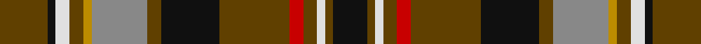

In pattern [GKWGYRGKGRGWGK](/stripes/gkwgyrgkgrgwgk/).

This was sourced from tartans-authority.  It is a [14 stripe tartan](/stripes/stripes14/).

Original link http://www.tartansauthority.com/tartan-ferret/display/8384/

## Thread count
T/24 K4 LN7 T7 DY4 N28 T7 K29 T35 R7 T7 LN4 T4 K/17

## Palette
Each colour and the base-6 reference it is a variant of.

| Colour | Shade | Base |
|---|---|---|
| DY | <code style="background-color:#BC8C00;">#BC8C00</code> `oklch(66.8% 0.137 84.1)` <small>#BC8C00</small> | Y <code style="background-color:#F2BF00;">#F2BF00</code> |
| K | <code style="background-color:#101010;">#101010</code> `oklch(17.3% 0.000 89.9)` <small>#101010</small> | K <code style="background-color:#000000;">#000000</code> |
| LN | <code style="background-color:#E0E0E0;">#E0E0E0</code> `oklch(90.7% 0.000 89.9)` <small>#E0E0E0</small> | W <code style="background-color:#F7F7F7;">#F7F7F7</code> |
| N | <code style="background-color:#888888;">#888888</code> `oklch(62.7% 0.000 89.9)` <small>#888888</small> | R <code style="background-color:#CC0000;">#CC0000</code> |
| R | <code style="background-color:#C80000;">#C80000</code> `oklch(52.3% 0.215 29.2)` <small>#C80000</small> | R <code style="background-color:#CC0000;">#CC0000</code> |
| T | <code style="background-color:#604000;">#604000</code> `oklch(39.8% 0.083 76.8)` <small>#604000</small> | G <code style="background-color:#006100;">#006100</code> |

## Nearest tartans

The nearest existing variants by ΔTartan distance.

1. [Stewart Camel Fashion Tartan Tartan Number: 4038. Earliest known date: 01/01/1999 No Details See products available Copyright © Blair Urquhart, Comrie, 2015](/setts/s14/y3k3dg2k6y7dg2y3dg2lo3dg5y3b3y20k2~x2/) — ΔT 0.91
1. [Kapasi (Personal)](/setts/s13/lo2g6r12k3w3k3g16k2g2k2g2k12lp2~x2/) — ΔT 1.03
1. [California Firefighters (Corporate)](/setts/s12/o4k2r2k1r1k1r2db3o1dg4o9dg1~x4/) — ΔT 1.04
1. [Moskova](/setts/s12/k2g5w1k4ly1db4g4k1r6k1g9db2~x4/) — ΔT 1.05
1. [Wilson's No.109](/setts/s14/r5g15dp8ly2k3r11g8r11k3ly2dp8g15r5w2~x2/) — ΔT 1.12
1. [Wcwm 9275-1258](/setts/s12/y8g2k4lo1k1lb1k1do8y3k1y1lb1~x4/) — ΔT 1.13
1. [Cochrane (1974)](/setts/s13/dg22r4dg2r2dg2r4dg12k12r2db10r4db4ly3~x2/) — ΔT 1.13
1. [Kidd](/setts/s15/r14t3r12g16ly2k11t7k2t2k2t7r12w3k3r4~x2/) — ΔT 1.17
1. [Rossi (Personal)](/setts/s14/k1ly1k1g6k6r6db1r1db1r6k6g6k1t1~x4/) — ΔT 1.17
1. [MacGuire Irish Family Tartan Tartan Number: 2427. Earliest known date: 1985 MacGuire is an Irish Family tartan See products available Copyright © Blair Urquhart, Comrie, 2015](/setts/s14/w10db3g30r4t12r30t6r6t6r6t6r30g30dt4/) — ΔT 1.19

## Neighbour map

Every grey dot is one of 14299 variants placed by the first two principal components of the ΔTartan feature space (44% of its variance). Red is this tartan; blue dots are its nearest — click one to open its page.

<svg viewBox="0 0 640 380" role="img" style="max-width:100%;height:auto;border:1px solid #e0e0e0;border-radius:4px;display:block" xmlns="http://www.w3.org/2000/svg"><image href="/nn/cloud.v1.png" width="640" height="380"/><a href="/setts/s14/y3k3dg2k6y7dg2y3dg2lo3dg5y3b3y20k2~x2/"><circle cx="168.8" cy="128.2" r="4" fill="#3465a4"><title>Stewart Camel Fashion Tartan Tartan Number: 4038. Earliest known date: 01/01/1999 No Details See products available Copyright © Blair Urquhart, Comrie, 2015</title></circle></a><a href="/setts/s13/lo2g6r12k3w3k3g16k2g2k2g2k12lp2~x2/"><circle cx="131.0" cy="135.9" r="4" fill="#3465a4"><title>Kapasi (Personal)</title></circle></a><a href="/setts/s12/o4k2r2k1r1k1r2db3o1dg4o9dg1~x4/"><circle cx="174.2" cy="157.4" r="4" fill="#3465a4"><title>California Firefighters (Corporate)</title></circle></a><a href="/setts/s12/k2g5w1k4ly1db4g4k1r6k1g9db2~x4/"><circle cx="148.0" cy="159.4" r="4" fill="#3465a4"><title>Moskova</title></circle></a><a href="/setts/s14/r5g15dp8ly2k3r11g8r11k3ly2dp8g15r5w2~x2/"><circle cx="120.4" cy="162.8" r="4" fill="#3465a4"><title>Wilson's No.109</title></circle></a><a href="/setts/s12/y8g2k4lo1k1lb1k1do8y3k1y1lb1~x4/"><circle cx="148.6" cy="150.5" r="4" fill="#3465a4"><title>Wcwm 9275-1258</title></circle></a><a href="/setts/s13/dg22r4dg2r2dg2r4dg12k12r2db10r4db4ly3~x2/"><circle cx="209.1" cy="158.7" r="4" fill="#3465a4"><title>Cochrane (1974)</title></circle></a><a href="/setts/s15/r14t3r12g16ly2k11t7k2t2k2t7r12w3k3r4~x2/"><circle cx="125.3" cy="140.6" r="4" fill="#3465a4"><title>Kidd</title></circle></a><a href="/setts/s14/k1ly1k1g6k6r6db1r1db1r6k6g6k1t1~x4/"><circle cx="106.9" cy="160.3" r="4" fill="#3465a4"><title>Rossi (Personal)</title></circle></a><a href="/setts/s14/w10db3g30r4t12r30t6r6t6r6t6r30g30dt4/"><circle cx="174.8" cy="136.3" r="4" fill="#3465a4"><title>MacGuire Irish Family Tartan Tartan Number: 2427. Earliest known date: 1985 MacGuire is an Irish Family tartan See products available Copyright © Blair Urquhart, Comrie, 2015</title></circle></a><circle cx="174.3" cy="148.3" r="5" fill="#c00000"/></svg>

ID: /setts/s14/dy24k4w7dy7lo4o28dy7k29dy35r7dy7w4dy4k17/
