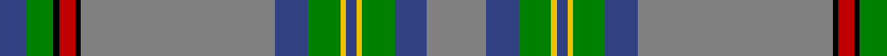

In pattern [BGKRKGBGYBYGBG](/patterns/bgkrkgbgybygbg/).

This was sourced from weddslist.  It is a [14 stripes tartan](/stripes/stripes14/).

Original link http://www.weddslist.com/cgi-bin/tartans/pg.pl?source=sts

## Thread count
B/10 G10 K2 R6 K2 N72 B12 G12 Y2 B4 Y2 G12 B12 N/22

## Palette
Each colour and its ΔE from the base-6 reference it is a variant of.

| Colour | Shade | Base | ΔE (OKLab) |
|---|---|---|---|
| B | <code style="background-color:#304080;">#304080</code> `#304080` | B <code style="background-color:#2A418A;">#2A418A</code> | 0.02 |
| G | <code style="background-color:#008000;">#008000</code> `#008000` | G <code style="background-color:#006100;">#006100</code> | 0.10 |
| K | <code style="background-color:#000000;">#000000</code> `#000000` | K <code style="background-color:#000000;">#000000</code> | 0.00 |
| N | <code style="background-color:#808080;">#808080</code> `#808080` | G <code style="background-color:#006100;">#006100</code> | 0.23 |
| R | <code style="background-color:#C00000;">#C00000</code> `#C00000` | R <code style="background-color:#CC0000;">#CC0000</code> | 0.03 |
| Y | <code style="background-color:#F0C000;">#F0C000</code> `#F0C000` | Y <code style="background-color:#F2BF00;">#F2BF00</code> | 0.00 |

## Nearest tartans

The nearest existing variants by ΔTartan distance.

1. [Penman Clan Tartan Tartan Number: 166. Earliest known date: 1984 From design by the late William Penman. See products available Copyright © Blair Urquhart, Comrie, 2015](/setts/s14/r11b6g6y1b2y1g6b6r36k1ra3k1g5b5~b2c2c80-g006818-k101010-r888888-rac80000-ye8c000~x2/) — ΔT 0.50
1. [State Seal of Maryland (Fashion)](/setts/s12/k3y3k2b40w3b10g10y3g21k1r3w3~b1870a4-g006818-k101010-r880000-we8ccb8-ybc8c00~x2/) — ΔT 1.04
1. [Heather Isle](/setts/s14/g80b16ba8bb10g8y1b6r1b6y1g8bb10ba8b16~b003c64-ba440044-bb780078-g808834-r888888-ybc8c00~x2/) — ΔT 1.09
1. [Barcelona English School](/setts/s12/r52g3w3b3y3b2ra3b12g8b2g6y4~b2c2c80-g006818-r888888-rac80000-wfcfcfc-ye8c000/) — ΔT 1.16
1. [Barcelona English School (School)](/setts/s12/r52g3w3b3y3b2ra3b12g8b2g6y4~b2c2c80-g006818-r888888-rac80000-wfcfcfc-ye8c000~x2/) — ΔT 1.16
1. [Donohoe Grey, Peter](/setts/s11/g9b2r1b2g3k9ga3g1ba35k3ba2~b0000cd-ba666666-g603311-ga008b00-k101010-rff0000~x2/) — ΔT 1.19
1. [Philip Boisserolles de St-Julien, baron of Hartsyde (Personal)](/setts/s10/b4r4w1b2r50b20y1g25ra4k2~b003c64-g5c6428-k000000-r888888-radc0000-wf8f8f8-ye8c000~x2/) — ΔT 1.29
1. [Victoria State (Australia)](/setts/s10/g24w2k4w2k8r2b51k2ba8w1~b4c5478-ba5c8ca8-g006818-k101010-re87878-we0e0e0~x2/) — ΔT 1.29
1. [Nickel Lodge Centennial (Corporate)](/setts/s9/r36y2r1y2r4b12w8g2ga12~b003c64-g604000-ga005834-r888888-we0e0e0-ye8c000~x2/) — ΔT 1.30
1. [Hill 70](/setts/s14/b18k1r1w1r4ba4b4g4r1g1r1g1r1g1~b6b8a96-ba2c2c80-g005020-k1c1714-rc82828-wf8f8f8~x4/) — ΔT 1.31

## Neighbour map

Every grey dot is one of 15726 variants placed by the first two principal components of the ΔTartan feature space (44% of its variance). Red is this tartan; blue dots are its nearest — click one to open its page.

<svg viewBox="0 0 640 380" role="img" style="max-width:100%;height:auto;border:1px solid #e0e0e0;border-radius:4px;display:block" xmlns="http://www.w3.org/2000/svg"><image href="/nn/cloud.v1.png" width="640" height="380"/><a href="/setts/s14/r11b6g6y1b2y1g6b6r36k1ra3k1g5b5~b2c2c80-g006818-k101010-r888888-rac80000-ye8c000~x2/"><circle cx="312.1" cy="71.4" r="4" fill="#3465a4"><title>Penman Clan Tartan Tartan Number: 166. Earliest known date: 1984 From design by the late William Penman. See products available Copyright © Blair Urquhart, Comrie, 2015</title></circle></a><a href="/setts/s12/k3y3k2b40w3b10g10y3g21k1r3w3~b1870a4-g006818-k101010-r880000-we8ccb8-ybc8c00~x2/"><circle cx="295.3" cy="82.7" r="4" fill="#3465a4"><title>State Seal of Maryland (Fashion)</title></circle></a><a href="/setts/s14/g80b16ba8bb10g8y1b6r1b6y1g8bb10ba8b16~b003c64-ba440044-bb780078-g808834-r888888-ybc8c00~x2/"><circle cx="335.7" cy="50.5" r="4" fill="#3465a4"><title>Heather Isle</title></circle></a><a href="/setts/s12/r52g3w3b3y3b2ra3b12g8b2g6y4~b2c2c80-g006818-r888888-rac80000-wfcfcfc-ye8c000/"><circle cx="291.4" cy="69.5" r="4" fill="#3465a4"><title>Barcelona English School</title></circle></a><a href="/setts/s12/r52g3w3b3y3b2ra3b12g8b2g6y4~b2c2c80-g006818-r888888-rac80000-wfcfcfc-ye8c000~x2/"><circle cx="291.4" cy="69.5" r="4" fill="#3465a4"><title>Barcelona English School (School)</title></circle></a><a href="/setts/s11/g9b2r1b2g3k9ga3g1ba35k3ba2~b0000cd-ba666666-g603311-ga008b00-k101010-rff0000~x2/"><circle cx="340.3" cy="85.0" r="4" fill="#3465a4"><title>Donohoe Grey, Peter</title></circle></a><a href="/setts/s10/b4r4w1b2r50b20y1g25ra4k2~b003c64-g5c6428-k000000-r888888-radc0000-wf8f8f8-ye8c000~x2/"><circle cx="300.7" cy="61.3" r="4" fill="#3465a4"><title>Philip Boisserolles de St-Julien, baron of Hartsyde (Personal)</title></circle></a><a href="/setts/s10/g24w2k4w2k8r2b51k2ba8w1~b4c5478-ba5c8ca8-g006818-k101010-re87878-we0e0e0~x2/"><circle cx="310.4" cy="73.0" r="4" fill="#3465a4"><title>Victoria State (Australia)</title></circle></a><a href="/setts/s9/r36y2r1y2r4b12w8g2ga12~b003c64-g604000-ga005834-r888888-we0e0e0-ye8c000~x2/"><circle cx="288.7" cy="90.9" r="4" fill="#3465a4"><title>Nickel Lodge Centennial (Corporate)</title></circle></a><a href="/setts/s14/b18k1r1w1r4ba4b4g4r1g1r1g1r1g1~b6b8a96-ba2c2c80-g005020-k1c1714-rc82828-wf8f8f8~x4/"><circle cx="277.0" cy="87.4" r="4" fill="#3465a4"><title>Hill 70</title></circle></a><circle cx="321.1" cy="76.2" r="5" fill="#c00000"/></svg>

ID: /setts/s14/g11b6ga6y1b2y1ga6b6g36k1r3k1ga5b5~b304080-g808080-ga008000-k000000-rc00000-yf0c000~x2/
