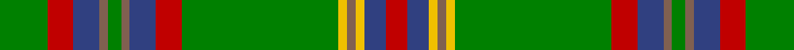

In pattern [GRBRGRBRGYRYBR](/stripes/grbrgrbrgyrybr/).

This was sourced from weddslist.  It is a [14 stripe tartan](/stripes/stripes14/).

Original link http://www.weddslist.com/cgi-bin/tartans/pg.pl?source=sts

## Thread count
G/22 R12 B12 LT4 G6 LT4 B12 R12 G72 Y4 LT4 Y4 B10 R/10

## Palette
Each colour and the base-6 reference it is a variant of.

| Colour | Shade | Base |
|---|---|---|
| B | <code style="background-color:#304080;">#304080</code> `oklch(39.4% 0.109 270.2)` <small>#304080</small> | B <code style="background-color:#2A418A;">#2A418A</code> |
| G | <code style="background-color:#008000;">#008000</code> `oklch(52.0% 0.177 142.5)` <small>#008000</small> | G <code style="background-color:#006100;">#006100</code> |
| LT | <code style="background-color:#806050;">#806050</code> `oklch(51.7% 0.049 47.8)` <small>#806050</small> | R <code style="background-color:#CC0000;">#CC0000</code> |
| R | <code style="background-color:#C00000;">#C00000</code> `oklch(50.7% 0.208 29.2)` <small>#C00000</small> | R <code style="background-color:#CC0000;">#CC0000</code> |
| Y | <code style="background-color:#F0C000;">#F0C000</code> `oklch(82.7% 0.169 90.5)` <small>#F0C000</small> | Y <code style="background-color:#F2BF00;">#F2BF00</code> |

## Nearest tartans

The nearest existing variants by ΔTartan distance, with this tartan at the top so the swatches line up against it.

ΔTartan

Tartan

Sett

—

<a href="/ttd/edit/#slug=g11r6db6o2g3o2db6r6g36ly2o2ly2db5r5~x2">Westmeath</a> <a class="nn-out" href="/setts/s14/g11r6db6o2g3o2db6r6g36ly2o2ly2db5r5~x2/" title="open its dictionary page">↗</a>

1.03

<a href="/ttd/edit/#slug=g21r2w1y3r2g5r21y1ly1y1r1g8~x2">Glendronach</a> <a class="nn-out" href="/setts/s12/g21r2w1y3r2g5r21y1ly1y1r1g8~x2/" title="open its dictionary page">↗</a>

1.03

<a href="/ttd/edit/#slug=g44r4g2r2g2r4g12k12r2db10r4db4ly3~x2">Cochrane of Dundonald</a> <a class="nn-out" href="/setts/s13/g44r4g2r2g2r4g12k12r2db10r4db4ly3~x2/" title="open its dictionary page">↗</a>

1.13

<a href="/ttd/edit/#slug=k3w1g29o8m2o2m2o2m8g7k2~x2">Gray Htg (Name)</a> <a class="nn-out" href="/setts/s11/k3w1g29o8m2o2m2o2m8g7k2~x2/" title="open its dictionary page">↗</a>

1.14

<a href="/ttd/edit/#slug=g7k3g53k3g8k3dr24g8lo18k3lo18k3~x2">MacMillan - 1847 (Clan)</a> <a class="nn-out" href="/setts/s12/g7k3g53k3g8k3dr24g8lo18k3lo18k3~x2/" title="open its dictionary page">↗</a>

1.16

<a href="/ttd/edit/#slug=k3w1g29y8r2y2r2y2r8g7k2~x2">Gray, hunting</a> <a class="nn-out" href="/setts/s11/k3w1g29y8r2y2r2y2r8g7k2~x2/" title="open its dictionary page">↗</a>

1.19

<a href="/ttd/edit/#slug=g34r4g4r2g4r2g3r4g17k17r2db17r4db4ly3~x2">Cochrane (1984) Clan Tartan Tartan Number: 978. Earliest known date: 1984 Lord Dundonald originally registered a version missing a red and a green stripe in 1974. There is a story that a fragment of this design was discovered in the foundations of a Perthshire house in 1934. Around that time, a count was recorded from the sample books of Messrs William Anderson. The red and green have been restored in this version, which is now the 'approved' tartan, and appears in the 'Appendix' of the Lyon Court Books dated 12th November 1984. See products available Copyright © Blair Urquhart, Comrie, 2015</a> <a class="nn-out" href="/setts/s15/g34r4g4r2g4r2g3r4g17k17r2db17r4db4ly3~x2/" title="open its dictionary page">↗</a>

1.21

<a href="/ttd/edit/#slug=g34r4g3r2g4r2g3r4g17k17r2db17r4db4ly3~x2">Cochrane</a> <a class="nn-out" href="/setts/s15/g34r4g3r2g4r2g3r4g17k17r2db17r4db4ly3~x2/" title="open its dictionary page">↗</a>

1.27

<a href="/ttd/edit/#slug=g28r2g28r7lb2r7lb2r7k5dp4lb2~x2">Hynde (Sir John)</a> <a class="nn-out" href="/setts/s11/g28r2g28r7lb2r7lb2r7k5dp4lb2~x2/" title="open its dictionary page">↗</a>

1.29

<a href="/ttd/edit/#slug=g18w1g4w1ly4dg1ly2dg12r2dg4~x2">Michigan, State of</a> <a class="nn-out" href="/setts/s10/g18w1g4w1ly4dg1ly2dg12r2dg4~x2/" title="open its dictionary page">↗</a>

1.30

<a href="/ttd/edit/#slug=ly4o2k2o42k13g25o6k2r4k2~x2">Dinwiddie Clan Tartan Tartan Number: 3212. Earliest known date: 2001 The registered tartan of the Dinwiddie Clan. Dinwiddies are normally associated with the Maxwells, but Lord Lyon stated, in 1988, that Dinwiddies were a sept of no other clan. See products available Copyright © Blair Urquhart, Comrie, 2015</a> <a class="nn-out" href="/setts/s10/ly4o2k2o42k13g25o6k2r4k2~x2/" title="open its dictionary page">↗</a>

## Neighbour map

Every grey dot is one of 14299 variants placed by the first two principal components of the ΔTartan feature space (44% of its variance). Red is this tartan; blue dots are its nearest — click one to open its page.

<svg viewBox="0 0 640 380" role="img" style="max-width:100%;height:auto;border:1px solid #e0e0e0;border-radius:4px;display:block" xmlns="http://www.w3.org/2000/svg"><image href="/nn/cloud.v1.png" width="640" height="380"/><a href="/setts/s12/g21r2w1y3r2g5r21y1ly1y1r1g8~x2/"><circle cx="326.8" cy="117.0" r="4" fill="#3465a4"><title>Glendronach</title></circle></a><a href="/setts/s13/g44r4g2r2g2r4g12k12r2db10r4db4ly3~x2/"><circle cx="332.1" cy="113.6" r="4" fill="#3465a4"><title>Cochrane of Dundonald</title></circle></a><a href="/setts/s11/k3w1g29o8m2o2m2o2m8g7k2~x2/"><circle cx="334.9" cy="115.5" r="4" fill="#3465a4"><title>Gray Htg (Name)</title></circle></a><a href="/setts/s12/g7k3g53k3g8k3dr24g8lo18k3lo18k3~x2/"><circle cx="294.6" cy="149.9" r="4" fill="#3465a4"><title>MacMillan - 1847 (Clan)</title></circle></a><a href="/setts/s11/k3w1g29y8r2y2r2y2r8g7k2~x2/"><circle cx="312.6" cy="105.1" r="4" fill="#3465a4"><title>Gray, hunting</title></circle></a><a href="/setts/s15/g34r4g4r2g4r2g3r4g17k17r2db17r4db4ly3~x2/"><circle cx="265.6" cy="128.0" r="4" fill="#3465a4"><title>Cochrane (1984) Clan Tartan Tartan Number: 978. Earliest known date: 1984 Lord Dundonald originally registered a version missing a red and a green stripe in 1974. There is a story that a fragment of this design was discovered in the foundations of a Perthshire house in 1934. Around that time, a count was recorded from the sample books of Messrs William Anderson. The red and green have been restored in this version, which is now the 'approved' tartan, and appears in the 'Appendix' of the Lyon Court Books dated 12th November 1984. See products available Copyright © Blair Urquhart, Comrie, 2015</title></circle></a><a href="/setts/s15/g34r4g3r2g4r2g3r4g17k17r2db17r4db4ly3~x2/"><circle cx="265.9" cy="128.3" r="4" fill="#3465a4"><title>Cochrane</title></circle></a><a href="/setts/s11/g28r2g28r7lb2r7lb2r7k5dp4lb2~x2/"><circle cx="336.1" cy="153.6" r="4" fill="#3465a4"><title>Hynde (Sir John)</title></circle></a><a href="/setts/s10/g18w1g4w1ly4dg1ly2dg12r2dg4~x2/"><circle cx="268.6" cy="148.3" r="4" fill="#3465a4"><title>Michigan, State of</title></circle></a><a href="/setts/s10/ly4o2k2o42k13g25o6k2r4k2~x2/"><circle cx="267.2" cy="115.2" r="4" fill="#3465a4"><title>Dinwiddie Clan Tartan Tartan Number: 3212. Earliest known date: 2001 The registered tartan of the Dinwiddie Clan. Dinwiddies are normally associated with the Maxwells, but Lord Lyon stated, in 1988, that Dinwiddies were a sept of no other clan. See products available Copyright © Blair Urquhart, Comrie, 2015</title></circle></a><circle cx="298.8" cy="119.7" r="5" fill="#c00000"/></svg>

ID: /setts/s14/g11r6db6o2g3o2db6r6g36ly2o2ly2db5r5~x2/
