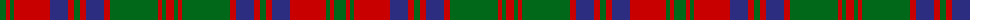

In pattern [GRGRBRGRBRGRGR](/patterns/grgrbrgrbrgrgr/).

This was sourced from house-of-tartan.  It is a [14 stripes tartan](/stripes/stripes14/).

Original link http://www.house-of-tartan.scotland.net/house/TartanViewjs.asp?colr=Def&tnam=898

## Thread count
G/12 R4 G4 R36 DB18 R6 G6 R6 DB18 R6 G48 R4 G4 R/8

## Palette
Each colour and its ΔE from the base-6 reference it is a variant of.

| Colour | Shade | Base | ΔE (OKLab) |
|---|---|---|---|
| DB | <code style="background-color:#2C2C80;">#2C2C80</code> `#2C2C80` | B <code style="background-color:#2C4084;">#2C4084</code> | 0.05 |
| G | <code style="background-color:#006818;">#006818</code> `#006818` | G <code style="background-color:#006400;">#006400</code> | 0.02 |
| R | <code style="background-color:#C80000;">#C80000</code> `#C80000` | R <code style="background-color:#C80000;">#C80000</code> | 0.00 |

ID: /setts/s14/g12r4g4r36b18r6g6r6b18r6g48r4g4r8-b2c2c80-g006818-rc80000/
