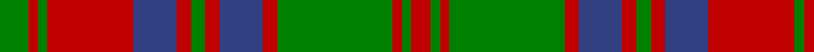

In pattern [GRGRBRGRBRGRGR](/patterns/grgrbrgrbrgrgr/).

This was sourced from weddslist.  It is a [14 stripes tartan](/stripes/stripes14/).

Original link http://www.weddslist.com/cgi-bin/tartans/pg.pl?source=sts

## Thread count
G/12 R4 G4 R36 B18 R6 G6 R6 B18 R6 G48 R4 G4 R/8

## Palette
Each colour and its ΔE from the base-6 reference it is a variant of.

| Colour | Shade | Base | ΔE (OKLab) |
|---|---|---|---|
| B | <code style="background-color:#304080;">#304080</code> `#304080` | B <code style="background-color:#2A418A;">#2A418A</code> | 0.02 |
| G | <code style="background-color:#008000;">#008000</code> `#008000` | G <code style="background-color:#006100;">#006100</code> | 0.10 |
| R | <code style="background-color:#C00000;">#C00000</code> `#C00000` | R <code style="background-color:#CC0000;">#CC0000</code> | 0.03 |

## Nearest tartans

The nearest existing variants by ΔTartan distance.

1. [Stewart of Urrard Clan Tartan Tartan Number: 898. Earliest known date: pre 1930 A kilt in this material was brought into the Scottish Tartans Museum in Comrie which could be dated to before 1930. It belonged to a member of the Stewart Society at that time. The threadcount and the name were documented by Mackinlay, who studied and collected tartans between 1930 and 1950. See products available Copyright © Blair Urquhart, Comrie, 2015](/setts/s14/g12r4g4r36b18r6g6r6b18r6g48r4g4r8-b2c2c80-g006818-rc80000/) — ΔT 0.53
1. [Stuart/Stewart of Urrard](/setts/s14/g12r4g4r36b18r6g6r6b18r6g48r4g4r8-b2c4084-g005020-rdc0000/) — ΔT 0.79
1. [Stewart of Urrard (Clan?)](/setts/s14/g12r4g4r36b18r6g6r6b18r6g48r4g4r8-b440044-g006818-rc80000/) — ΔT 0.83
1. [Wilson's No.119](/setts/s12/r12g56r12b4r12b38r12b4r12g56r12b4-b780078-g006818-rc80000/) — ΔT 0.91
1. [Inverness, Fencibles](/setts/s12/b20r2b2r2g20r26g4r26g20b20r2b2-b304080-g008000-rc00000/) — ΔT 0.91
1. [Frasers Highlanders (Military?)](/setts/s12/r56g4r4g4b24g36r4g36b24r30g4r6-b1c1c50-g006818-rc80000/) — ΔT 0.97
1. [Bruce, Old](/setts/s14/r45b4r4g48r4b4r4b15r4b4r40g4r4g30-b304080-g008000-rc00000/) — ΔT 0.98
1. [Leach (1999)](/setts/s12/k12r6k6r48b8g20r4g8r4g48r12b4-b2888c4-g006818-k101010-rc80000/) — ΔT 1.01
1. [Fraser, Stewart of Athol](/setts/s12/b32r2b2r2g24r32g4r32g24b24r2b2-b304080-g008000-rc00000/) — ΔT 1.02
1. [Nithsdale](/setts/s10/b20r4g4r12g32r2g4r2g6r12-b304080-g008000-rc00000/) — ΔT 1.04

## Neighbour map

Every grey dot is one of 15726 variants placed by the first two principal components of the ΔTartan feature space (44% of its variance). Red is this tartan; blue dots are its nearest — click one to open its page.

<svg viewBox="0 0 640 380" role="img" style="max-width:100%;height:auto;border:1px solid #e0e0e0;border-radius:4px;display:block" xmlns="http://www.w3.org/2000/svg"><image href="/nn/cloud.v1.png" width="640" height="380"/><a href="/setts/s14/g12r4g4r36b18r6g6r6b18r6g48r4g4r8-b2c2c80-g006818-rc80000/"><circle cx="268.9" cy="170.8" r="4" fill="#3465a4"><title>Stewart of Urrard Clan Tartan Tartan Number: 898. Earliest known date: pre 1930 A kilt in this material was brought into the Scottish Tartans Museum in Comrie which could be dated to before 1930. It belonged to a member of the Stewart Society at that time. The threadcount and the name were documented by Mackinlay, who studied and collected tartans between 1930 and 1950. See products available Copyright © Blair Urquhart, Comrie, 2015</title></circle></a><a href="/setts/s14/g12r4g4r36b18r6g6r6b18r6g48r4g4r8-b2c4084-g005020-rdc0000/"><circle cx="269.0" cy="169.4" r="4" fill="#3465a4"><title>Stuart/Stewart of Urrard</title></circle></a><a href="/setts/s14/g12r4g4r36b18r6g6r6b18r6g48r4g4r8-b440044-g006818-rc80000/"><circle cx="270.8" cy="168.5" r="4" fill="#3465a4"><title>Stewart of Urrard (Clan?)</title></circle></a><a href="/setts/s12/r12g56r12b4r12b38r12b4r12g56r12b4-b780078-g006818-rc80000/"><circle cx="303.5" cy="177.4" r="4" fill="#3465a4"><title>Wilson's No.119</title></circle></a><a href="/setts/s12/b20r2b2r2g20r26g4r26g20b20r2b2-b304080-g008000-rc00000/"><circle cx="249.5" cy="187.1" r="4" fill="#3465a4"><title>Inverness, Fencibles</title></circle></a><a href="/setts/s12/r56g4r4g4b24g36r4g36b24r30g4r6-b1c1c50-g006818-rc80000/"><circle cx="271.6" cy="178.9" r="4" fill="#3465a4"><title>Frasers Highlanders (Military?)</title></circle></a><a href="/setts/s14/r45b4r4g48r4b4r4b15r4b4r40g4r4g30-b304080-g008000-rc00000/"><circle cx="320.2" cy="163.7" r="4" fill="#3465a4"><title>Bruce, Old</title></circle></a><a href="/setts/s12/k12r6k6r48b8g20r4g8r4g48r12b4-b2888c4-g006818-k101010-rc80000/"><circle cx="253.8" cy="157.4" r="4" fill="#3465a4"><title>Leach (1999)</title></circle></a><a href="/setts/s12/b32r2b2r2g24r32g4r32g24b24r2b2-b304080-g008000-rc00000/"><circle cx="255.9" cy="176.8" r="4" fill="#3465a4"><title>Fraser, Stewart of Athol</title></circle></a><a href="/setts/s10/b20r4g4r12g32r2g4r2g6r12-b304080-g008000-rc00000/"><circle cx="299.7" cy="182.6" r="4" fill="#3465a4"><title>Nithsdale</title></circle></a><circle cx="267.0" cy="170.6" r="5" fill="#c00000"/></svg>

ID: /setts/s14/g12r4g4r36b18r6g6r6b18r6g48r4g4r8-b304080-g008000-rc00000/
