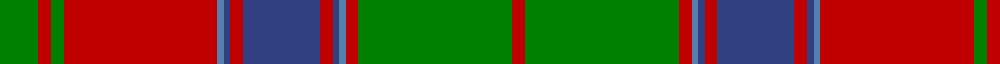

In pattern [GRGRBBRBRBBRGR](/patterns/grgrbbrbrbbrgr/).

This was sourced from weddslist.  It is a [14 stripes tartan](/stripes/stripes14/).

Original link http://www.weddslist.com/cgi-bin/tartans/pg.pl?source=sts

## Thread count
G/12 R4 G4 R48 Ba2 B2 R4 B24 R4 B2 Ba2 R4 G48 R/4

## Palette
Each colour and its ΔE from the base-6 reference it is a variant of.

| Colour | Shade | Base | ΔE (OKLab) |
|---|---|---|---|
| B | <code style="background-color:#304080;">#304080</code> `#304080` | B <code style="background-color:#2C4084;">#2C4084</code> | 0.01 |
| Ba | <code style="background-color:#5480B0;">#5480B0</code> `#5480B0` | B <code style="background-color:#2C4084;">#2C4084</code> | 0.20 |
| G | <code style="background-color:#008000;">#008000</code> `#008000` | G <code style="background-color:#006400;">#006400</code> | 0.09 |
| R | <code style="background-color:#C00000;">#C00000</code> `#C00000` | R <code style="background-color:#C80000;">#C80000</code> | 0.02 |

## Nearest tartans

The nearest existing variants by ΔTartan distance.

1. [Stewart of Appin 4](/setts/s16/r6b4ba2r4g48r8g4r4b16r4g4r48b4ba2r4g4-b304080-ba5480b0-g008000-rc00000/) — ΔT 0.64
1. [Ladybird](/setts/s15/r40b2r2ba4r2b2r8ba8g4ba8g4ba8g38r2b4-b800080-ba304080-g008000-rc00000/) — ΔT 0.67
1. [Unidentified Coat](/setts/s14/g12r4g4r48b2ba2r4ba24r4ba2b2r4g48r4-b3c82af-ba2c4084-g005020-rdc0000/) — ΔT 0.75
1. [Crieff](/setts/s13/r4ra10g7ra70g7ra4b21ra4g85ra4g7ra10r4-b800080-g008000-rd03030-rac00000/) — ΔT 0.79
1. [Stewart of Appin - 1906](/setts/s16/r6b4ba2r4g48r8g4r4b16r4g4r48b4ba2r4g4-b2c2c80-ba5c8ca8-g006818-rc80000/) — ΔT 0.84
1. [Crieff District Tartan Tartan Number: 1636. Earliest known date: 1793 Wilson's accounts of 1793 mention the Crieff tartan with no details. A manuscript dated 1800 gives details of colour but it is not until the publication of the Key Pattern Book of 1819 that this sett is revealed in full. Crieff in Perthshire was the most famous of the cattle drovers 'trysts' prior to 1700. It is a very large sett which has been proportionately reduced for this illustration. The full threadcount: Light Red 4, Red 12, Green 8, R 140, G 8, R 4, Purple 42, R 4, G 170, R 4, G 8, R 12, LR 4. See products available Copyright © Blair Urquhart, Comrie, 2015](/setts/s13/r4ra10g7ra70g7ra4b21ra4g85ra4g7ra10r4-b780078-g006818-rd05054-rac80000/) — ΔT 0.87
1. [MacQuarrie 3](/setts/s13/g4r6g4r104g4r4b56r4g84r4g4r6g4-b304080-g008000-rc00000/) — ΔT 0.98
1. [MacLintock](/setts/s12/g72r6g6r6b18r6ba4r80b6r6b4r12-b304080-ba5480b0-g008000-rc00000/) — ΔT 1.13
1. [Robertson 7](/setts/s13/w2g4r36b4r4b36r4g36r4b4r36g4w2-b304080-g008000-rc00000-we0e0e0/) — ΔT 1.17
1. [Fraser of Altyre](/setts/s14/r9b4r89b4r4b80r9b9r4b4r4g80r4b4-b304080-g008000-rc00000/) — ΔT 1.18

## Neighbour map

Every grey dot is one of 15726 variants placed by the first two principal components of the ΔTartan feature space (44% of its variance). Red is this tartan; blue dots are its nearest — click one to open its page.

<svg viewBox="0 0 640 380" role="img" style="max-width:100%;height:auto;border:1px solid #e0e0e0;border-radius:4px;display:block" xmlns="http://www.w3.org/2000/svg"><image href="/nn/cloud.v1.png" width="640" height="380"/><a href="/setts/s16/r6b4ba2r4g48r8g4r4b16r4g4r48b4ba2r4g4-b304080-ba5480b0-g008000-rc00000/"><circle cx="322.2" cy="100.2" r="4" fill="#3465a4"><title>Stewart of Appin 4</title></circle></a><a href="/setts/s15/r40b2r2ba4r2b2r8ba8g4ba8g4ba8g38r2b4-b800080-ba304080-g008000-rc00000/"><circle cx="265.9" cy="112.0" r="4" fill="#3465a4"><title>Ladybird</title></circle></a><a href="/setts/s14/g12r4g4r48b2ba2r4ba24r4ba2b2r4g48r4-b3c82af-ba2c4084-g005020-rdc0000/"><circle cx="294.5" cy="106.8" r="4" fill="#3465a4"><title>Unidentified Coat</title></circle></a><a href="/setts/s13/r4ra10g7ra70g7ra4b21ra4g85ra4g7ra10r4-b800080-g008000-rd03030-rac00000/"><circle cx="325.2" cy="112.8" r="4" fill="#3465a4"><title>Crieff</title></circle></a><a href="/setts/s16/r6b4ba2r4g48r8g4r4b16r4g4r48b4ba2r4g4-b2c2c80-ba5c8ca8-g006818-rc80000/"><circle cx="323.4" cy="99.9" r="4" fill="#3465a4"><title>Stewart of Appin - 1906</title></circle></a><a href="/setts/s13/r4ra10g7ra70g7ra4b21ra4g85ra4g7ra10r4-b780078-g006818-rd05054-rac80000/"><circle cx="333.2" cy="115.7" r="4" fill="#3465a4"><title>Crieff District Tartan Tartan Number: 1636. Earliest known date: 1793 Wilson's accounts of 1793 mention the Crieff tartan with no details. A manuscript dated 1800 gives details of colour but it is not until the publication of the Key Pattern Book of 1819 that this sett is revealed in full. Crieff in Perthshire was the most famous of the cattle drovers 'trysts' prior to 1700. It is a very large sett which has been proportionately reduced for this illustration. The full threadcount: Light Red 4, Red 12, Green 8, R 140, G 8, R 4, Purple 42, R 4, G 170, R 4, G 8, R 12, LR 4. See products available Copyright © Blair Urquhart, Comrie, 2015</title></circle></a><a href="/setts/s13/g4r6g4r104g4r4b56r4g84r4g4r6g4-b304080-g008000-rc00000/"><circle cx="339.4" cy="116.0" r="4" fill="#3465a4"><title>MacQuarrie 3</title></circle></a><a href="/setts/s12/g72r6g6r6b18r6ba4r80b6r6b4r12-b304080-ba5480b0-g008000-rc00000/"><circle cx="346.9" cy="120.2" r="4" fill="#3465a4"><title>MacLintock</title></circle></a><a href="/setts/s13/w2g4r36b4r4b36r4g36r4b4r36g4w2-b304080-g008000-rc00000-we0e0e0/"><circle cx="290.7" cy="131.1" r="4" fill="#3465a4"><title>Robertson 7</title></circle></a><a href="/setts/s14/r9b4r89b4r4b80r9b9r4b4r4g80r4b4-b304080-g008000-rc00000/"><circle cx="306.8" cy="122.2" r="4" fill="#3465a4"><title>Fraser of Altyre</title></circle></a><circle cx="294.6" cy="109.1" r="5" fill="#c00000"/></svg>

ID: /setts/s14/g12r4g4r48b2ba2r4ba24r4ba2b2r4g48r4-b5480b0-ba304080-g008000-rc00000/
