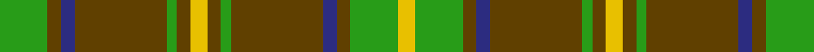

In pattern [GGBGGGYGGGBGGY](/stripes/ggbgggygggbggy/).

This was sourced from register-of-tartans.  It is a [14 stripe tartan](/stripes/stripes14/).

Original link https://www.tartanregister.gov.uk/tartanDetails.aspx?ref=1848

## Register references

External register numbers recorded for this tartan.

- Scottish Register of Tartans: [1848](https://www.tartanregister.gov.uk/tartanDetails.aspx?ref=1848)
- Scottish Tartans Authority (ITI): 1882
- Scottish Tartans World Register: 1882

## Thread count
Ga/28 T8 DBa8 T54 Ga6 T8 Y10 T8 Ga6 T54 DBa8 T8 Ga28 Y/10

## Palette
Each colour and the base-6 reference it is a variant of.

| Colour | Shade | Base |
|---|---|---|
| DB | <code style="background-color:#202060;">#202060</code> `oklch(28.9% 0.111 276.9)` <small>#202060</small> | B <code style="background-color:#2A418A;">#2A418A</code> |
| DBa | <code style="background-color:#2C2C80;">#2C2C80</code> `oklch(35.0% 0.138 276.6)` <small>#2C2C80</small> | B <code style="background-color:#2A418A;">#2A418A</code> |
| DG | <code style="background-color:#003820;">#003820</code> `oklch(30.0% 0.070 158.3)` <small>#003820</small> | G <code style="background-color:#006100;">#006100</code> |
| G | <code style="background-color:#006818;">#006818</code> `oklch(45.0% 0.142 145.0)` <small>#006818</small> | G <code style="background-color:#006100;">#006100</code> |
| Ga | <code style="background-color:#289C18;">#289C18</code> `oklch(60.6% 0.191 141.6)` <small>#289C18</small> | G <code style="background-color:#006100;">#006100</code> |
| T | <code style="background-color:#604000;">#604000</code> `oklch(39.8% 0.083 76.8)` <small>#604000</small> | G <code style="background-color:#006100;">#006100</code> |
| Y | <code style="background-color:#E8C000;">#E8C000</code> `oklch(81.9% 0.168 93.7)` <small>#E8C000</small> | Y <code style="background-color:#F2BF00;">#F2BF00</code> |

## Nearest tartans

The nearest existing variants by ΔTartan distance.

1. [Dublin](/setts/s12/r3g8r2g18m5g3dr3g3dr16g3dr3g3~x2/) — ΔT 0.70
1. [Ulster Red (District)](/setts/s12/g10k1g10r1g1k1g1k1r10k1lo1k1~x4/) — ΔT 1.15
1. [Dublin Irish County Tartan Tartan Number: 2250. Earliest known date: 1996 One of a series of Irish District tartans designed by Polly Wittering of the House of Edgar, with colours reminiscent of the Country with soft warm colours dominating. See products available Copyright © Blair Urquhart, Comrie, 2015](/setts/s12/r3lg8r2lg18dp5lg3o3lg3o16lg3o3lg3~x2/) — ΔT 1.26
1. [Fraser of Castle Leathers, Major James](/setts/s15/lb2r19lb2r5lb2g13lb2g12lb2r5lb2g14lb2g12lb2~x2/) — ΔT 1.30
1. [Invertere (Daks #2) (Fashion)](/setts/s8/ly5g14dy4db4dy27g3dy4ly5~x2/) — ΔT 1.34
1. [Beechgrove Garden, The](/setts/s14/dp2g25dg8g2dg2g25dp2g2dp6g2w2g4dg16g2~x2/) — ΔT 1.37
1. [Unidentified #51](/setts/s14/r2dg2lr2dg8r2dg2r2dg6r1dg1r1dg1r1lr1~x2/) — ΔT 1.38
1. [Hynde (Sir John)](/setts/s11/g28r2g28r7lb2r7lb2r7k5dp4lb2~x2/) — ΔT 1.40
1. [Skene #2](/setts/s12/db6r3g1r3g12r3g1~x4/) — ΔT 1.42
1. [Princess Marina](/setts/s12/r3g18g4r3g4r5g4r5g4r5g2w2~x2/) — ΔT 1.42

## Neighbour map

Every grey dot is one of 14299 variants placed by the first two principal components of the ΔTartan feature space (44% of its variance). Red is this tartan; blue dots are its nearest — click one to open its page.

<svg viewBox="0 0 640 380" role="img" style="max-width:100%;height:auto;border:1px solid #e0e0e0;border-radius:4px;display:block" xmlns="http://www.w3.org/2000/svg"><image href="/nn/cloud.v1.png" width="640" height="380"/><a href="/setts/s12/r3g8r2g18m5g3dr3g3dr16g3dr3g3~x2/"><circle cx="292.0" cy="192.6" r="4" fill="#3465a4"><title>Dublin</title></circle></a><a href="/setts/s12/g10k1g10r1g1k1g1k1r10k1lo1k1~x4/"><circle cx="344.8" cy="177.8" r="4" fill="#3465a4"><title>Ulster Red (District)</title></circle></a><a href="/setts/s12/r3lg8r2lg18dp5lg3o3lg3o16lg3o3lg3~x2/"><circle cx="300.1" cy="189.2" r="4" fill="#3465a4"><title>Dublin Irish County Tartan Tartan Number: 2250. Earliest known date: 1996 One of a series of Irish District tartans designed by Polly Wittering of the House of Edgar, with colours reminiscent of the Country with soft warm colours dominating. See products available Copyright © Blair Urquhart, Comrie, 2015</title></circle></a><a href="/setts/s15/lb2r19lb2r5lb2g13lb2g12lb2r5lb2g14lb2g12lb2~x2/"><circle cx="289.3" cy="181.5" r="4" fill="#3465a4"><title>Fraser of Castle Leathers, Major James</title></circle></a><a href="/setts/s8/ly5g14dy4db4dy27g3dy4ly5~x2/"><circle cx="278.5" cy="194.4" r="4" fill="#3465a4"><title>Invertere (Daks #2) (Fashion)</title></circle></a><a href="/setts/s14/dp2g25dg8g2dg2g25dp2g2dp6g2w2g4dg16g2~x2/"><circle cx="359.4" cy="159.8" r="4" fill="#3465a4"><title>Beechgrove Garden, The</title></circle></a><a href="/setts/s14/r2dg2lr2dg8r2dg2r2dg6r1dg1r1dg1r1lr1~x2/"><circle cx="369.3" cy="215.2" r="4" fill="#3465a4"><title>Unidentified #51</title></circle></a><a href="/setts/s11/g28r2g28r7lb2r7lb2r7k5dp4lb2~x2/"><circle cx="336.1" cy="153.6" r="4" fill="#3465a4"><title>Hynde (Sir John)</title></circle></a><a href="/setts/s12/db6r3g1r3g12r3g1~x4/"><circle cx="325.1" cy="195.0" r="4" fill="#3465a4"><title>Skene #2</title></circle></a><a href="/setts/s12/r3g18g4r3g4r5g4r5g4r5g2w2~x2/"><circle cx="359.1" cy="207.0" r="4" fill="#3465a4"><title>Princess Marina</title></circle></a><circle cx="310.0" cy="180.7" r="5" fill="#c00000"/></svg>

ID: /setts/s14/g14dy4db4dy27g3dy4ly5dy4g3dy27db4dy4g14ly5~x2/
