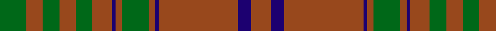

In pattern [GRGRGRBRGRBRBR](/patterns/grgrgrbrgrbrbr/).

This was sourced from tartans-authority.  It is a [14 stripes tartan](/stripes/stripes14/).

Original link http://www.tartansauthority.com/tartan-ferret/display/3371/

## Attestations

This cloth appears in 2 source records; the oldest owns this page.

- pre 1970 — MacGillivray Htg (Clan) (tartans-authority, [record](http://www.tartansauthority.com/tartan-ferret/display/3371/))
- undated — MacGillivray Hunting (register-of-tartans, [record](https://www.tartanregister.gov.uk/tartanDetails.aspx?ref=5388))

## Thread count
G/16 T10 G10 T10 G10 T12 DB2 T4 G16 T4 DB2 T48 DB8 T/12

## Palette
Each colour and its ΔE from the base-6 reference it is a variant of.

| Colour | Shade | Base | ΔE (OKLab) |
|---|---|---|---|
| DB | <code style="background-color:#1C0070;">#1C0070</code> `#1C0070` | B <code style="background-color:#2A418A;">#2A418A</code> | 0.14 |
| G | <code style="background-color:#006818;">#006818</code> `#006818` | G <code style="background-color:#006100;">#006100</code> | 0.02 |
| T | <code style="background-color:#98481C;">#98481C</code> `#98481C` | R <code style="background-color:#CC0000;">#CC0000</code> | 0.11 |

## Nearest tartans

The nearest existing variants by ΔTartan distance.

1. [Scottish Piping Society of London](/setts/s12/g42r6g42b10g6r60g6b10g42r6g42b4-b202060-g5c6428-rc8002c/) — ΔT 1.00
1. [Howells](/setts/s15/b32r2g6b10r2b10g6b8g24b28y2b28g24y4r12-b785050-g005020-rdc0000-ye8c000/) — ΔT 1.42
1. [Seton Hunting](/setts/s18/g12ga4g60r8g4r8g4ga28w4ga8w4ga28g4r8g4r8g60ga4-g604000-ga408060-rc80000-wfcfcfc/) — ΔT 1.65
1. [Seton Htg (Clan)](/setts/s10/g12ga4g60r8g4r8g4ga28w4ga8-g604000-ga408060-rc80000-wfcfcfc/) — ΔT 1.65
1. [Land's End (Unnamed Camel)](/setts/s9/r48b4r6ra12r6b4g30r40b8-b401000-g003000-r906030-ra806050/) — ΔT 1.66
1. [Livingstone (Australia) NSW](/setts/s12/g24r8k2y2r4k2y2r8g32r40g4r16-g003820-k101010-r780808-ye1ad29/) — ΔT 1.70
1. [Donachie of Brockloch (Clan)](/setts/s10/r48g4r4g40r50g4r4g4r4g40-g005834-r940000/) — ΔT 1.74
1. [Livingston](/setts/s10/g24r8k2r4k2r8g32r40g4r16-g11450d-k000000-raa0000/) — ΔT 1.77
1. [Frame - Ferniegair (Personal)](/setts/s12/g16ga56r4ga4g4ga4r4ga56r56ga4r4g4-g003820-ga604000-rc8002c/) — ΔT 1.78
1. [MacDonald of Aird & Valley (Clan?)](/setts/s14/r48b4r4g32r8b4r4b12r4b4r48g4r4g32-b1c0070-g006818-r880000/) — ΔT 1.80

## Neighbour map

Every grey dot is one of 15726 variants placed by the first two principal components of the ΔTartan feature space (44% of its variance). Red is this tartan; blue dots are its nearest — click one to open its page.

<svg viewBox="0 0 640 380" role="img" style="max-width:100%;height:auto;border:1px solid #e0e0e0;border-radius:4px;display:block" xmlns="http://www.w3.org/2000/svg"><image href="/nn/cloud.v1.png" width="640" height="380"/><a href="/setts/s12/g42r6g42b10g6r60g6b10g42r6g42b4-b202060-g5c6428-rc8002c/"><circle cx="443.8" cy="203.6" r="4" fill="#3465a4"><title>Scottish Piping Society of London</title></circle></a><a href="/setts/s15/b32r2g6b10r2b10g6b8g24b28y2b28g24y4r12-b785050-g005020-rdc0000-ye8c000/"><circle cx="388.6" cy="190.7" r="4" fill="#3465a4"><title>Howells</title></circle></a><a href="/setts/s18/g12ga4g60r8g4r8g4ga28w4ga8w4ga28g4r8g4r8g60ga4-g604000-ga408060-rc80000-wfcfcfc/"><circle cx="373.0" cy="142.9" r="4" fill="#3465a4"><title>Seton Hunting</title></circle></a><a href="/setts/s10/g12ga4g60r8g4r8g4ga28w4ga8-g604000-ga408060-rc80000-wfcfcfc/"><circle cx="389.8" cy="170.7" r="4" fill="#3465a4"><title>Seton Htg (Clan)</title></circle></a><a href="/setts/s9/r48b4r6ra12r6b4g30r40b8-b401000-g003000-r906030-ra806050/"><circle cx="409.5" cy="207.2" r="4" fill="#3465a4"><title>Land's End (Unnamed Camel)</title></circle></a><a href="/setts/s12/g24r8k2y2r4k2y2r8g32r40g4r16-g003820-k101010-r780808-ye1ad29/"><circle cx="406.7" cy="173.5" r="4" fill="#3465a4"><title>Livingstone (Australia) NSW</title></circle></a><a href="/setts/s10/r48g4r4g40r50g4r4g4r4g40-g005834-r940000/"><circle cx="449.8" cy="229.8" r="4" fill="#3465a4"><title>Donachie of Brockloch (Clan)</title></circle></a><a href="/setts/s10/g24r8k2r4k2r8g32r40g4r16-g11450d-k000000-raa0000/"><circle cx="402.3" cy="185.3" r="4" fill="#3465a4"><title>Livingston</title></circle></a><a href="/setts/s12/g16ga56r4ga4g4ga4r4ga56r56ga4r4g4-g003820-ga604000-rc8002c/"><circle cx="445.3" cy="186.8" r="4" fill="#3465a4"><title>Frame - Ferniegair (Personal)</title></circle></a><a href="/setts/s14/r48b4r4g32r8b4r4b12r4b4r48g4r4g32-b1c0070-g006818-r880000/"><circle cx="379.4" cy="179.4" r="4" fill="#3465a4"><title>MacDonald of Aird &amp; Valley (Clan?)</title></circle></a><circle cx="445.2" cy="178.3" r="5" fill="#c00000"/></svg>

ID: /setts/s14/g16r10g10r10g10r12b2r4g16r4b2r48b8r12-b1c0070-g006818-r98481c/
