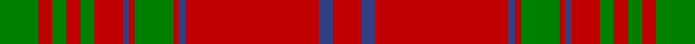

In pattern [GRGRGRBRGRBRBR](/stripes/grgrgrbrgrbrbr/).

This was sourced from weddslist.  It is a [14 stripe tartan](/stripes/stripes14/).

Original link http://www.weddslist.com/cgi-bin/tartans/pg.pl?source=sts

## Also known as

This cloth is also recorded under:

- MacGillivray #3
- MacGillivray Hunting

## Attestations

This cloth appears in 2 source records; the oldest owns this page.

- undated — MacGillivray (weddslist, [record](http://www.weddslist.com/cgi-bin/tartans/pg.pl?source=sts))
- undated — MacGillivray Hunting Clan Tartan Tartan Number: 880. Earliest known date: pre 2003 The pattern books of the old firm of weavers, Wilson's of Bannockburn, provide a reliable early source for this tartan. Wilson's were in business with a monopoly to supply tartan to the regiments in the second half of the 18th century before this pattern was recorded. See products available Copyright © Blair Urquhart, Comrie, 2015 (house-of-tartan, [record](http://www.house-of-tartan.scotland.net/house/TartanViewjs.asp?colr=Def&tnam=880))

## Thread count
G/38 R14 G14 R14 G14 R28 B6 R6 G38 R6 B6 R132 B14 R/28

## Palette
Each colour and the base-6 reference it is a variant of.

| Colour | Shade | Base |
|---|---|---|
| B | <code style="background-color:#304080;">#304080</code> `oklch(39.4% 0.109 270.2)` <small>#304080</small> | B <code style="background-color:#2A418A;">#2A418A</code> |
| G | <code style="background-color:#008000;">#008000</code> `oklch(52.0% 0.177 142.5)` <small>#008000</small> | G <code style="background-color:#006100;">#006100</code> |
| R | <code style="background-color:#C00000;">#C00000</code> `oklch(50.7% 0.208 29.2)` <small>#C00000</small> | R <code style="background-color:#CC0000;">#CC0000</code> |

## Nearest tartans

The nearest existing variants by ΔTartan distance.

1. [MacGillivray #3](/setts/s14/dg19r7dg7r7dg7r14db3r3dg19r3db3r66db7r14~x2/) — ΔT 0.70
1. [MacAlister of Glenbarr](/setts/s14/g20r3g6r6g6r8dp2r2g20r2dp2r46dp3r8~x2/) — ΔT 0.72
1. [MacDonell of Keppoch](/setts/s15/r24g4r2g2r2g2r12g24r1k1r24k1r1k1r6~x2/) — ΔT 0.75
1. [Ross 5](/setts/s14/r3g12r2g1r1g1r4db3r1db3r28db1r3db2~x2/) — ΔT 0.81
1. [Ross 4](/setts/s14/r5g25r5g2r2g2r8db6r2db6r62g2r5g5~x2/) — ΔT 0.90
1. [Rothesay (Red)](/setts/s17/w8r83g7r5g7r7g28r7g28r7g7r5g7r83w4r4w8/) — ΔT 1.03
1. [MacColl](/setts/s14/r12db1r1g8r2db1r1db3r1db1r12g1r1g4~x2/) — ΔT 1.05
1. [Kyle (Green)](/setts/s14/r54g6r5g6r10g3r2g18~x2/) — ΔT 1.08
1. [MacDonald 1](/setts/s9/g2r2db1r24db6r3g12r4db1~x2/) — ΔT 1.13
1. [MacColl](/setts/s14/r12db1r1g8r2db1r1db3r1db1r12g1r1g4~x4/) — ΔT 1.15

## Neighbour map

Every grey dot is one of 14299 variants placed by the first two principal components of the ΔTartan feature space (44% of its variance). Red is this tartan; blue dots are its nearest — click one to open its page.

<svg viewBox="0 0 640 380" role="img" style="max-width:100%;height:auto;border:1px solid #e0e0e0;border-radius:4px;display:block" xmlns="http://www.w3.org/2000/svg"><image href="/nn/cloud.v1.png" width="640" height="380"/><a href="/setts/s14/dg19r7dg7r7dg7r14db3r3dg19r3db3r66db7r14~x2/"><circle cx="439.3" cy="129.0" r="4" fill="#3465a4"><title>MacGillivray #3</title></circle></a><a href="/setts/s14/g20r3g6r6g6r8dp2r2g20r2dp2r46dp3r8~x2/"><circle cx="408.9" cy="136.5" r="4" fill="#3465a4"><title>MacAlister of Glenbarr</title></circle></a><a href="/setts/s15/r24g4r2g2r2g2r12g24r1k1r24k1r1k1r6~x2/"><circle cx="468.2" cy="125.1" r="4" fill="#3465a4"><title>MacDonell of Keppoch</title></circle></a><a href="/setts/s14/r3g12r2g1r1g1r4db3r1db3r28db1r3db2~x2/"><circle cx="469.2" cy="113.6" r="4" fill="#3465a4"><title>Ross 5</title></circle></a><a href="/setts/s14/r5g25r5g2r2g2r8db6r2db6r62g2r5g5~x2/"><circle cx="482.5" cy="107.2" r="4" fill="#3465a4"><title>Ross 4</title></circle></a><a href="/setts/s17/w8r83g7r5g7r7g28r7g28r7g7r5g7r83w4r4w8/"><circle cx="441.5" cy="108.4" r="4" fill="#3465a4"><title>Rothesay (Red)</title></circle></a><a href="/setts/s14/r12db1r1g8r2db1r1db3r1db1r12g1r1g4~x2/"><circle cx="393.9" cy="162.7" r="4" fill="#3465a4"><title>MacColl</title></circle></a><a href="/setts/s14/r54g6r5g6r10g3r2g18~x2/"><circle cx="504.8" cy="143.4" r="4" fill="#3465a4"><title>Kyle (Green)</title></circle></a><a href="/setts/s9/g2r2db1r24db6r3g12r4db1~x2/"><circle cx="420.4" cy="154.2" r="4" fill="#3465a4"><title>MacDonald 1</title></circle></a><a href="/setts/s14/r12db1r1g8r2db1r1db3r1db1r12g1r1g4~x4/"><circle cx="390.2" cy="159.8" r="4" fill="#3465a4"><title>MacColl</title></circle></a><circle cx="445.6" cy="136.6" r="5" fill="#c00000"/></svg>

ID: /setts/s14/g19r7g7r7g7r14db3r3g19r3db3r66db7r14~x2/
