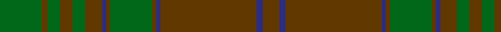

In pattern [GBGBGGGBGGGGGG](/patterns/gbgbgggbgggggg/).

This was sourced from register-of-tartans.  It is a [14 stripes tartan](/stripes/stripes14/).

Original link https://www.tartanregister.gov.uk/tartanDetails.aspx?ref=2270

## Attestations

This cloth appears in 2 source records; the oldest owns this page.

- 01/01/1984 — MacAlister of Glenbarr Hunting (register-of-tartans, [record](https://www.tartanregister.gov.uk/tartanDetails.aspx?ref=2270))
- pre 1984 — MacAlister of Glenbarr Htg (Clan) (tartans-authority, [record](http://www.tartansauthority.com/tartan-ferret/display/910/))

## Thread count
G/40 T6 G12 T12 G12 T16 DB4 T4 G40 T4 DB4 T92 DB6 T/16

## Palette
Each colour and its ΔE from the base-6 reference it is a variant of.

| Colour | Shade | Base | ΔE (OKLab) |
|---|---|---|---|
| DB | <code style="background-color:#2C2C80;">#2C2C80</code> `#2C2C80` | B <code style="background-color:#2A418A;">#2A418A</code> | 0.06 |
| G | <code style="background-color:#006818;">#006818</code> `#006818` | G <code style="background-color:#006100;">#006100</code> | 0.02 |
| T | <code style="background-color:#603800;">#603800</code> `#603800` | G <code style="background-color:#006100;">#006100</code> | 0.16 |

## Nearest tartans

The nearest existing variants by ΔTartan distance.

1. [Unnamed Green (Teddy Bear)](/setts/s11/r1g3ga2g3r1ga24r1g3ga2g3r1x2~g503c14-ga005020-rdc0000/) — ΔT 1.24
1. [MacAlister of Glenbarr Clan Tartan Tartan Number: 910. Earliest known date: pre 1984 This version of the MacAlister of Glenbarr tartan is the same as the MacGillivray hunting tartan. This sample was taken from a piece woven by Lochcarron Weavers around 1984. See products available Copyright © Blair Urquhart, Comrie, 2015](/setts/s14/g4ga2g2ga2g2ga3b1ga1g4ga1b1ga12b2ga3x2~b2c2c80-g006818-ga604000/) — ΔT 1.26
1. [Prince David](/setts/s15/g3ga1y2g3ga1y2gb21g18gb2g3gb2g18gb21ga1y2x2~g006818-ga5c6428-gb604000-yd87c00/) — ΔT 1.44
1. [Prince David Royal Family Tartan Tartan Number: 2125. Earliest known date: 1930 Mackinlay suggests that David was the pet name of the Duke of Windsor when he was a boy and that the tartan was designed for his personal use. See products available Copyright © Blair Urquhart, Comrie, 2015](/setts/s15/g3ga1y2g3ga1y2gb21g18gb2g3gb2g18gb21ga1y2x2~g003820-ga006818-gb604000-yd87c00/) — ΔT 1.47
1. [Historic Scotland Corporate Tartan Tartan Number: 2122. Earliest known date: 1988 Custodians at Historic Scotland properties throughout Scotland, including Edinburgh Castle, wear this distinctive tartan. See products available Copyright © Blair Urquhart, Comrie, 2015](/setts/s9/g2r1g1r2g21ga9k1ga7k2x2~g604000-ga5c6428-k101010-r888888/) — ΔT 1.71
1. [Donachie of Brockloch Htg (Clan)](/setts/s10/g24r2g2ga40g25ga2g2r2g2ga20x2~g487048-ga003820-r880000/) — ΔT 1.73
1. [Gray (Personal)](/setts/s18/b33g10r3g3r3g3r8b10r3b10r8g3r3g3r3g10b33r3x2~b5c5c5c-g006818-ra00000/) — ΔT 1.80
1. [MacAlister of Glenbarr](/setts/s14/g4r2g2r2g2r3b1r1g4r1b1r12b2r3x2~b304080-g008000-r806050/) — ΔT 1.83
1. [Galloway District Tartan Tartan Number: 1469. Earliest known date: 1950 In contemporary correspondence Mr Hannay said that the Galloway 'everyday' tartan was 'in four shades of green with yellow and red stripe'. Cree Mills of Newton-Stewart, however, used only two shades in the manufacture on Mr Hannay's behalf. MacGregor Hastie's collection includes this sett with the pale yellow rendered in white and called Galloway Hunting. See products available Copyright © Blair Urquhart, Comrie, 2015](/setts/s11/g20ga2y3ga2g32ga32g2r3g2ga32g12x2~g003820-ga285800-rc80000-yc4bc68/) — ΔT 1.84
1. [Seton Hunting Family Tartan Tartan Number: 938. Earliest known date: pre 1930 Based on Vestiarium Scoticum - D.C.S. James Cant was a noted authority on tartans around 1930. See products available Copyright © Blair Urquhart, Comrie, 2015](/setts/s10/g6w1g12ga4r4ga2r4ga32g1ga2x2~g006818-ga604000-rc80000-we0e0e0/) — ΔT 1.86

## Neighbour map

Every grey dot is one of 15726 variants placed by the first two principal components of the ΔTartan feature space (44% of its variance). Red is this tartan; blue dots are its nearest — click one to open its page.

<svg viewBox="0 0 640 380" role="img" style="max-width:100%;height:auto;border:1px solid #e0e0e0;border-radius:4px;display:block" xmlns="http://www.w3.org/2000/svg"><image href="/nn/cloud.v1.png" width="640" height="380"/><a href="/setts/s11/r1g3ga2g3r1ga24r1g3ga2g3r1x2~g503c14-ga005020-rdc0000/"><circle cx="544.6" cy="186.0" r="4" fill="#3465a4"><title>Unnamed Green (Teddy Bear)</title></circle></a><a href="/setts/s14/g4ga2g2ga2g2ga3b1ga1g4ga1b1ga12b2ga3x2~b2c2c80-g006818-ga604000/"><circle cx="467.5" cy="234.2" r="4" fill="#3465a4"><title>MacAlister of Glenbarr Clan Tartan Tartan Number: 910. Earliest known date: pre 1984 This version of the MacAlister of Glenbarr tartan is the same as the MacGillivray hunting tartan. This sample was taken from a piece woven by Lochcarron Weavers around 1984. See products available Copyright © Blair Urquhart, Comrie, 2015</title></circle></a><a href="/setts/s15/g3ga1y2g3ga1y2gb21g18gb2g3gb2g18gb21ga1y2x2~g006818-ga5c6428-gb604000-yd87c00/"><circle cx="423.0" cy="179.9" r="4" fill="#3465a4"><title>Prince David</title></circle></a><a href="/setts/s15/g3ga1y2g3ga1y2gb21g18gb2g3gb2g18gb21ga1y2x2~g003820-ga006818-gb604000-yd87c00/"><circle cx="406.7" cy="173.7" r="4" fill="#3465a4"><title>Prince David Royal Family Tartan Tartan Number: 2125. Earliest known date: 1930 Mackinlay suggests that David was the pet name of the Duke of Windsor when he was a boy and that the tartan was designed for his personal use. See products available Copyright © Blair Urquhart, Comrie, 2015</title></circle></a><a href="/setts/s9/g2r1g1r2g21ga9k1ga7k2x2~g604000-ga5c6428-k101010-r888888/"><circle cx="457.3" cy="197.6" r="4" fill="#3465a4"><title>Historic Scotland Corporate Tartan Tartan Number: 2122. Earliest known date: 1988 Custodians at Historic Scotland properties throughout Scotland, including Edinburgh Castle, wear this distinctive tartan. See products available Copyright © Blair Urquhart, Comrie, 2015</title></circle></a><a href="/setts/s10/g24r2g2ga40g25ga2g2r2g2ga20x2~g487048-ga003820-r880000/"><circle cx="444.3" cy="212.8" r="4" fill="#3465a4"><title>Donachie of Brockloch Htg (Clan)</title></circle></a><a href="/setts/s18/b33g10r3g3r3g3r8b10r3b10r8g3r3g3r3g10b33r3x2~b5c5c5c-g006818-ra00000/"><circle cx="430.2" cy="204.3" r="4" fill="#3465a4"><title>Gray (Personal)</title></circle></a><a href="/setts/s14/g4r2g2r2g2r3b1r1g4r1b1r12b2r3x2~b304080-g008000-r806050/"><circle cx="439.7" cy="218.6" r="4" fill="#3465a4"><title>MacAlister of Glenbarr</title></circle></a><a href="/setts/s11/g20ga2y3ga2g32ga32g2r3g2ga32g12x2~g003820-ga285800-rc80000-yc4bc68/"><circle cx="426.6" cy="224.4" r="4" fill="#3465a4"><title>Galloway District Tartan Tartan Number: 1469. Earliest known date: 1950 In contemporary correspondence Mr Hannay said that the Galloway 'everyday' tartan was 'in four shades of green with yellow and red stripe'. Cree Mills of Newton-Stewart, however, used only two shades in the manufacture on Mr Hannay's behalf. MacGregor Hastie's collection includes this sett with the pale yellow rendered in white and called Galloway Hunting. See products available Copyright © Blair Urquhart, Comrie, 2015</title></circle></a><a href="/setts/s10/g6w1g12ga4r4ga2r4ga32g1ga2x2~g006818-ga604000-rc80000-we0e0e0/"><circle cx="473.0" cy="156.6" r="4" fill="#3465a4"><title>Seton Hunting Family Tartan Tartan Number: 938. Earliest known date: pre 1930 Based on Vestiarium Scoticum - D.C.S. James Cant was a noted authority on tartans around 1930. See products available Copyright © Blair Urquhart, Comrie, 2015</title></circle></a><circle cx="498.3" cy="194.5" r="5" fill="#c00000"/></svg>

ID: /setts/s14/g20ga3g6ga6g6ga8b2ga2g20ga2b2ga46b3ga8x2~b2c2c80-g006818-ga603800/
