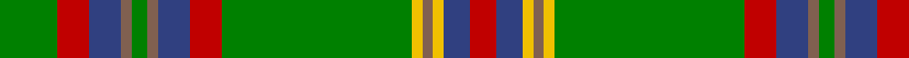

In pattern [GRBRGRBRGYRYBR](/patterns/grbrgrbrgyrybr/).

This was sourced from weddslist.  It is a [14 stripes tartan](/stripes/stripes14/).

Original link http://www.weddslist.com/cgi-bin/tartans/pg.pl?source=sts

## Thread count
G/22 R12 B12 LT4 G6 LT4 B12 R12 G72 Y4 LT4 Y4 B10 R/10

## Palette
Each colour and its ΔE from the base-6 reference it is a variant of.

| Colour | Shade | Base | ΔE (OKLab) |
|---|---|---|---|
| B | <code style="background-color:#304080;">#304080</code> `#304080` | B <code style="background-color:#2A418A;">#2A418A</code> | 0.02 |
| G | <code style="background-color:#008000;">#008000</code> `#008000` | G <code style="background-color:#006100;">#006100</code> | 0.10 |
| LT | <code style="background-color:#806050;">#806050</code> `#806050` | R <code style="background-color:#CC0000;">#CC0000</code> | 0.17 |
| R | <code style="background-color:#C00000;">#C00000</code> `#C00000` | R <code style="background-color:#CC0000;">#CC0000</code> | 0.03 |
| Y | <code style="background-color:#F0C000;">#F0C000</code> `#F0C000` | Y <code style="background-color:#F2BF00;">#F2BF00</code> | 0.00 |

## Nearest tartans

The nearest existing variants by ΔTartan distance.

1. [Glendronach](/setts/s12/g42r4w2ga6r4g10r42ga2y2ga2r2g16-g008000-ga908000-r900030-we0e0e0-yf0c000/) — ΔT 1.02
1. [Cochrane of Dundonald](/setts/s13/g88r8g4r4g4r8g24k24r4b20r8b8y6-b202060-g006818-k101010-rc80000-yd8b000/) — ΔT 1.03
1. [Gray Hunting Family Tartan Tartan Number: 1079. Earliest known date: 1990 There is also a Gray tartan designed by Mrs G. Gray some years earlier. See products available Copyright © Blair Urquhart, Comrie, 2015](/setts/s11/k6w2g58r16ra4r4ra4r4ra16g14k4-g006818-k101010-r888888-raa00048-we0e0e0/) — ΔT 1.04
1. [Gray Htg (Name)](/setts/s11/k6w2g58r16ra4r4ra4r4ra16g14k4-g006818-k101010-r888888-ra981c70-we0e0e0/) — ΔT 1.13
1. [MacMillan - 1847 (Clan)](/setts/s12/g14k6g106k6g16k6b48g16y36k6y36k6-b680028-g006818-k101010-ybc8c00/) — ΔT 1.13
1. [Gray, hunting](/setts/s11/k6w2g58ga16r4ga4r4ga4r16g14k4-g008000-ga808080-k000000-r900030-we0e0e0/) — ΔT 1.15
1. [Cochrane (1984) Clan Tartan Tartan Number: 978. Earliest known date: 1984 Lord Dundonald originally registered a version missing a red and a green stripe in 1974. There is a story that a fragment of this design was discovered in the foundations of a Perthshire house in 1934. Around that time, a count was recorded from the sample books of Messrs William Anderson. The red and green have been restored in this version, which is now the 'approved' tartan, and appears in the 'Appendix' of the Lyon Court Books dated 12th November 1984. See products available Copyright © Blair Urquhart, Comrie, 2015](/setts/s15/g68r8g8r4g8r4g6r8g34k34r4b34r8b8y6-b2c2c80-g006818-k101010-rc80000-ye8c000/) — ΔT 1.18
1. [Manitoba Province (District)](/setts/s14/r48g4ga12g80b4g4b12g4b4g80ga12g4r48y12-b5c8ca8-g006818-ga003820-r901c38-ybc8c00/) — ΔT 1.19
1. [Cochrane](/setts/s15/g68r8g6r4g8r4g6r8g34k34r4b34r8b8y6-b202060-g006818-k101010-rc80000-yd8b000/) — ΔT 1.20
1. [Hynde (Sir John)](/setts/s11/g56r4g56r14w4r14w4r14k10b8w4-b6c0070-g006818-k101010-r880000-wc0c0c0/) — ΔT 1.27

## Neighbour map

Every grey dot is one of 15726 variants placed by the first two principal components of the ΔTartan feature space (44% of its variance). Red is this tartan; blue dots are its nearest — click one to open its page.

<svg viewBox="0 0 640 380" role="img" style="max-width:100%;height:auto;border:1px solid #e0e0e0;border-radius:4px;display:block" xmlns="http://www.w3.org/2000/svg"><image href="/nn/cloud.v1.png" width="640" height="380"/><a href="/setts/s12/g42r4w2ga6r4g10r42ga2y2ga2r2g16-g008000-ga908000-r900030-we0e0e0-yf0c000/"><circle cx="323.4" cy="114.4" r="4" fill="#3465a4"><title>Glendronach</title></circle></a><a href="/setts/s13/g88r8g4r4g4r8g24k24r4b20r8b8y6-b202060-g006818-k101010-rc80000-yd8b000/"><circle cx="327.6" cy="110.0" r="4" fill="#3465a4"><title>Cochrane of Dundonald</title></circle></a><a href="/setts/s11/k6w2g58r16ra4r4ra4r4ra16g14k4-g006818-k101010-r888888-raa00048-we0e0e0/"><circle cx="332.3" cy="111.6" r="4" fill="#3465a4"><title>Gray Hunting Family Tartan Tartan Number: 1079. Earliest known date: 1990 There is also a Gray tartan designed by Mrs G. Gray some years earlier. See products available Copyright © Blair Urquhart, Comrie, 2015</title></circle></a><a href="/setts/s11/k6w2g58r16ra4r4ra4r4ra16g14k4-g006818-k101010-r888888-ra981c70-we0e0e0/"><circle cx="330.3" cy="111.4" r="4" fill="#3465a4"><title>Gray Htg (Name)</title></circle></a><a href="/setts/s12/g14k6g106k6g16k6b48g16y36k6y36k6-b680028-g006818-k101010-ybc8c00/"><circle cx="291.1" cy="146.8" r="4" fill="#3465a4"><title>MacMillan - 1847 (Clan)</title></circle></a><a href="/setts/s11/k6w2g58ga16r4ga4r4ga4r16g14k4-g008000-ga808080-k000000-r900030-we0e0e0/"><circle cx="308.3" cy="102.7" r="4" fill="#3465a4"><title>Gray, hunting</title></circle></a><a href="/setts/s15/g68r8g8r4g8r4g6r8g34k34r4b34r8b8y6-b2c2c80-g006818-k101010-rc80000-ye8c000/"><circle cx="261.0" cy="124.6" r="4" fill="#3465a4"><title>Cochrane (1984) Clan Tartan Tartan Number: 978. Earliest known date: 1984 Lord Dundonald originally registered a version missing a red and a green stripe in 1974. There is a story that a fragment of this design was discovered in the foundations of a Perthshire house in 1934. Around that time, a count was recorded from the sample books of Messrs William Anderson. The red and green have been restored in this version, which is now the 'approved' tartan, and appears in the 'Appendix' of the Lyon Court Books dated 12th November 1984. See products available Copyright © Blair Urquhart, Comrie, 2015</title></circle></a><a href="/setts/s14/r48g4ga12g80b4g4b12g4b4g80ga12g4r48y12-b5c8ca8-g006818-ga003820-r901c38-ybc8c00/"><circle cx="337.6" cy="133.9" r="4" fill="#3465a4"><title>Manitoba Province (District)</title></circle></a><a href="/setts/s15/g68r8g6r4g8r4g6r8g34k34r4b34r8b8y6-b202060-g006818-k101010-rc80000-yd8b000/"><circle cx="261.2" cy="124.7" r="4" fill="#3465a4"><title>Cochrane</title></circle></a><a href="/setts/s11/g56r4g56r14w4r14w4r14k10b8w4-b6c0070-g006818-k101010-r880000-wc0c0c0/"><circle cx="333.2" cy="150.4" r="4" fill="#3465a4"><title>Hynde (Sir John)</title></circle></a><circle cx="294.6" cy="116.1" r="5" fill="#c00000"/></svg>

ID: /setts/s14/g22r12b12ra4g6ra4b12r12g72y4ra4y4b10r10-b304080-g008000-rc00000-ra806050-yf0c000/
