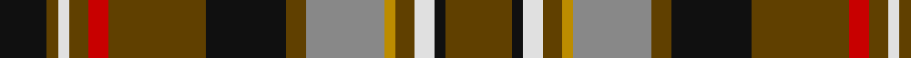

In pattern [GKWGYRGKGRGWGK](/patterns/gkwgyrgkgrgwgk/).

This was sourced from tartans-authority.  It is a [14 stripes tartan](/stripes/stripes14/).

Original link http://www.tartansauthority.com/tartan-ferret/display/8384/

## Thread count
K/17 T4 LN4 T7 R7 T35 K29 T7 N28 DY4 T7 LN7 K4 T/24

## Palette
Each colour and its ΔE from the base-6 reference it is a variant of.

| Colour | Shade | Base | ΔE (OKLab) |
|---|---|---|---|
| DY | <code style="background-color:#BC8C00;">#BC8C00</code> `#BC8C00` | Y <code style="background-color:#F2BF00;">#F2BF00</code> | 0.16 |
| K | <code style="background-color:#101010;">#101010</code> `#101010` | K <code style="background-color:#000000;">#000000</code> | 0.17 |
| LN | <code style="background-color:#E0E0E0;">#E0E0E0</code> `#E0E0E0` | W <code style="background-color:#F7F7F7;">#F7F7F7</code> | 0.07 |
| N | <code style="background-color:#888888;">#888888</code> `#888888` | R <code style="background-color:#CC0000;">#CC0000</code> | 0.24 |
| R | <code style="background-color:#C80000;">#C80000</code> `#C80000` | R <code style="background-color:#CC0000;">#CC0000</code> | 0.01 |
| T | <code style="background-color:#604000;">#604000</code> `#604000` | G <code style="background-color:#006100;">#006100</code> | 0.14 |

## Nearest tartans

The nearest existing variants by ΔTartan distance.

1. [Stewart Camel Fashion Tartan Tartan Number: 4038. Earliest known date: 01/01/1999 No Details See products available Copyright © Blair Urquhart, Comrie, 2015](/setts/s14/g3k3ga2k6gb7ga2g3ga2y3ga5g3b3g20k2~b3850c8-g8c7038-ga003820-gb5c6428-k000000-ybc8c00~x2/) — ΔT 0.91
1. [Kapasi (Personal)](/setts/s13/w2k12g2k2g2k2g16k3wa3k3r12g6y2~g408060-k101010-rc80000-wc49cd8-wafcfcfc-yd87c00~x2/) — ΔT 1.03
1. [California Firefighters (Corporate)](/setts/s12/r4k2ra2k1ra1k1ra2b3r1g4r9g1~b00008c-g004c00-k000000-ra0783c-ra8c0000~x4/) — ΔT 1.04
1. [Moskova](/setts/s12/b2g9k1r6k1g4b4y1k4w1g5k2~b2c2c80-g408060-k101010-rc80000-wf8f8f8-ye8c000~x4/) — ΔT 1.05
1. [Wilson's No.109](/setts/s14/r5g15b8y2k3r11g8r11k3y2b8g15r5w2~b440044-g006818-k101010-rc80000-wfcfcfc-yd8b000~x2/) — ΔT 1.12
1. [Wcwm 9275-1258](/setts/s12/g8ga2k4y1k1w1k1b8g3k1g1w1~b4c3428-g8c7038-ga006818-k101010-wc0c0c0-yd09800~x4/) — ΔT 1.13
1. [Cochrane (1974)](/setts/s13/g22r4g2r2g2r4g12k12r2b10r4b4y3~b2c4084-g005020-k101010-rdc0000-ye8c000~x2/) — ΔT 1.13
1. [Kidd](/setts/s15/r14b3r12g16y2k11b7k2b2k2b7r12w3k3r4~b2888c4-g006818-k101010-rc80000-we0e0e0-ye8c000~x2/) — ΔT 1.16
1. [Rossi (Personal)](/setts/s14/b1k1g6k6r6ba1r1ba1r6k6g6k1y1k1~b5c8ca8-ba2c2c80-g006818-k101010-rc80000-ye8c000~x4/) — ΔT 1.17
1. [MacGuire Irish Family Tartan Tartan Number: 2427. Earliest known date: 1985 MacGuire is an Irish Family tartan See products available Copyright © Blair Urquhart, Comrie, 2015](/setts/s14/w10b3g30r4ba12r30ba6r6ba6r6ba6r30g30bb4~b202060-ba5c8ca8-bb003c64-g006818-rc80000-we0e0e0/) — ΔT 1.18

## Neighbour map

Every grey dot is one of 15726 variants placed by the first two principal components of the ΔTartan feature space (44% of its variance). Red is this tartan; blue dots are its nearest — click one to open its page.

<svg viewBox="0 0 640 380" role="img" style="max-width:100%;height:auto;border:1px solid #e0e0e0;border-radius:4px;display:block" xmlns="http://www.w3.org/2000/svg"><image href="/nn/cloud.v1.png" width="640" height="380"/><a href="/setts/s14/g3k3ga2k6gb7ga2g3ga2y3ga5g3b3g20k2~b3850c8-g8c7038-ga003820-gb5c6428-k000000-ybc8c00~x2/"><circle cx="166.2" cy="125.8" r="4" fill="#3465a4"><title>Stewart Camel Fashion Tartan Tartan Number: 4038. Earliest known date: 01/01/1999 No Details See products available Copyright © Blair Urquhart, Comrie, 2015</title></circle></a><a href="/setts/s13/w2k12g2k2g2k2g16k3wa3k3r12g6y2~g408060-k101010-rc80000-wc49cd8-wafcfcfc-yd87c00~x2/"><circle cx="128.4" cy="135.1" r="4" fill="#3465a4"><title>Kapasi (Personal)</title></circle></a><a href="/setts/s12/r4k2ra2k1ra1k1ra2b3r1g4r9g1~b00008c-g004c00-k000000-ra0783c-ra8c0000~x4/"><circle cx="172.0" cy="157.1" r="4" fill="#3465a4"><title>California Firefighters (Corporate)</title></circle></a><a href="/setts/s12/b2g9k1r6k1g4b4y1k4w1g5k2~b2c2c80-g408060-k101010-rc80000-wf8f8f8-ye8c000~x4/"><circle cx="145.4" cy="157.2" r="4" fill="#3465a4"><title>Moskova</title></circle></a><a href="/setts/s14/r5g15b8y2k3r11g8r11k3y2b8g15r5w2~b440044-g006818-k101010-rc80000-wfcfcfc-yd8b000~x2/"><circle cx="118.7" cy="161.1" r="4" fill="#3465a4"><title>Wilson's No.109</title></circle></a><a href="/setts/s12/g8ga2k4y1k1w1k1b8g3k1g1w1~b4c3428-g8c7038-ga006818-k101010-wc0c0c0-yd09800~x4/"><circle cx="146.3" cy="146.0" r="4" fill="#3465a4"><title>Wcwm 9275-1258</title></circle></a><a href="/setts/s13/g22r4g2r2g2r4g12k12r2b10r4b4y3~b2c4084-g005020-k101010-rdc0000-ye8c000~x2/"><circle cx="206.7" cy="155.5" r="4" fill="#3465a4"><title>Cochrane (1974)</title></circle></a><a href="/setts/s15/r14b3r12g16y2k11b7k2b2k2b7r12w3k3r4~b2888c4-g006818-k101010-rc80000-we0e0e0-ye8c000~x2/"><circle cx="123.6" cy="140.1" r="4" fill="#3465a4"><title>Kidd</title></circle></a><a href="/setts/s14/b1k1g6k6r6ba1r1ba1r6k6g6k1y1k1~b5c8ca8-ba2c2c80-g006818-k101010-rc80000-ye8c000~x4/"><circle cx="104.5" cy="157.9" r="4" fill="#3465a4"><title>Rossi (Personal)</title></circle></a><a href="/setts/s14/w10b3g30r4ba12r30ba6r6ba6r6ba6r30g30bb4~b202060-ba5c8ca8-bb003c64-g006818-rc80000-we0e0e0/"><circle cx="173.4" cy="133.9" r="4" fill="#3465a4"><title>MacGuire Irish Family Tartan Tartan Number: 2427. Earliest known date: 1985 MacGuire is an Irish Family tartan See products available Copyright © Blair Urquhart, Comrie, 2015</title></circle></a><circle cx="172.2" cy="146.0" r="5" fill="#c00000"/></svg>

ID: /setts/s14/g24k4w7g7y4r28g7k29g35ra7g7w4g4k17~g604000-k101010-r888888-rac80000-we0e0e0-ybc8c00/
