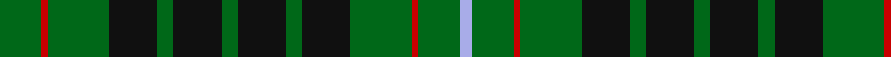

In pattern [GRGKGKGKGKGRGW](/patterns/grgkgkgkgkgrgw/).

This was sourced from register-of-tartans.  It is a [14 stripes tartan](/stripes/stripes14/).

Original link https://www.tartanregister.gov.uk/tartanDetails.aspx?ref=3977

## Thread count
Ga/26 R4 Ga38 K30 Ga10 K30 Ga10 K30 Ga10 K30 Ga38 R4 Ga26 LP/8

## Palette
Each colour and its ΔE from the base-6 reference it is a variant of.

| Colour | Shade | Base | ΔE (OKLab) |
|---|---|---|---|
| DG | <code style="background-color:#003820;">#003820</code> `#003820` | G <code style="background-color:#006100;">#006100</code> | 0.15 |
| G | <code style="background-color:#289C18;">#289C18</code> `#289C18` | G <code style="background-color:#006100;">#006100</code> | 0.19 |
| Ga | <code style="background-color:#006818;">#006818</code> `#006818` | G <code style="background-color:#006100;">#006100</code> | 0.02 |
| K | <code style="background-color:#101010;">#101010</code> `#101010` | K <code style="background-color:#000000;">#000000</code> | 0.17 |
| LP | <code style="background-color:#A8ACE8;">#A8ACE8</code> `#A8ACE8` | W <code style="background-color:#F7F7F7;">#F7F7F7</code> | 0.23 |
| R | <code style="background-color:#C80000;">#C80000</code> `#C80000` | R <code style="background-color:#CC0000;">#CC0000</code> | 0.01 |

## Nearest tartans

The nearest existing variants by ΔTartan distance.

1. [Holman (Personal)](/setts/s10/g14k24g24k18r6k18g40k32g14b6-b2474e8-g006818-k101010-r880000/) — ΔT 1.13
1. [MacAlpine Clan Tartan Tartan Number: 2024. Earliest known date: 1908 'The Clans, Sept and Regiments of the Scottish Highlands' (1908) by Frank Adam, is the first document of the tartan. The history of the Clan MacAlpine is obscure. The Siol Alpin is claimed as the origin of a number of clans, but as D.C. Stewart remarks, "belongs rather to mythology than to history." It is considered to be a branch of the royal Clan Alpin, of the Kings of Dalriada. The tartan is similar to the hunting MacLean, but for the yellow lines. Other tartans connected with Siol Alpin are red. See products available Copyright © Blair Urquhart, Comrie, 2015](/setts/s14/k16y4k16g4k16w4k16g4k4g24k4g24k4g4-g006818-k101010-we0e0e0-ye8c000/) — ΔT 1.15
1. [Strath Hallidale (Fashion)](/setts/s8/g10k30g10k30g38r4g26w8-g006818-k101010-rc80000-wa8ace8/) — ΔT 1.19
1. [Moncrieff of Atholl](/setts/s13/g36k4g8k8g8b28g36r8g36b36g28k4r12-b2c2c80-g006818-k101010-rc80000/) — ΔT 1.20
1. [Moncrieffe (1998)](/setts/s13/g50k8g8k8g8k52g50r18g50k52g50k4r18-g006818-k101010-rc80000/) — ΔT 1.22
1. [MacAlpine](/setts/s14/k32y4k16g4k16w4k16g4k4g24k4g24k4g4-g005020-k101010-we0e0e0-ye8c000/) — ΔT 1.38
1. [Salvation Army Hunting](/setts/s12/g32k4y8k4g32b16g32k4y8k4g32b20-b1c1c50-g285800-k101010-ycca800/) — ΔT 1.38
1. [MacAulay of Lewis](/setts/s8/g12k32r6k32g56k8g24w6-g006818-k101010-rc80000-wf8f8f8/) — ΔT 1.44
1. [Wilson's No.167](/setts/s10/k40b4k12g32ba8k18ba8g32k12b4-b5c8ca8-ba440044-g006818-k101010/) — ΔT 1.47
1. [Stuart/Stewart Hunting #4](/setts/s16/k6g20y4g20k18g4k18g20r4g20k6g4k10g4k10g4-g005020-k101010-rdc0000-ye8c000/) — ΔT 1.47

## Neighbour map

Every grey dot is one of 15726 variants placed by the first two principal components of the ΔTartan feature space (44% of its variance). Red is this tartan; blue dots are its nearest — click one to open its page.

<svg viewBox="0 0 640 380" role="img" style="max-width:100%;height:auto;border:1px solid #e0e0e0;border-radius:4px;display:block" xmlns="http://www.w3.org/2000/svg"><image href="/nn/cloud.v1.png" width="640" height="380"/><a href="/setts/s10/g14k24g24k18r6k18g40k32g14b6-b2474e8-g006818-k101010-r880000/"><circle cx="243.5" cy="257.4" r="4" fill="#3465a4"><title>Holman (Personal)</title></circle></a><a href="/setts/s14/k16y4k16g4k16w4k16g4k4g24k4g24k4g4-g006818-k101010-we0e0e0-ye8c000/"><circle cx="256.0" cy="213.3" r="4" fill="#3465a4"><title>MacAlpine Clan Tartan Tartan Number: 2024. Earliest known date: 1908 'The Clans, Sept and Regiments of the Scottish Highlands' (1908) by Frank Adam, is the first document of the tartan. The history of the Clan MacAlpine is obscure. The Siol Alpin is claimed as the origin of a number of clans, but as D.C. Stewart remarks, &quot;belongs rather to mythology than to history.&quot; It is considered to be a branch of the royal Clan Alpin, of the Kings of Dalriada. The tartan is similar to the hunting MacLean, but for the yellow lines. Other tartans connected with Siol Alpin are red. See products available Copyright © Blair Urquhart, Comrie, 2015</title></circle></a><a href="/setts/s8/g10k30g10k30g38r4g26w8-g006818-k101010-rc80000-wa8ace8/"><circle cx="277.6" cy="235.6" r="4" fill="#3465a4"><title>Strath Hallidale (Fashion)</title></circle></a><a href="/setts/s13/g36k4g8k8g8b28g36r8g36b36g28k4r12-b2c2c80-g006818-k101010-rc80000/"><circle cx="314.2" cy="217.3" r="4" fill="#3465a4"><title>Moncrieff of Atholl</title></circle></a><a href="/setts/s13/g50k8g8k8g8k52g50r18g50k52g50k4r18-g006818-k101010-rc80000/"><circle cx="330.4" cy="213.0" r="4" fill="#3465a4"><title>Moncrieffe (1998)</title></circle></a><a href="/setts/s14/k32y4k16g4k16w4k16g4k4g24k4g24k4g4-g005020-k101010-we0e0e0-ye8c000/"><circle cx="318.8" cy="207.4" r="4" fill="#3465a4"><title>MacAlpine</title></circle></a><a href="/setts/s12/g32k4y8k4g32b16g32k4y8k4g32b20-b1c1c50-g285800-k101010-ycca800/"><circle cx="345.1" cy="221.5" r="4" fill="#3465a4"><title>Salvation Army Hunting</title></circle></a><a href="/setts/s8/g12k32r6k32g56k8g24w6-g006818-k101010-rc80000-wf8f8f8/"><circle cx="277.9" cy="219.7" r="4" fill="#3465a4"><title>MacAulay of Lewis</title></circle></a><a href="/setts/s10/k40b4k12g32ba8k18ba8g32k12b4-b5c8ca8-ba440044-g006818-k101010/"><circle cx="264.7" cy="219.0" r="4" fill="#3465a4"><title>Wilson's No.167</title></circle></a><a href="/setts/s16/k6g20y4g20k18g4k18g20r4g20k6g4k10g4k10g4-g005020-k101010-rdc0000-ye8c000/"><circle cx="295.2" cy="244.0" r="4" fill="#3465a4"><title>Stuart/Stewart Hunting #4</title></circle></a><circle cx="274.3" cy="220.5" r="5" fill="#c00000"/></svg>

ID: /setts/s14/g26r4g38k30g10k30g10k30g10k30g38r4g26w8-g006818-k101010-rc80000-wa8ace8/
