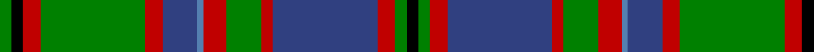

In pattern [GKRGRBBRGRBRGK](/patterns/gkrgrbbrgrbrgk/).

This was sourced from weddslist.  It is a [14 stripes tartan](/stripes/stripes14/).

Original link http://www.weddslist.com/cgi-bin/tartans/pg.pl?source=sts

## Thread count
G/4 K4 R6 G36 R6 B12 Ba2 R8 G12 R4 B36 R6 G4 K/4

## Palette
Each colour and its ΔE from the base-6 reference it is a variant of.

| Colour | Shade | Base | ΔE (OKLab) |
|---|---|---|---|
| B | <code style="background-color:#304080;">#304080</code> `#304080` | B <code style="background-color:#2A418A;">#2A418A</code> | 0.02 |
| Ba | <code style="background-color:#5480B0;">#5480B0</code> `#5480B0` | B <code style="background-color:#2A418A;">#2A418A</code> | 0.19 |
| G | <code style="background-color:#008000;">#008000</code> `#008000` | G <code style="background-color:#006100;">#006100</code> | 0.10 |
| K | <code style="background-color:#000000;">#000000</code> `#000000` | K <code style="background-color:#000000;">#000000</code> | 0.00 |
| R | <code style="background-color:#C00000;">#C00000</code> `#C00000` | R <code style="background-color:#CC0000;">#CC0000</code> | 0.03 |

## Nearest tartans

The nearest existing variants by ΔTartan distance.

1. [Glen Orchy #2 or MacIntyre](/setts/s14/g2k2r3g18r3b6ba1r4g6r2b18r3g2k2x2~b2c2c80-ba5c8ca8-g006818-k101010-rc80000/) — ΔT 0.73
1. [Cochrane Clan Tartan Tartan Number: 994. Earliest known date: 1934 Lord Dundonald originally registered a version missing a red and a green stripe with Lord Lyon in 1974. There is a story that a fragment of this design was discovered in the foundations of a Perthshire house around the 1930's, thought to be of greater authenticity. However, other reports suggest that the missing stripes were simply a typing error. The sett is based on the old Lochaber district tartan which also provided a base for the MacDonald and the Cameron of Erracht. (All of which have four red stripes). The red and green have been restored in this version, which is now the approved tartan, and appears in the 'Appendix' of the Lyon Court Books dated 12th November 1984. See products available Copyright © Blair Urquhart, Comrie, 2015](/setts/s15/g16r2g2r1g3r1g2r2g12k12r1b16r2b8y2x2~b2c2c80-g006818-k101010-rc80000-ye8c000/) — ΔT 0.76
1. [Ontario (Official)](/setts/s13/g19r1g2r2g15r1b13w1ba2r2ba21r1w3x2~b1c1c1c-ba2c2c80-g006818-rc80000-we0e0e0/) — ΔT 0.79
1. [Glen Orchy](/setts/s15/g3r2ra1b18r2g8r4ba1b8r2g18r2ra1b3ba1x2~b304080-ba5480b0-g008000-rc00000-rad03030/) — ΔT 0.83
1. [Dinwoodie (Name)](/setts/s10/g12r2k2r42k13ga25r6k2ra4k10x2~g604000-ga006818-k101010-r888888-rac80000/) — ΔT 0.85
1. [Pope (Welsh Name)](/setts/s12/k10g26k2g4k2g26k3r36k3ga30k3r2~g808080-ga289c18-k101010-r901c38/) — ΔT 0.89
1. [Pope of Wales](/setts/s12/k10r26k2r4k2r26k3g36k3ga30k3gb2~g00643c-ga289c18-gb808080-k101010-r901c38/) — ΔT 0.90
1. [Windsor](/setts/s10/r4b12k18b4g22w1g2w2g3w2x4~b0c585c-g8c7038-k101010-r880000-wc0c0c0/) — ΔT 0.92
1. [Cochrane](/setts/s15/g16r2g2r1g3r1g2r2g12k12r1b16r2b8y2x2~b304080-g008000-k000000-rc00000-yf0c000/) — ΔT 0.93
1. [Celts, Tartan of the](/setts/s12/r2k1r1k1g15r4b4r3b3y1k1y2x6~b2c2c80-g006818-k101010-rc80000-ye8c000/) — ΔT 0.94

## Neighbour map

Every grey dot is one of 15726 variants placed by the first two principal components of the ΔTartan feature space (44% of its variance). Red is this tartan; blue dots are its nearest — click one to open its page.

<svg viewBox="0 0 640 380" role="img" style="max-width:100%;height:auto;border:1px solid #e0e0e0;border-radius:4px;display:block" xmlns="http://www.w3.org/2000/svg"><image href="/nn/cloud.v1.png" width="640" height="380"/><a href="/setts/s14/g2k2r3g18r3b6ba1r4g6r2b18r3g2k2x2~b2c2c80-ba5c8ca8-g006818-k101010-rc80000/"><circle cx="222.9" cy="126.3" r="4" fill="#3465a4"><title>Glen Orchy #2 or MacIntyre</title></circle></a><a href="/setts/s15/g16r2g2r1g3r1g2r2g12k12r1b16r2b8y2x2~b2c2c80-g006818-k101010-rc80000-ye8c000/"><circle cx="216.0" cy="132.7" r="4" fill="#3465a4"><title>Cochrane Clan Tartan Tartan Number: 994. Earliest known date: 1934 Lord Dundonald originally registered a version missing a red and a green stripe with Lord Lyon in 1974. There is a story that a fragment of this design was discovered in the foundations of a Perthshire house around the 1930's, thought to be of greater authenticity. However, other reports suggest that the missing stripes were simply a typing error. The sett is based on the old Lochaber district tartan which also provided a base for the MacDonald and the Cameron of Erracht. (All of which have four red stripes). The red and green have been restored in this version, which is now the approved tartan, and appears in the 'Appendix' of the Lyon Court Books dated 12th November 1984. See products available Copyright © Blair Urquhart, Comrie, 2015</title></circle></a><a href="/setts/s13/g19r1g2r2g15r1b13w1ba2r2ba21r1w3x2~b1c1c1c-ba2c2c80-g006818-rc80000-we0e0e0/"><circle cx="234.0" cy="118.4" r="4" fill="#3465a4"><title>Ontario (Official)</title></circle></a><a href="/setts/s15/g3r2ra1b18r2g8r4ba1b8r2g18r2ra1b3ba1x2~b304080-ba5480b0-g008000-rc00000-rad03030/"><circle cx="239.0" cy="121.4" r="4" fill="#3465a4"><title>Glen Orchy</title></circle></a><a href="/setts/s10/g12r2k2r42k13ga25r6k2ra4k10x2~g604000-ga006818-k101010-r888888-rac80000/"><circle cx="226.6" cy="132.5" r="4" fill="#3465a4"><title>Dinwoodie (Name)</title></circle></a><a href="/setts/s12/k10g26k2g4k2g26k3r36k3ga30k3r2~g808080-ga289c18-k101010-r901c38/"><circle cx="201.0" cy="125.4" r="4" fill="#3465a4"><title>Pope (Welsh Name)</title></circle></a><a href="/setts/s12/k10r26k2r4k2r26k3g36k3ga30k3gb2~g00643c-ga289c18-gb808080-k101010-r901c38/"><circle cx="207.0" cy="130.6" r="4" fill="#3465a4"><title>Pope of Wales</title></circle></a><a href="/setts/s10/r4b12k18b4g22w1g2w2g3w2x4~b0c585c-g8c7038-k101010-r880000-wc0c0c0/"><circle cx="212.5" cy="129.6" r="4" fill="#3465a4"><title>Windsor</title></circle></a><a href="/setts/s15/g16r2g2r1g3r1g2r2g12k12r1b16r2b8y2x2~b304080-g008000-k000000-rc00000-yf0c000/"><circle cx="186.7" cy="122.1" r="4" fill="#3465a4"><title>Cochrane</title></circle></a><a href="/setts/s12/r2k1r1k1g15r4b4r3b3y1k1y2x6~b2c2c80-g006818-k101010-rc80000-ye8c000/"><circle cx="196.6" cy="118.3" r="4" fill="#3465a4"><title>Celts, Tartan of the</title></circle></a><circle cx="206.5" cy="120.3" r="5" fill="#c00000"/></svg>

ID: /setts/s14/g2k2r3g18r3b6ba1r4g6r2b18r3g2k2x2~b304080-ba5480b0-g008000-k000000-rc00000/
