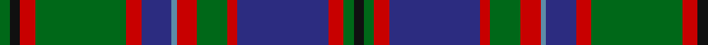

In pattern [GKRGRBBRGRBRGK](/patterns/gkrgrbbrgrbrgk/).

This was sourced from register-of-tartans.  It is a [14 stripes tartan](/stripes/stripes14/).

Original link https://www.tartanregister.gov.uk/tartanDetails.aspx?ref=1394

## Attestations

This cloth appears in 3 source records; the oldest owns this page.

- 01/01/1822 — Glen Orchy #2 or MacIntyre (register-of-tartans, [record](https://www.tartanregister.gov.uk/tartanDetails.aspx?ref=1394))
- 1822 — Glen Orchy #2 (District) (tartans-authority, [record](http://www.tartansauthority.com/tartan-ferret/display/812/))
- undated — Glen Orchy or MacIntyre District Tartan Tartan Number: 812. Earliest known date: 1893 The Glen Orchy sett is sometimes known as the MacIntyre and Glenorchy, although the MacIntyres occupied only part of the Glen. See products available Copyright © Blair Urquhart, Comrie, 2015 (house-of-tartan, [record](http://www.house-of-tartan.scotland.net/house/TartanViewjs.asp?colr=Def&tnam=812))

## Register references

External register numbers recorded for this tartan.

- Scottish Register of Tartans: [1394](https://www.tartanregister.gov.uk/tartanDetails.aspx?ref=1394)
- Scottish Tartans Authority (ITI): 812
- Scottish Tartans World Register: 812

## Thread count
G/4 K4 R6 G36 R6 DB12 B2 R8 G12 R4 DB36 R6 G4 K/4

## Palette
Each colour and its ΔE from the base-6 reference it is a variant of.

| Colour | Shade | Base | ΔE (OKLab) |
|---|---|---|---|
| B | <code style="background-color:#5C8CA8;">#5C8CA8</code> `#5C8CA8` | B <code style="background-color:#2A418A;">#2A418A</code> | 0.23 |
| DB | <code style="background-color:#2C2C80;">#2C2C80</code> `#2C2C80` | B <code style="background-color:#2A418A;">#2A418A</code> | 0.06 |
| G | <code style="background-color:#006818;">#006818</code> `#006818` | G <code style="background-color:#006100;">#006100</code> | 0.02 |
| K | <code style="background-color:#101010;">#101010</code> `#101010` | K <code style="background-color:#000000;">#000000</code> | 0.17 |
| R | <code style="background-color:#C80000;">#C80000</code> `#C80000` | R <code style="background-color:#CC0000;">#CC0000</code> | 0.01 |

## Nearest tartans

The nearest existing variants by ΔTartan distance.

1. [Glenorchy - National Archives](/setts/s15/g3b2r1b17ra2g8ra4ba1b8ra2g17ra2r1b3ba1~b2c2c80-ba5c8ca8-g006818-re87878-rac80000~x2/) — ΔT 0.64
1. [Cochrane Clan Tartan Tartan Number: 994. Earliest known date: 1934 Lord Dundonald originally registered a version missing a red and a green stripe with Lord Lyon in 1974. There is a story that a fragment of this design was discovered in the foundations of a Perthshire house around the 1930's, thought to be of greater authenticity. However, other reports suggest that the missing stripes were simply a typing error. The sett is based on the old Lochaber district tartan which also provided a base for the MacDonald and the Cameron of Erracht. (All of which have four red stripes). The red and green have been restored in this version, which is now the approved tartan, and appears in the 'Appendix' of the Lyon Court Books dated 12th November 1984. See products available Copyright © Blair Urquhart, Comrie, 2015](/setts/s15/g16r2g2r1g3r1g2r2g12k12r1b16r2b8y2~b2c2c80-g006818-k101010-rc80000-ye8c000~x2/) — ΔT 0.69
1. [Cochrane (1984)](/setts/s15/g16r2g2r1g3r1g2r2g12k12r1b16r2b8y2~b2c4084-g005020-k101010-rdc0000-ye8c000~x2/) — ΔT 0.73
1. [Glen Orchy, or MacIntyre](/setts/s14/g2k2r3g18r3b6ba1r4g6r2b18r3g2k2~b304080-ba5480b0-g008000-k000000-rc00000~x2/) — ΔT 0.73
1. [Glen Orchy](/setts/s15/g3r2ra1b18r2g8r4ba1b8r2g18r2ra1b3ba1~b304080-ba5480b0-g008000-rc00000-rad03030~x2/) — ΔT 0.76
1. [Urquhart (Fashion)](/setts/s12/r9w2r18k3r3k3r3k12b30k6b6ra6~b5c5c5c-k101010-r888888-rac80000-we0e0e0/) — ΔT 0.80
1. [MacDonald of Clanranald #5](/setts/s14/b20r2b2r5b30r2k32w2g30r5g4r2g4w2~b2c4084-g005020-k101010-rdc0000-we0e0e0/) — ΔT 0.82
1. [Ontario (Official)](/setts/s13/g19r1g2r2g15r1b13w1ba2r2ba21r1w3~b1c1c1c-ba2c2c80-g006818-rc80000-we0e0e0~x2/) — ΔT 0.85
1. [MacDonald of Clanranald #2](/setts/s13/b16r2b2r7b31r2k32w3g31r7g2r2g16~b2c4084-g005020-k101010-rdc0000-we0e0e0~x2/) — ΔT 0.89
1. [Rankin](/setts/s16/b36g10r2g10w2g10r2g10k14r2b12r3b2r2b4w2~b2c4084-g005020-k101010-rdc0000-we0e0e0~x2/) — ΔT 0.93

## Neighbour map

Every grey dot is one of 15726 variants placed by the first two principal components of the ΔTartan feature space (44% of its variance). Red is this tartan; blue dots are its nearest — click one to open its page.

<svg viewBox="0 0 640 380" role="img" style="max-width:100%;height:auto;border:1px solid #e0e0e0;border-radius:4px;display:block" xmlns="http://www.w3.org/2000/svg"><image href="/nn/cloud.v1.png" width="640" height="380"/><a href="/setts/s15/g3b2r1b17ra2g8ra4ba1b8ra2g17ra2r1b3ba1~b2c2c80-ba5c8ca8-g006818-re87878-rac80000~x2/"><circle cx="246.6" cy="127.0" r="4" fill="#3465a4"><title>Glenorchy - National Archives</title></circle></a><a href="/setts/s15/g16r2g2r1g3r1g2r2g12k12r1b16r2b8y2~b2c2c80-g006818-k101010-rc80000-ye8c000~x2/"><circle cx="216.0" cy="132.7" r="4" fill="#3465a4"><title>Cochrane Clan Tartan Tartan Number: 994. Earliest known date: 1934 Lord Dundonald originally registered a version missing a red and a green stripe with Lord Lyon in 1974. There is a story that a fragment of this design was discovered in the foundations of a Perthshire house around the 1930's, thought to be of greater authenticity. However, other reports suggest that the missing stripes were simply a typing error. The sett is based on the old Lochaber district tartan which also provided a base for the MacDonald and the Cameron of Erracht. (All of which have four red stripes). The red and green have been restored in this version, which is now the approved tartan, and appears in the 'Appendix' of the Lyon Court Books dated 12th November 1984. See products available Copyright © Blair Urquhart, Comrie, 2015</title></circle></a><a href="/setts/s15/g16r2g2r1g3r1g2r2g12k12r1b16r2b8y2~b2c4084-g005020-k101010-rdc0000-ye8c000~x2/"><circle cx="230.3" cy="138.6" r="4" fill="#3465a4"><title>Cochrane (1984)</title></circle></a><a href="/setts/s14/g2k2r3g18r3b6ba1r4g6r2b18r3g2k2~b304080-ba5480b0-g008000-k000000-rc00000~x2/"><circle cx="206.5" cy="120.3" r="4" fill="#3465a4"><title>Glen Orchy, or MacIntyre</title></circle></a><a href="/setts/s15/g3r2ra1b18r2g8r4ba1b8r2g18r2ra1b3ba1~b304080-ba5480b0-g008000-rc00000-rad03030~x2/"><circle cx="239.0" cy="121.4" r="4" fill="#3465a4"><title>Glen Orchy</title></circle></a><a href="/setts/s12/r9w2r18k3r3k3r3k12b30k6b6ra6~b5c5c5c-k101010-r888888-rac80000-we0e0e0/"><circle cx="191.7" cy="142.2" r="4" fill="#3465a4"><title>Urquhart (Fashion)</title></circle></a><a href="/setts/s14/b20r2b2r5b30r2k32w2g30r5g4r2g4w2~b2c4084-g005020-k101010-rdc0000-we0e0e0/"><circle cx="200.3" cy="125.9" r="4" fill="#3465a4"><title>MacDonald of Clanranald #5</title></circle></a><a href="/setts/s13/g19r1g2r2g15r1b13w1ba2r2ba21r1w3~b1c1c1c-ba2c2c80-g006818-rc80000-we0e0e0~x2/"><circle cx="234.0" cy="118.4" r="4" fill="#3465a4"><title>Ontario (Official)</title></circle></a><a href="/setts/s13/b16r2b2r7b31r2k32w3g31r7g2r2g16~b2c4084-g005020-k101010-rdc0000-we0e0e0~x2/"><circle cx="179.0" cy="139.3" r="4" fill="#3465a4"><title>MacDonald of Clanranald #2</title></circle></a><a href="/setts/s16/b36g10r2g10w2g10r2g10k14r2b12r3b2r2b4w2~b2c4084-g005020-k101010-rdc0000-we0e0e0~x2/"><circle cx="248.0" cy="125.1" r="4" fill="#3465a4"><title>Rankin</title></circle></a><circle cx="222.9" cy="126.3" r="5" fill="#c00000"/></svg>

ID: /setts/s14/g2k2r3g18r3b6ba1r4g6r2b18r3g2k2~b2c2c80-ba5c8ca8-g006818-k101010-rc80000~x2/
