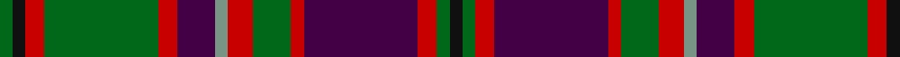

In pattern [GKRGRBGRGRBRGK](/patterns/gkrgrbgrgrbrgk/).

This was sourced from register-of-tartans.  It is a [14 stripes tartan](/stripes/stripes14/).

Original link https://www.tartanregister.gov.uk/tartanDetails.aspx?ref=5059

## Thread count
G/4 K4 R6 G36 R6 DP12 LG4 R8 G12 R4 DP36 R6 G4 K/4

## Palette
Each colour and its ΔE from the base-6 reference it is a variant of.

| Colour | Shade | Base | ΔE (OKLab) |
|---|---|---|---|
| DG | <code style="background-color:#003820;">#003820</code> `#003820` | G <code style="background-color:#006100;">#006100</code> | 0.15 |
| DP | <code style="background-color:#440044;">#440044</code> `#440044` | B <code style="background-color:#2A418A;">#2A418A</code> | 0.18 |
| G | <code style="background-color:#006818;">#006818</code> `#006818` | G <code style="background-color:#006100;">#006100</code> | 0.02 |
| K | <code style="background-color:#101010;">#101010</code> `#101010` | K <code style="background-color:#000000;">#000000</code> | 0.17 |
| LG | <code style="background-color:#789484;">#789484</code> `#789484` | G <code style="background-color:#006100;">#006100</code> | 0.24 |
| R | <code style="background-color:#C80000;">#C80000</code> `#C80000` | R <code style="background-color:#CC0000;">#CC0000</code> | 0.01 |

## Nearest tartans

The nearest existing variants by ΔTartan distance.

1. [Manx Heritage](/setts/s14/b3r3b2r3g2r2g2r17ba10r2g2r2g19ga3~b5480b0-ba304080-g004010-ga808080-rc00020~x2/) — ΔT 0.71
1. [Dorcas](/setts/s12/g4y2g2y3g20k6b4k2b2k2b16r3~b4c3428-g8c7038-k101010-re86000-yb8b8b8~x2/) — ΔT 0.80
1. [Callum, Brown (Fashion)](/setts/s12/r3g16b2g2b2g3b6ra20y3ra2y2ra3~b000060-g604000-r880000-rab07430-yacacac~x2/) — ΔT 0.90
1. [Dryburgh](/setts/s11/r2ra2r2ra16b10k3b2k2b2k10y2~b6c5454-k101010-r907c80-rabc4c10-ydcc010~x2/) — ΔT 0.98
1. [Manx Heritage](/setts/s14/b3r3b2r3g2r2g2r17ba10r2g2r2g19ra3~b5c8ca8-ba2c2c80-g006438-rc8002c-ra888888~x2/) — ΔT 0.99
1. [Flaumandrum](/setts/s15/b12k2b2k2b2k12r12k1y2k1r12k12b12k1ra2~b5c5c5c-k101010-r880000-rac00000-ye8c000~x2/) — ΔT 1.03
1. [Cochrane (1974)](/setts/s13/g22r4g2r2g2r4g12k12r2b10r4b4y3~b2c4084-g005020-k101010-rdc0000-ye8c000~x2/) — ΔT 1.04
1. [Deas Clan Tartan Tartan Number: 2139. Earliest known date: pre 2003 The name Deas is described as an 'alias' for Davidson in historic records, and is a recognised sept of Clan Dhai (Davidson). See products available Copyright © Blair Urquhart, Comrie, 2015](/setts/s14/g21k2r8k6r8k2b21k2b2k12y3k12g2k2~b2c2c80-g006818-k101010-rc80000-ye8c000~x2/) — ΔT 1.04
1. [Dryburgh Clan Tartan Tartan Number: 6422. Earliest known date: 2004 Based on Kerr, and the colours of the Dryburgh coat of arms including the 3 martlet birds, matriculated for William J. Dryburgh. See products available Copyright © Blair Urquhart, Comrie, 2015](/setts/s20/k10b2k2b2k3b10r16ra2r2ra2r2ra2r16b10k3b2k2b2k10y2~b6c5454-k101010-rbc4c10-ra907c80-ydcc010~x2/) — ΔT 1.06
1. [MacKinnon](/setts/s14/b2r3g2ba2r6g16r2ba4g2r16g8b2r4w2~b5a3094-ba000064-g004c00-rc80000-wd0d0d0/) — ΔT 1.07

## Neighbour map

Every grey dot is one of 15726 variants placed by the first two principal components of the ΔTartan feature space (44% of its variance). Red is this tartan; blue dots are its nearest — click one to open its page.

<svg viewBox="0 0 640 380" role="img" style="max-width:100%;height:auto;border:1px solid #e0e0e0;border-radius:4px;display:block" xmlns="http://www.w3.org/2000/svg"><image href="/nn/cloud.v1.png" width="640" height="380"/><a href="/setts/s14/b3r3b2r3g2r2g2r17ba10r2g2r2g19ga3~b5480b0-ba304080-g004010-ga808080-rc00020~x2/"><circle cx="220.2" cy="142.6" r="4" fill="#3465a4"><title>Manx Heritage</title></circle></a><a href="/setts/s12/g4y2g2y3g20k6b4k2b2k2b16r3~b4c3428-g8c7038-k101010-re86000-yb8b8b8~x2/"><circle cx="206.8" cy="150.0" r="4" fill="#3465a4"><title>Dorcas</title></circle></a><a href="/setts/s12/r3g16b2g2b2g3b6ra20y3ra2y2ra3~b000060-g604000-r880000-rab07430-yacacac~x2/"><circle cx="202.8" cy="142.7" r="4" fill="#3465a4"><title>Callum, Brown (Fashion)</title></circle></a><a href="/setts/s11/r2ra2r2ra16b10k3b2k2b2k10y2~b6c5454-k101010-r907c80-rabc4c10-ydcc010~x2/"><circle cx="162.9" cy="160.0" r="4" fill="#3465a4"><title>Dryburgh</title></circle></a><a href="/setts/s14/b3r3b2r3g2r2g2r17ba10r2g2r2g19ra3~b5c8ca8-ba2c2c80-g006438-rc8002c-ra888888~x2/"><circle cx="219.6" cy="140.9" r="4" fill="#3465a4"><title>Manx Heritage</title></circle></a><a href="/setts/s15/b12k2b2k2b2k12r12k1y2k1r12k12b12k1ra2~b5c5c5c-k101010-r880000-rac00000-ye8c000~x2/"><circle cx="203.1" cy="154.1" r="4" fill="#3465a4"><title>Flaumandrum</title></circle></a><a href="/setts/s13/g22r4g2r2g2r4g12k12r2b10r4b4y3~b2c4084-g005020-k101010-rdc0000-ye8c000~x2/"><circle cx="206.7" cy="155.5" r="4" fill="#3465a4"><title>Cochrane (1974)</title></circle></a><a href="/setts/s14/g21k2r8k6r8k2b21k2b2k12y3k12g2k2~b2c2c80-g006818-k101010-rc80000-ye8c000~x2/"><circle cx="156.0" cy="151.9" r="4" fill="#3465a4"><title>Deas Clan Tartan Tartan Number: 2139. Earliest known date: pre 2003 The name Deas is described as an 'alias' for Davidson in historic records, and is a recognised sept of Clan Dhai (Davidson). See products available Copyright © Blair Urquhart, Comrie, 2015</title></circle></a><a href="/setts/s20/k10b2k2b2k3b10r16ra2r2ra2r2ra2r16b10k3b2k2b2k10y2~b6c5454-k101010-rbc4c10-ra907c80-ydcc010~x2/"><circle cx="164.0" cy="139.1" r="4" fill="#3465a4"><title>Dryburgh Clan Tartan Tartan Number: 6422. Earliest known date: 2004 Based on Kerr, and the colours of the Dryburgh coat of arms including the 3 martlet birds, matriculated for William J. Dryburgh. See products available Copyright © Blair Urquhart, Comrie, 2015</title></circle></a><a href="/setts/s14/b2r3g2ba2r6g16r2ba4g2r16g8b2r4w2~b5a3094-ba000064-g004c00-rc80000-wd0d0d0/"><circle cx="213.2" cy="152.3" r="4" fill="#3465a4"><title>MacKinnon</title></circle></a><circle cx="192.2" cy="147.4" r="5" fill="#c00000"/></svg>

ID: /setts/s14/g2k2r3g18r3b6ga2r4g6r2b18r3g2k2~b440044-g006818-ga789484-k101010-rc80000~x2/
