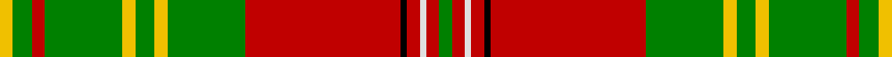

In pattern [GRWRKRGYGYGRGY](/stripes/grwrkrgygygrgy/).

This was sourced from weddslist.  It is a [14 stripe tartan](/stripes/stripes14/).

Original link http://www.weddslist.com/cgi-bin/tartans/pg.pl?source=sts

## Attestations

This cloth appears in 2 source records; the oldest owns this page.

- undated — Leask (weddslist, [record](http://www.weddslist.com/cgi-bin/tartans/pg.pl?source=sts))
- undated — Leask Family Tartan Tartan Number: 905. Earliest known date: 1981 Designed by Madam Leask and the Scottish Tartans Society Accredited in 1981. See products available Copyright © Blair Urquhart, Comrie, 2015 (house-of-tartan, [record](http://www.house-of-tartan.scotland.net/house/TartanViewjs.asp?colr=Def&tnam=905))

## Thread count
Y/4 G6 R4 G24 Y4 G6 Y4 G24 R48 K2 R4 LN2 R4 G/4

## Palette
Each colour and the base-6 reference it is a variant of.

| Colour | Shade | Base |
|---|---|---|
| G | <code style="background-color:#008000;">#008000</code> `oklch(52.0% 0.177 142.5)` <small>#008000</small> | G <code style="background-color:#006100;">#006100</code> |
| K | <code style="background-color:#000000;">#000000</code> `oklch(0.0% 0.000 0.0)` <small>#000000</small> | K <code style="background-color:#000000;">#000000</code> |
| LN | <code style="background-color:#E0E0E0;">#E0E0E0</code> `oklch(90.7% 0.000 89.9)` <small>#E0E0E0</small> | W <code style="background-color:#F7F7F7;">#F7F7F7</code> |
| R | <code style="background-color:#C00000;">#C00000</code> `oklch(50.7% 0.208 29.2)` <small>#C00000</small> | R <code style="background-color:#CC0000;">#CC0000</code> |
| Y | <code style="background-color:#F0C000;">#F0C000</code> `oklch(82.7% 0.169 90.5)` <small>#F0C000</small> | Y <code style="background-color:#F2BF00;">#F2BF00</code> |

## Nearest tartans

The nearest existing variants by ΔTartan distance.

1. [Hay](/setts/s14/r9g6ly4g54r4g4r4g18r72g6r4k2r4w9/) — ΔT 0.86
1. [Keilar (2013)](/setts/s16/o15r3o3r1o35dg5w2db2dg35r1dg3r3dg15o5w2db2~x2/) — ΔT 0.91
1. [Connemarra Irish District Tartan Tartan Number: 3897. Earliest known date: pre 1997 The Connemara tartan has been created to represent the wild yet picturesque area situated in the north west of County Galway. Strictly speaking this should be a fashion tartan but it has been placed in the same class as the House of Edgar irish tartans. See products available Copyright © Blair Urquhart, Comrie, 2015](/setts/s16/t4ly1g1r30g18g3g1k3g1g3g18r30g1ly1t4g2~x2/) — ΔT 0.98
1. [Leask](/setts/s14/g4r2w1r2k1r24g12ly2g3ly2g12r2g3ly4~x2/) — ΔT 1.10
1. [Hay - 1842 (Clan)](/setts/s14/r3dg2ly1dg18r1dg1r1dg6r24dg2r1k1r1w3~x2/) — ΔT 1.15
1. [Glendronach](/setts/s12/g21r2w1y3r2g5r21y1ly1y1r1g8~x2/) — ΔT 1.15
1. [MacKinnon 1](/setts/s12/r3r4g3p3r11g30r3p7g3r2r4w2~x2/) — ΔT 1.26
1. [MacDonald of Kingsburgh](/setts/s9/r3g3ly1r18w1g21ly1g1ly3~x2/) — ΔT 1.29
1. [Crieff](/setts/s13/r4r10g7r70g7r4p21r4g85r4g7r10r4/) — ΔT 1.31
1. [Longmore (Name)](/setts/s9/g15ly3g27r2g2r33b2w1b4~x2/) — ΔT 1.34

## Neighbour map

Every grey dot is one of 14299 variants placed by the first two principal components of the ΔTartan feature space (44% of its variance). Red is this tartan; blue dots are its nearest — click one to open its page.

<svg viewBox="0 0 640 380" role="img" style="max-width:100%;height:auto;border:1px solid #e0e0e0;border-radius:4px;display:block" xmlns="http://www.w3.org/2000/svg"><image href="/nn/cloud.v1.png" width="640" height="380"/><a href="/setts/s14/r9g6ly4g54r4g4r4g18r72g6r4k2r4w9/"><circle cx="339.4" cy="69.4" r="4" fill="#3465a4"><title>Hay</title></circle></a><a href="/setts/s16/o15r3o3r1o35dg5w2db2dg35r1dg3r3dg15o5w2db2~x2/"><circle cx="295.9" cy="73.6" r="4" fill="#3465a4"><title>Keilar (2013)</title></circle></a><a href="/setts/s16/t4ly1g1r30g18g3g1k3g1g3g18r30g1ly1t4g2~x2/"><circle cx="309.4" cy="77.7" r="4" fill="#3465a4"><title>Connemarra Irish District Tartan Tartan Number: 3897. Earliest known date: pre 1997 The Connemara tartan has been created to represent the wild yet picturesque area situated in the north west of County Galway. Strictly speaking this should be a fashion tartan but it has been placed in the same class as the House of Edgar irish tartans. See products available Copyright © Blair Urquhart, Comrie, 2015</title></circle></a><a href="/setts/s14/g4r2w1r2k1r24g12ly2g3ly2g12r2g3ly4~x2/"><circle cx="300.0" cy="100.3" r="4" fill="#3465a4"><title>Leask</title></circle></a><a href="/setts/s14/r3dg2ly1dg18r1dg1r1dg6r24dg2r1k1r1w3~x2/"><circle cx="335.0" cy="84.9" r="4" fill="#3465a4"><title>Hay - 1842 (Clan)</title></circle></a><a href="/setts/s12/g21r2w1y3r2g5r21y1ly1y1r1g8~x2/"><circle cx="326.8" cy="117.0" r="4" fill="#3465a4"><title>Glendronach</title></circle></a><a href="/setts/s12/r3r4g3p3r11g30r3p7g3r2r4w2~x2/"><circle cx="266.0" cy="120.7" r="4" fill="#3465a4"><title>MacKinnon 1</title></circle></a><a href="/setts/s9/r3g3ly1r18w1g21ly1g1ly3~x2/"><circle cx="325.7" cy="130.9" r="4" fill="#3465a4"><title>MacDonald of Kingsburgh</title></circle></a><a href="/setts/s13/r4r10g7r70g7r4p21r4g85r4g7r10r4/"><circle cx="327.9" cy="114.5" r="4" fill="#3465a4"><title>Crieff</title></circle></a><a href="/setts/s9/g15ly3g27r2g2r33b2w1b4~x2/"><circle cx="333.9" cy="114.4" r="4" fill="#3465a4"><title>Longmore (Name)</title></circle></a><circle cx="291.8" cy="91.2" r="5" fill="#c00000"/></svg>

ID: /setts/s14/g2r2w1r2k1r24g12ly2g3ly2g12r2g3ly2~x2/
