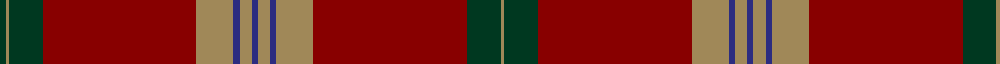

In pattern [GYGRYBYBYBYRGY](/patterns/gygrybybybyrgy/).

This was sourced from register-of-tartans.  It is a [14 stripes tartan](/stripes/stripes14/).

Original link https://www.tartanregister.gov.uk/tartanDetails.aspx?ref=3818

## Register references

External register numbers recorded for this tartan.

- Scottish Register of Tartans: [3818](https://www.tartanregister.gov.uk/tartanDetails.aspx?ref=3818)
- Scottish Tartans Authority (ITI): 5795

## Thread count
DG/4 LT2 DG22 DR100 LT24 DB4 LT8 DB4 LT8 DB4 LT24 DR100 DG22 LT/2

## Palette
Each colour and its ΔE from the base-6 reference it is a variant of.

| Colour | Shade | Base | ΔE (OKLab) |
|---|---|---|---|
| DB | <code style="background-color:#2C2C80;">#2C2C80</code> `#2C2C80` | B <code style="background-color:#2A418A;">#2A418A</code> | 0.06 |
| DG | <code style="background-color:#003820;">#003820</code> `#003820` | G <code style="background-color:#006100;">#006100</code> | 0.15 |
| DR | <code style="background-color:#880000;">#880000</code> `#880000` | R <code style="background-color:#CC0000;">#CC0000</code> | 0.15 |
| LT | <code style="background-color:#A08858;">#A08858</code> `#A08858` | Y <code style="background-color:#F2BF00;">#F2BF00</code> | 0.21 |

## Nearest tartans

The nearest existing variants by ΔTartan distance.

1. [MacGillivray - 1819 (Clan)](/setts/s13/r6b1ba1r57b2r2ba23r4g30r6b1r6ba2~b5c8ca8-ba14283c-g006818-rc80000~x2/) — ΔT 1.08
1. [Grant](/setts/s15/r6b2r2g24r2g2r2b8r2ba1r32b2r2b1r6~b000052-ba4367ae-g11450d-raa0000~x2/) — ΔT 1.13
1. [Grant](/setts/s15/r6b2r2g24r2g2r2b8r2ba1r32b2r2b1r6~b000052-ba4367ae-g11450d-raa0000/) — ΔT 1.13
1. [Slessor (Personal)](/setts/s8/b2y4b2y12r50g11y1g2~b2c2c80-g003820-r880000-ya08858~x2/) — ΔT 1.17
1. [Unidentified #60](/setts/s11/r50ra3r4ra4b1ra1b1ra7g7ra1g3~b000088-g085454-r70000c-rab07430~x4/) — ΔT 1.18
1. [MacGillivray](/setts/s13/r4b1ba1r32b2r2ba12r2g16r4b1r4ba2~b5480b0-ba304080-g008000-rc00000~x2/) — ΔT 1.18
1. [Drummond](/setts/s15/r6b2r2g24r2g2r2b8r2ba1r32b2r2b1r6~b1474b4-ba5c8ca8-g006818-rc80000~x2/) — ΔT 1.23
1. [Grant or Drummond Clan Tartan Tartan Number: 1384. Earliest known date: 1831 The usual design is sometimes called Drummond. It is recorded by Logan (1831), Smibert (1850), and Smith (1850). McIan's drawing of the Grant tartan is too roughly done to make out the pattern details. A certain difficulty arises in establishing a single Grant tartan to represent the clan, illustrated by the existance of ten Grant portraits at Cullen House in which each brother is wearing a different tartan, and where a coat or plaid is worn, these also differ. The chief of the Grants is Lord Strathspey. See products available Copyright © Blair Urquhart, Comrie, 2015](/setts/s15/r6b2r2g24r2g2r2b8r2ba2r32b2r2b1r6~b2c2c80-ba2888c4-g006818-rc80000~x2/) — ΔT 1.26
1. [Grant, or Drummond](/setts/s15/r6b2r2g24r2g2r2b8r2ba1r32b2r2b1r6~b304080-ba5480b0-g008000-rc00000~x2/) — ΔT 1.26
1. [MacGillivray Clan Tartan Tartan Number: 446. Earliest known date: 1831 "A characteristic Clan Chattan tartan...", writes D.C.Stewart, with much in common with the setts of the neighbouring clans in Strathnairn and Morvern. Wilson produced this sett with a black stripe in the centre of the the red square. The chiefship of Clan MacGillivray is vacant and the 'Steward' of clan affairs, appointed by Lord Lyon, is Commander Colonel George Brown MacGillivray. See products available Copyright © Blair Urquhart, Comrie, 2015](/setts/s13/r4b1ba1r32b2r2ba12r2g16r4b1r4ba2~b5c8ca8-ba2c2c80-g006818-rc80000~x2/) — ΔT 1.30

## Neighbour map

Every grey dot is one of 15726 variants placed by the first two principal components of the ΔTartan feature space (44% of its variance). Red is this tartan; blue dots are its nearest — click one to open its page.

<svg viewBox="0 0 640 380" role="img" style="max-width:100%;height:auto;border:1px solid #e0e0e0;border-radius:4px;display:block" xmlns="http://www.w3.org/2000/svg"><image href="/nn/cloud.v1.png" width="640" height="380"/><a href="/setts/s13/r6b1ba1r57b2r2ba23r4g30r6b1r6ba2~b5c8ca8-ba14283c-g006818-rc80000~x2/"><circle cx="412.5" cy="80.2" r="4" fill="#3465a4"><title>MacGillivray - 1819 (Clan)</title></circle></a><a href="/setts/s15/r6b2r2g24r2g2r2b8r2ba1r32b2r2b1r6~b000052-ba4367ae-g11450d-raa0000~x2/"><circle cx="403.3" cy="100.3" r="4" fill="#3465a4"><title>Grant</title></circle></a><a href="/setts/s15/r6b2r2g24r2g2r2b8r2ba1r32b2r2b1r6~b000052-ba4367ae-g11450d-raa0000/"><circle cx="403.3" cy="100.3" r="4" fill="#3465a4"><title>Grant</title></circle></a><a href="/setts/s8/b2y4b2y12r50g11y1g2~b2c2c80-g003820-r880000-ya08858~x2/"><circle cx="460.0" cy="114.5" r="4" fill="#3465a4"><title>Slessor (Personal)</title></circle></a><a href="/setts/s11/r50ra3r4ra4b1ra1b1ra7g7ra1g3~b000088-g085454-r70000c-rab07430~x4/"><circle cx="525.9" cy="95.1" r="4" fill="#3465a4"><title>Unidentified #60</title></circle></a><a href="/setts/s13/r4b1ba1r32b2r2ba12r2g16r4b1r4ba2~b5480b0-ba304080-g008000-rc00000~x2/"><circle cx="395.4" cy="103.1" r="4" fill="#3465a4"><title>MacGillivray</title></circle></a><a href="/setts/s15/r6b2r2g24r2g2r2b8r2ba1r32b2r2b1r6~b1474b4-ba5c8ca8-g006818-rc80000~x2/"><circle cx="400.9" cy="94.4" r="4" fill="#3465a4"><title>Drummond</title></circle></a><a href="/setts/s15/r6b2r2g24r2g2r2b8r2ba2r32b2r2b1r6~b2c2c80-ba2888c4-g006818-rc80000~x2/"><circle cx="390.9" cy="93.4" r="4" fill="#3465a4"><title>Grant or Drummond Clan Tartan Tartan Number: 1384. Earliest known date: 1831 The usual design is sometimes called Drummond. It is recorded by Logan (1831), Smibert (1850), and Smith (1850). McIan's drawing of the Grant tartan is too roughly done to make out the pattern details. A certain difficulty arises in establishing a single Grant tartan to represent the clan, illustrated by the existance of ten Grant portraits at Cullen House in which each brother is wearing a different tartan, and where a coat or plaid is worn, these also differ. The chief of the Grants is Lord Strathspey. See products available Copyright © Blair Urquhart, Comrie, 2015</title></circle></a><a href="/setts/s15/r6b2r2g24r2g2r2b8r2ba1r32b2r2b1r6~b304080-ba5480b0-g008000-rc00000~x2/"><circle cx="398.8" cy="94.1" r="4" fill="#3465a4"><title>Grant, or Drummond</title></circle></a><a href="/setts/s13/r4b1ba1r32b2r2ba12r2g16r4b1r4ba2~b5c8ca8-ba2c2c80-g006818-rc80000~x2/"><circle cx="391.4" cy="100.6" r="4" fill="#3465a4"><title>MacGillivray Clan Tartan Tartan Number: 446. Earliest known date: 1831 &quot;A characteristic Clan Chattan tartan...&quot;, writes D.C.Stewart, with much in common with the setts of the neighbouring clans in Strathnairn and Morvern. Wilson produced this sett with a black stripe in the centre of the the red square. The chiefship of Clan MacGillivray is vacant and the 'Steward' of clan affairs, appointed by Lord Lyon, is Commander Colonel George Brown MacGillivray. See products available Copyright © Blair Urquhart, Comrie, 2015</title></circle></a><circle cx="456.7" cy="95.7" r="5" fill="#c00000"/></svg>

ID: /setts/s14/g2y1g11r50y12b2y4b2y4b2y12r50g11y1~b2c2c80-g003820-r880000-ya08858~x2/
