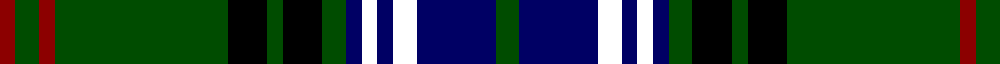

In pattern [GBKBKBGKGKGRGR](/patterns/gbkbkbgkgkgrgr/).

This was sourced from house-of-tartan.  It is a [14 stripes tartan](/stripes/stripes14/).

Original link http://www.house-of-tartan.scotland.net/house/TartanViewjs.asp?colr=Def&tnam=5464

## Thread count
DR/4 G6 DR4 G44 K10 G4 K10 G6 DB4 WWB4 DB4 WWB6 DB20 G/6

## Palette
Each colour and its ΔE from the base-6 reference it is a variant of.

| Colour | Shade | Base | ΔE (OKLab) |
|---|---|---|---|
| DB | <code style="background-color:#000064;">#000064</code> `#000064` | B <code style="background-color:#2A418A;">#2A418A</code> | 0.18 |
| DR | <code style="background-color:#8C0000;">#8C0000</code> `#8C0000` | R <code style="background-color:#CC0000;">#CC0000</code> | 0.14 |
| G | <code style="background-color:#004C00;">#004C00</code> `#004C00` | G <code style="background-color:#006100;">#006100</code> | 0.07 |
| K | <code style="background-color:#000000;">#000000</code> `#000000` | K <code style="background-color:#000000;">#000000</code> | 0.00 |

## Nearest tartans

The nearest existing variants by ΔTartan distance.

1. [Lochcarron Hunting](/setts/s14/g3b10ba3b2ba2b2g3k5g2k5g22r2g3r2~b000064-ba346488-g004c00-k000000-r8c0000~x2/) — ΔT 0.35
1. [Skene N](/setts/s12/k4b24k4r3k4g24k4ga3k4g24r3k4~b000052-g11450d-ga7f5200-k000000-raa0000~x2/) — ΔT 0.80
1. [Skene N](/setts/s12/k4b24k4r3k4g24k4ga3k4g24r3k4~b000052-g11450d-ga7f5200-k000000-raa0000/) — ΔT 0.80
1. [Robieson, Graham Alexander (Personal)](/setts/s13/w1k1g8k1g1ka8g1k8g1ka1g8k1y1~g004000-k101010-ka000040-wffffff-yffff00~x6/) — ΔT 0.83
1. [Skene N](/setts/s12/k4b24k4r3k4g24k4y3k4g24r3k4~b000064-g004c00-k000000-rc80000-yffc800/) — ΔT 1.04
1. [Cochrane](/setts/s15/g16r2g2r1g3r1g2r2g12k12r1b16r2b8y2~b000052-g11450d-k000000-raa0000-yaaaa00~x2/) — ΔT 1.06
1. [Cochrane](/setts/s15/g16r2g2r1g3r1g2r2g12k12r1b16r2b8y2~b000052-g11450d-k000000-raa0000-yaaaa00/) — ΔT 1.06
1. [Dama Resort (Fashion)](/setts/s11/b3k2ba6k2ba2k18g13w2g2k6b2~b780078-ba5c5c5c-g006818-k101010-w98c8e8~x2/) — ΔT 1.09
1. [Choinka Family (Inverness)](/setts/s11/g4k2b3k2g20k9ka7k2y3k2ka4~b3e647a-g124b24-k120a01-ka000000-yd3cc20~x2/) — ΔT 1.16
1. [Scottish Tartans Authority](/setts/s11/k16ka2b2ka4g16r2k15ka6b2k3b4~b5c8ca8-g285800-k101010-ka00002c-rc80000~x2/) — ΔT 1.19

## Neighbour map

Every grey dot is one of 15726 variants placed by the first two principal components of the ΔTartan feature space (44% of its variance). Red is this tartan; blue dots are its nearest — click one to open its page.

<svg viewBox="0 0 640 380" role="img" style="max-width:100%;height:auto;border:1px solid #e0e0e0;border-radius:4px;display:block" xmlns="http://www.w3.org/2000/svg"><image href="/nn/cloud.v1.png" width="640" height="380"/><a href="/setts/s14/g3b10ba3b2ba2b2g3k5g2k5g22r2g3r2~b000064-ba346488-g004c00-k000000-r8c0000~x2/"><circle cx="247.4" cy="153.2" r="4" fill="#3465a4"><title>Lochcarron Hunting</title></circle></a><a href="/setts/s12/k4b24k4r3k4g24k4ga3k4g24r3k4~b000052-g11450d-ga7f5200-k000000-raa0000~x2/"><circle cx="218.0" cy="177.7" r="4" fill="#3465a4"><title>Skene N</title></circle></a><a href="/setts/s12/k4b24k4r3k4g24k4ga3k4g24r3k4~b000052-g11450d-ga7f5200-k000000-raa0000/"><circle cx="218.0" cy="177.7" r="4" fill="#3465a4"><title>Skene N</title></circle></a><a href="/setts/s13/w1k1g8k1g1ka8g1k8g1ka1g8k1y1~g004000-k101010-ka000040-wffffff-yffff00~x6/"><circle cx="222.0" cy="174.1" r="4" fill="#3465a4"><title>Robieson, Graham Alexander (Personal)</title></circle></a><a href="/setts/s12/k4b24k4r3k4g24k4y3k4g24r3k4~b000064-g004c00-k000000-rc80000-yffc800/"><circle cx="192.7" cy="167.5" r="4" fill="#3465a4"><title>Skene N</title></circle></a><a href="/setts/s15/g16r2g2r1g3r1g2r2g12k12r1b16r2b8y2~b000052-g11450d-k000000-raa0000-yaaaa00~x2/"><circle cx="216.1" cy="138.1" r="4" fill="#3465a4"><title>Cochrane</title></circle></a><a href="/setts/s15/g16r2g2r1g3r1g2r2g12k12r1b16r2b8y2~b000052-g11450d-k000000-raa0000-yaaaa00/"><circle cx="216.1" cy="138.1" r="4" fill="#3465a4"><title>Cochrane</title></circle></a><a href="/setts/s11/b3k2ba6k2ba2k18g13w2g2k6b2~b780078-ba5c5c5c-g006818-k101010-w98c8e8~x2/"><circle cx="230.2" cy="172.8" r="4" fill="#3465a4"><title>Dama Resort (Fashion)</title></circle></a><a href="/setts/s11/g4k2b3k2g20k9ka7k2y3k2ka4~b3e647a-g124b24-k120a01-ka000000-yd3cc20~x2/"><circle cx="191.7" cy="169.0" r="4" fill="#3465a4"><title>Choinka Family (Inverness)</title></circle></a><a href="/setts/s11/k16ka2b2ka4g16r2k15ka6b2k3b4~b5c8ca8-g285800-k101010-ka00002c-rc80000~x2/"><circle cx="216.4" cy="190.4" r="4" fill="#3465a4"><title>Scottish Tartans Authority</title></circle></a><circle cx="246.0" cy="153.6" r="5" fill="#c00000"/></svg>

ID: /setts/s14/g3b10k3b2k2b2g3k5g2k5g22r2g3r2~b000064-g004c00-k000000-r8c0000~x2/
