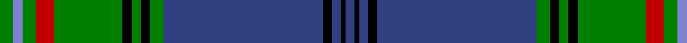

This page is one **sett** — a single exact thread-count. It belongs to the [tartan](/tartans/g3b2g3r4g15k2g2k2g3db35k2db2k1db2/)
(the same proportion at any scale), whose colour order is pattern [BKBKBGKGKGRGBG](/stripes/bkbkbgkgkgrgbg/).

Sourced from weddslist.  It is a [14 stripe tartan](/stripes/stripes14/).

Original link http://www.weddslist.com/cgi-bin/tartans/pg.pl?source=sts

## Thread count
G/6 B4 G6 R8 G30 K4 G4 K4 G6 Ba70 K4 Ba4 K2 Ba/4

## Palette

Palette: <strong>Ingles Buchan</strong> <small style="color:#888">(1 of 5 colours)</small>
<table><thead><tr><th>Colour</th><th>Threads</th><th>Shade</th><th>Base</th><th>OKLCh</th></tr></thead><tbody><tr><td>G/</td><td style="text-align:right;font-variant-numeric:tabular-nums">6</td><td><code style="background-color:#008000;">#008000</code> <small style="color:#888">#008000</small></td><td>G <code style="background-color:#006100;">#006100</code></td><td><small style="color:#888">oklch(52.0% 0.177 142.5)</small></td></tr><tr><td>B</td><td style="text-align:right;font-variant-numeric:tabular-nums">4</td><td><code style="background-color:#8080D0;">#8080D0</code> <small style="color:#888">#8080D0</small></td><td>B <code style="background-color:#2A418A;">#2A418A</code></td><td><small style="color:#888">oklch(63.4% 0.119 282.5)</small></td></tr><tr><td>G</td><td style="text-align:right;font-variant-numeric:tabular-nums">6</td><td><code style="background-color:#008000;">#008000</code> <small style="color:#888">#008000</small></td><td>G <code style="background-color:#006100;">#006100</code></td><td><small style="color:#888">oklch(52.0% 0.177 142.5)</small></td></tr><tr><td>R</td><td style="text-align:right;font-variant-numeric:tabular-nums">8</td><td><code style="background-color:#C00000;">#C00000</code> <small style="color:#888">#C00000</small></td><td>R <code style="background-color:#CC0000;">#CC0000</code></td><td><small style="color:#888">oklch(50.7% 0.208 29.2)</small></td></tr><tr><td>G</td><td style="text-align:right;font-variant-numeric:tabular-nums">30</td><td><code style="background-color:#008000;">#008000</code> <small style="color:#888">#008000</small></td><td>G <code style="background-color:#006100;">#006100</code></td><td><small style="color:#888">oklch(52.0% 0.177 142.5)</small></td></tr><tr><td>K</td><td style="text-align:right;font-variant-numeric:tabular-nums">4</td><td><code style="background-color:#000000;">#000000</code> <small style="color:#888">#000000</small></td><td>K <code style="background-color:#000000;">#000000</code></td><td><small style="color:#888">oklch(0.0% 0.000 0.0)</small></td></tr><tr><td>G</td><td style="text-align:right;font-variant-numeric:tabular-nums">4</td><td><code style="background-color:#008000;">#008000</code> <small style="color:#888">#008000</small></td><td>G <code style="background-color:#006100;">#006100</code></td><td><small style="color:#888">oklch(52.0% 0.177 142.5)</small></td></tr><tr><td>K</td><td style="text-align:right;font-variant-numeric:tabular-nums">4</td><td><code style="background-color:#000000;">#000000</code> <small style="color:#888">#000000</small></td><td>K <code style="background-color:#000000;">#000000</code></td><td><small style="color:#888">oklch(0.0% 0.000 0.0)</small></td></tr><tr><td>G</td><td style="text-align:right;font-variant-numeric:tabular-nums">6</td><td><code style="background-color:#008000;">#008000</code> <small style="color:#888">#008000</small></td><td>G <code style="background-color:#006100;">#006100</code></td><td><small style="color:#888">oklch(52.0% 0.177 142.5)</small></td></tr><tr><td>Ba</td><td style="text-align:right;font-variant-numeric:tabular-nums">70</td><td><code style="background-color:#304080;">#304080</code> <small style="color:#888">#304080</small></td><td>B <code style="background-color:#2A418A;">#2A418A</code></td><td><small style="color:#888">oklch(39.4% 0.109 270.2)</small></td></tr><tr><td>K</td><td style="text-align:right;font-variant-numeric:tabular-nums">4</td><td><code style="background-color:#000000;">#000000</code> <small style="color:#888">#000000</small></td><td>K <code style="background-color:#000000;">#000000</code></td><td><small style="color:#888">oklch(0.0% 0.000 0.0)</small></td></tr><tr><td>Ba</td><td style="text-align:right;font-variant-numeric:tabular-nums">4</td><td><code style="background-color:#304080;">#304080</code> <small style="color:#888">#304080</small></td><td>B <code style="background-color:#2A418A;">#2A418A</code></td><td><small style="color:#888">oklch(39.4% 0.109 270.2)</small></td></tr><tr><td>K</td><td style="text-align:right;font-variant-numeric:tabular-nums">2</td><td><code style="background-color:#000000;">#000000</code> <small style="color:#888">#000000</small></td><td>K <code style="background-color:#000000;">#000000</code></td><td><small style="color:#888">oklch(0.0% 0.000 0.0)</small></td></tr><tr><td>Ba/</td><td style="text-align:right;font-variant-numeric:tabular-nums">4</td><td><code style="background-color:#304080;">#304080</code> <small style="color:#888">#304080</small></td><td>B <code style="background-color:#2A418A;">#2A418A</code></td><td><small style="color:#888">oklch(39.4% 0.109 270.2)</small></td></tr></tbody></table>

## Nearest tartans

The nearest existing variants by ΔTartan distance, with this tartan at the top so the swatches line up against it.

ΔTartan

Tartan

Sett

—

<a href="/ttd/edit/#slug=g3b2g3r4g15k2g2k2g3db35k2db2k1db2~x2">Prestoungrange/Dolphinstoun/Wills</a> <a class="nn-out" href="/setts/s14/g3b2g3r4g15k2g2k2g3db35k2db2k1db2~x2/" title="open its dictionary page">↗</a>

0.38

<a href="/ttd/edit/#slug=db116k4g22r7db3r7k26db7g3db7g66db4r7ri4">Cooper</a> <a class="nn-out" href="/setts/s14/db116k4g22r7db3r7k26db7g3db7g66db4r7ri4/" title="open its dictionary page">↗</a>

1.05

<a href="/ttd/edit/#slug=db116k4g22ri7db3ri7k26db7g3db7g66db4ri7r4">Cooper Family Tartan Tartan Number: 332. Earliest known date: pre 2003 See Couper. (Couper of Gogar) See products available Copyright © Blair Urquhart, Comrie, 2015</a> <a class="nn-out" href="/setts/s14/db116k4g22ri7db3ri7k26db7g3db7g66db4ri7r4/" title="open its dictionary page">↗</a>

1.11

<a href="/ttd/edit/#slug=db60k15g10r2g10r2g10r2g10k1ly4~x2">Muir/Moore</a> <a class="nn-out" href="/setts/s11/db60k15g10r2g10r2g10r2g10k1ly4~x2/" title="open its dictionary page">↗</a>

1.16

<a href="/ttd/edit/#slug=g3t2g3r4g15k2g2k2g3db35k2db2k1db2~x2">Prestoungrange (Personal)</a> <a class="nn-out" href="/setts/s14/g3t2g3r4g15k2g2k2g3db35k2db2k1db2~x2/" title="open its dictionary page">↗</a>

1.16

<a href="/ttd/edit/#slug=r10db4r3db6w3db4w3db40dg73k4db2ly6">Johnston, Diana Dress (Personal)</a> <a class="nn-out" href="/setts/s12/r10db4r3db6w3db4w3db40dg73k4db2ly6/" title="open its dictionary page">↗</a>

1.20

<a href="/ttd/edit/#slug=db60ly2db2ly2db5k15db5g20r2k3r2g20db5k15g5db20ly2g4~x2">Whitworth (Name)</a> <a class="nn-out" href="/setts/s18/db60ly2db2ly2db5k15db5g20r2k3r2g20db5k15g5db20ly2g4~x2/" title="open its dictionary page">↗</a>

1.21

<a href="/ttd/edit/#slug=r10dt4r3dt6w3dt4w3dt40dg73k4dt2ly6">Johnston, Diana Dress (Personal)</a> <a class="nn-out" href="/setts/s12/r10dt4r3dt6w3dt4w3dt40dg73k4dt2ly6/" title="open its dictionary page">↗</a>

1.22

<a href="/ttd/edit/#slug=g2r2g18o6db40lo1db1lo4w2lo4db1lo1db40o6g18r2g2w1~x2">O'Mahony, The</a> <a class="nn-out" href="/setts/s18/g2r2g18o6db40lo1db1lo4w2lo4db1lo1db40o6g18r2g2w1~x2/" title="open its dictionary page">↗</a>

1.26

<a href="/ttd/edit/#slug=w3dt1k14dt2k1g6k1dt30lo3~x2">Bro-Kerne</a> <a class="nn-out" href="/setts/s9/w3dt1k14dt2k1g6k1dt30lo3~x2/" title="open its dictionary page">↗</a>

1.27

<a href="/ttd/edit/#slug=dg50k3w4k1lo5r4k1w2k2b15k5dg4w2~x2">City of Abbotsford (District)</a> <a class="nn-out" href="/setts/s13/dg50k3w4k1lo5r4k1w2k2b15k5dg4w2~x2/" title="open its dictionary page">↗</a>

## Neighbour map

Every grey dot is one of 14359 variants placed by the first two principal components of the ΔTartan feature space (44% of its variance). Red is this tartan; blue dots are its nearest — click one to open its page.

<svg viewBox="0 0 640 380" role="img" style="max-width:100%;height:auto;border:1px solid #e0e0e0;border-radius:4px;display:block" xmlns="http://www.w3.org/2000/svg"><image href="/nn/cloud.v1.png" width="640" height="380"/><a href="/setts/s14/db116k4g22r7db3r7k26db7g3db7g66db4r7ri4/"><circle cx="304.4" cy="75.3" r="4" fill="#3465a4"><title>Cooper</title></circle></a><a href="/setts/s14/db116k4g22ri7db3ri7k26db7g3db7g66db4ri7r4/"><circle cx="334.7" cy="90.5" r="4" fill="#3465a4"><title>Cooper Family Tartan Tartan Number: 332. Earliest known date: pre 2003 See Couper. (Couper of Gogar) See products available Copyright © Blair Urquhart, Comrie, 2015</title></circle></a><a href="/setts/s11/db60k15g10r2g10r2g10r2g10k1ly4~x2/"><circle cx="327.0" cy="93.8" r="4" fill="#3465a4"><title>Muir/Moore</title></circle></a><a href="/setts/s14/g3t2g3r4g15k2g2k2g3db35k2db2k1db2~x2/"><circle cx="349.1" cy="96.7" r="4" fill="#3465a4"><title>Prestoungrange (Personal)</title></circle></a><a href="/setts/s12/r10db4r3db6w3db4w3db40dg73k4db2ly6/"><circle cx="282.7" cy="65.0" r="4" fill="#3465a4"><title>Johnston, Diana Dress (Personal)</title></circle></a><a href="/setts/s18/db60ly2db2ly2db5k15db5g20r2k3r2g20db5k15g5db20ly2g4~x2/"><circle cx="313.0" cy="97.5" r="4" fill="#3465a4"><title>Whitworth (Name)</title></circle></a><a href="/setts/s12/r10dt4r3dt6w3dt4w3dt40dg73k4dt2ly6/"><circle cx="289.7" cy="73.7" r="4" fill="#3465a4"><title>Johnston, Diana Dress (Personal)</title></circle></a><a href="/setts/s18/g2r2g18o6db40lo1db1lo4w2lo4db1lo1db40o6g18r2g2w1~x2/"><circle cx="297.7" cy="45.9" r="4" fill="#3465a4"><title>O'Mahony, The</title></circle></a><a href="/setts/s9/w3dt1k14dt2k1g6k1dt30lo3~x2/"><circle cx="332.4" cy="116.8" r="4" fill="#3465a4"><title>Bro-Kerne</title></circle></a><a href="/setts/s13/dg50k3w4k1lo5r4k1w2k2b15k5dg4w2~x2/"><circle cx="320.7" cy="46.8" r="4" fill="#3465a4"><title>City of Abbotsford (District)</title></circle></a><circle cx="318.0" cy="80.9" r="5" fill="#c00000"/></svg>

ID: /setts/s14/g3b2g3r4g15k2g2k2g3db35k2db2k1db2~x2/
