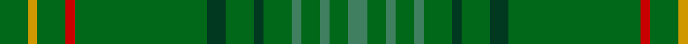

In pattern [GGGGGGGGGGRGYG](/patterns/ggggggggggrgyg/).

This was sourced from register-of-tartans.  It is a [14 stripes tartan](/stripes/stripes14/).

Original link https://www.tartanregister.gov.uk/tartanDetails.aspx?ref=3118

## Attestations

This cloth appears in 2 source records; the oldest owns this page.

- 01/01/1998 — New South Wales (register-of-tartans, [record](https://www.tartanregister.gov.uk/tartanDetails.aspx?ref=3118))
- 1998 — New South Wales (District) (tartans-authority, [record](http://www.tartansauthority.com/tartan-ferret/display/2492/))

## Thread count
G/12 DY4 G12 R4 G56 DG8 G12 DG4 G12 Ga4 G8 Ga4 G8 Ga/8

## Palette
Each colour and its ΔE from the base-6 reference it is a variant of.

| Colour | Shade | Base | ΔE (OKLab) |
|---|---|---|---|
| DG | <code style="background-color:#003820;">#003820</code> `#003820` | G <code style="background-color:#006100;">#006100</code> | 0.15 |
| DY | <code style="background-color:#D09800;">#D09800</code> `#D09800` | Y <code style="background-color:#F2BF00;">#F2BF00</code> | 0.12 |
| G | <code style="background-color:#006818;">#006818</code> `#006818` | G <code style="background-color:#006100;">#006100</code> | 0.02 |
| Ga | <code style="background-color:#408060;">#408060</code> `#408060` | G <code style="background-color:#006100;">#006100</code> | 0.14 |
| R | <code style="background-color:#C80000;">#C80000</code> `#C80000` | R <code style="background-color:#CC0000;">#CC0000</code> | 0.01 |

## Nearest tartans

The nearest existing variants by ΔTartan distance.

1. [Glenlivet Corporate Tartan Tartan Number: 193. Earliest known date: 1989 Designed for Glenlivet Distilleries Ltd, Strathspey. See products available Copyright © Blair Urquhart, Comrie, 2015](/setts/s8/g18r6g75b6g13ga35g12b6~b2c2c80-g006818-ga604000-rc80000/) — ΔT 2.00
1. [Pino Family (Pennsylvania) (Personal)](/setts/s13/g25ga7g25ga7y5g25ga7g25ga7y5r2w2r2~g006400-ga008b00-re3170d-wffffff-y86c67c~x2/) — ΔT 2.30
1. [Glenlivet](/setts/s8/g18r6g75b6g13ra35g12b6~b304080-g008000-rc00000-ra806050/) — ΔT 2.36
1. [Montgomerie Artifact Tartan Tartan Number: 692. Earliest known date: c.1815 The sample does not show a complete sett. The broad mid green stripe is narrower in the weft. See products available Copyright © Blair Urquhart, Comrie, 2015](/setts/s12/g27ga39b3ga3b4ga3b3ga39b3ga3b4ga3~b2c2c80-g003820-ga006818~x2/) — ΔT 2.46
1. [INSEAD](/setts/s12/y3g15r2g2r6g2ga6g2ga2g23gb2g2~g00643c-ga002814-gb008b00-r880000-ybc8c00~x2/) — ΔT 2.49
1. [Owen Welsh Name Tartan Tartan Number: 5750. Earliest known date: 2002 The tartan for this Welsh surname and its variations, Bowen, Ifan, is actually woven in Wales at the Cambrian Woollen Mill, weaving on the same site since 1830. This tartan differs from many traditional patterns in that the warp and weft differ, giving the finished worsted wool cloth more of a predominant stripe, vertically noticeable in the finished Kilt, or Cilt in Wales. See products available Copyright © Blair Urquhart, Comrie, 2015](/setts/s10/g3b1g2r1g3ba3g2ba2g18b2~b003c64-ba002048-g006818-rc80000~x2/) — ΔT 2.49
1. [Gayre Bodyguard](/setts/s8/g18r6g75b6g13ga35g12b6~b2c4084-g005020-ga503c14-rdc0000/) — ΔT 2.50
1. [U.S. Seabees (Military)](/setts/s13/g72y2g10r9g2ga9g2b9g2ba9g9y2g72~b2c2c80-ba1474b4-g006818-ga603800-r880000-yd09800~x2/) — ΔT 2.50
1. [Bannockbane Hunting Trade Tartan Tartan Number: 909. Earliest known date: c.1984 Nothing See products available Copyright © Blair Urquhart, Comrie, 2015](/setts/s8/g2ga2g15ga1w1g15ga2g2~g006818-ga604000-we0e0e0~x2/) — ΔT 2.54
1. [Owen of Wales](/setts/s18/g18b2g2b3g3r1g2ba1g3ba1g2r1g3b3g2b2g18ba2~b002048-ba003c64-g006818-rc80000~x2/) — ΔT 2.55

## Neighbour map

Every grey dot is one of 15726 variants placed by the first two principal components of the ΔTartan feature space (44% of its variance). Red is this tartan; blue dots are its nearest — click one to open its page.

<svg viewBox="0 0 640 380" role="img" style="max-width:100%;height:auto;border:1px solid #e0e0e0;border-radius:4px;display:block" xmlns="http://www.w3.org/2000/svg"><image href="/nn/cloud.v1.png" width="640" height="380"/><a href="/setts/s8/g18r6g75b6g13ga35g12b6~b2c2c80-g006818-ga604000-rc80000/"><circle cx="497.5" cy="233.4" r="4" fill="#3465a4"><title>Glenlivet Corporate Tartan Tartan Number: 193. Earliest known date: 1989 Designed for Glenlivet Distilleries Ltd, Strathspey. See products available Copyright © Blair Urquhart, Comrie, 2015</title></circle></a><a href="/setts/s13/g25ga7g25ga7y5g25ga7g25ga7y5r2w2r2~g006400-ga008b00-re3170d-wffffff-y86c67c~x2/"><circle cx="419.2" cy="197.9" r="4" fill="#3465a4"><title>Pino Family (Pennsylvania) (Personal)</title></circle></a><a href="/setts/s8/g18r6g75b6g13ra35g12b6~b304080-g008000-rc00000-ra806050/"><circle cx="471.5" cy="220.9" r="4" fill="#3465a4"><title>Glenlivet</title></circle></a><a href="/setts/s12/g27ga39b3ga3b4ga3b3ga39b3ga3b4ga3~b2c2c80-g003820-ga006818~x2/"><circle cx="497.2" cy="216.6" r="4" fill="#3465a4"><title>Montgomerie Artifact Tartan Tartan Number: 692. Earliest known date: c.1815 The sample does not show a complete sett. The broad mid green stripe is narrower in the weft. See products available Copyright © Blair Urquhart, Comrie, 2015</title></circle></a><a href="/setts/s12/y3g15r2g2r6g2ga6g2ga2g23gb2g2~g00643c-ga002814-gb008b00-r880000-ybc8c00~x2/"><circle cx="434.2" cy="180.9" r="4" fill="#3465a4"><title>INSEAD</title></circle></a><a href="/setts/s10/g3b1g2r1g3ba3g2ba2g18b2~b003c64-ba002048-g006818-rc80000~x2/"><circle cx="535.0" cy="187.4" r="4" fill="#3465a4"><title>Owen Welsh Name Tartan Tartan Number: 5750. Earliest known date: 2002 The tartan for this Welsh surname and its variations, Bowen, Ifan, is actually woven in Wales at the Cambrian Woollen Mill, weaving on the same site since 1830. This tartan differs from many traditional patterns in that the warp and weft differ, giving the finished worsted wool cloth more of a predominant stripe, vertically noticeable in the finished Kilt, or Cilt in Wales. See products available Copyright © Blair Urquhart, Comrie, 2015</title></circle></a><a href="/setts/s8/g18r6g75b6g13ga35g12b6~b2c4084-g005020-ga503c14-rdc0000/"><circle cx="540.9" cy="253.8" r="4" fill="#3465a4"><title>Gayre Bodyguard</title></circle></a><a href="/setts/s13/g72y2g10r9g2ga9g2b9g2ba9g9y2g72~b2c2c80-ba1474b4-g006818-ga603800-r880000-yd09800~x2/"><circle cx="589.7" cy="118.5" r="4" fill="#3465a4"><title>U.S. Seabees (Military)</title></circle></a><a href="/setts/s8/g2ga2g15ga1w1g15ga2g2~g006818-ga604000-we0e0e0~x2/"><circle cx="626.0" cy="250.6" r="4" fill="#3465a4"><title>Bannockbane Hunting Trade Tartan Tartan Number: 909. Earliest known date: c.1984 Nothing See products available Copyright © Blair Urquhart, Comrie, 2015</title></circle></a><a href="/setts/s18/g18b2g2b3g3r1g2ba1g3ba1g2r1g3b3g2b2g18ba2~b002048-ba003c64-g006818-rc80000~x2/"><circle cx="531.7" cy="160.8" r="4" fill="#3465a4"><title>Owen of Wales</title></circle></a><circle cx="553.3" cy="195.9" r="5" fill="#c00000"/></svg>

ID: /setts/s14/g3y1g3r1g14ga2g3ga1g3gb1g2gb1g2gb2~g006818-ga003820-gb408060-rc80000-yd09800~x4/
