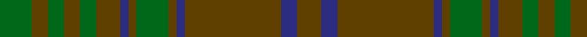

In pattern [GBGBGGGBGGGGGG](/patterns/gbgbgggbgggggg/).

This was sourced from house-of-tartan.  It is a [14 stripes tartan](/stripes/stripes14/).

Original link http://www.house-of-tartan.scotland.net/house/TartanViewjs.asp?colr=Def&tnam=910

## Thread count
G/8 T4 G4 T4 G4 T6 DB2 T2 G8 T2 DB2 T24 DB4 T/6

## Palette
Each colour and its ΔE from the base-6 reference it is a variant of.

| Colour | Shade | Base | ΔE (OKLab) |
|---|---|---|---|
| DB | <code style="background-color:#2C2C80;">#2C2C80</code> `#2C2C80` | B <code style="background-color:#2A418A;">#2A418A</code> | 0.06 |
| G | <code style="background-color:#006818;">#006818</code> `#006818` | G <code style="background-color:#006100;">#006100</code> | 0.02 |
| T | <code style="background-color:#604000;">#604000</code> `#604000` | G <code style="background-color:#006100;">#006100</code> | 0.14 |

## Nearest tartans

The nearest existing variants by ΔTartan distance.

1. [MacAlister of Glenbarr Hunting](/setts/s14/g20ga3g6ga6g6ga8b2ga2g20ga2b2ga46b3ga8~b2c2c80-g006818-ga603800~x2/) — ΔT 1.26
1. [MacAlister of Glenbarr](/setts/s14/g4r2g2r2g2r3b1r1g4r1b1r12b2r3~b304080-g008000-r806050~x2/) — ΔT 1.30
1. [Gray (Personal)](/setts/s18/b33g10r3g3r3g3r8b10r3b10r8g3r3g3r3g10b33r3~b5c5c5c-g006818-ra00000~x2/) — ΔT 1.32
1. [Dublin, County](/setts/s12/g3b3g3b16g3b3g3ba5g18r2g8r3~b441800-ba480800-g005448-r880000~x2/) — ΔT 1.55
1. [Sarna (District)](/setts/s16/g13r1g2r2g2r1g2r5g11r1g2ga2g2r1g2ga7~g604000-ga006818-rc80000~x2/) — ΔT 1.61
1. [Sarna](/setts/s16/r13ra1r2ra2r2ra1r2ra5r11ra1r2g2r2ra1r2g7~g008000-r806050-rac00000~x2/) — ΔT 1.71
1. [Galloway District Tartan Tartan Number: 1469. Earliest known date: 1950 In contemporary correspondence Mr Hannay said that the Galloway 'everyday' tartan was 'in four shades of green with yellow and red stripe'. Cree Mills of Newton-Stewart, however, used only two shades in the manufacture on Mr Hannay's behalf. MacGregor Hastie's collection includes this sett with the pale yellow rendered in white and called Galloway Hunting. See products available Copyright © Blair Urquhart, Comrie, 2015](/setts/s11/g20ga2y3ga2g32ga32g2r3g2ga32g12~g003820-ga285800-rc80000-yc4bc68~x2/) — ΔT 1.87
1. [Prince David Royal Family Tartan Tartan Number: 2125. Earliest known date: 1930 Mackinlay suggests that David was the pet name of the Duke of Windsor when he was a boy and that the tartan was designed for his personal use. See products available Copyright © Blair Urquhart, Comrie, 2015](/setts/s15/g3ga1y2g3ga1y2gb21g18gb2g3gb2g18gb21ga1y2~g003820-ga006818-gb604000-yd87c00~x2/) — ΔT 1.91
1. [Montgomerie/Montgomery](/setts/s12/g27ga39b3ga3b4ga3b3ga39b3ga3b4ga3~b2c4084-g002814-ga005020~x2/) — ΔT 1.91
1. [Ulster (Peat) (District](/setts/s10/g28k2g28k2g2k2ga29k2r2k2~g7c5428-ga604000-k101010-rc80000~x2/) — ΔT 1.91

## Neighbour map

Every grey dot is one of 15726 variants placed by the first two principal components of the ΔTartan feature space (44% of its variance). Red is this tartan; blue dots are its nearest — click one to open its page.

<svg viewBox="0 0 640 380" role="img" style="max-width:100%;height:auto;border:1px solid #e0e0e0;border-radius:4px;display:block" xmlns="http://www.w3.org/2000/svg"><image href="/nn/cloud.v1.png" width="640" height="380"/><a href="/setts/s14/g20ga3g6ga6g6ga8b2ga2g20ga2b2ga46b3ga8~b2c2c80-g006818-ga603800~x2/"><circle cx="498.3" cy="194.5" r="4" fill="#3465a4"><title>MacAlister of Glenbarr Hunting</title></circle></a><a href="/setts/s14/g4r2g2r2g2r3b1r1g4r1b1r12b2r3~b304080-g008000-r806050~x2/"><circle cx="439.7" cy="218.6" r="4" fill="#3465a4"><title>MacAlister of Glenbarr</title></circle></a><a href="/setts/s18/b33g10r3g3r3g3r8b10r3b10r8g3r3g3r3g10b33r3~b5c5c5c-g006818-ra00000~x2/"><circle cx="430.2" cy="204.3" r="4" fill="#3465a4"><title>Gray (Personal)</title></circle></a><a href="/setts/s12/g3b3g3b16g3b3g3ba5g18r2g8r3~b441800-ba480800-g005448-r880000~x2/"><circle cx="392.5" cy="235.4" r="4" fill="#3465a4"><title>Dublin, County</title></circle></a><a href="/setts/s16/g13r1g2r2g2r1g2r5g11r1g2ga2g2r1g2ga7~g604000-ga006818-rc80000~x2/"><circle cx="479.8" cy="205.3" r="4" fill="#3465a4"><title>Sarna (District)</title></circle></a><a href="/setts/s16/r13ra1r2ra2r2ra1r2ra5r11ra1r2g2r2ra1r2g7~g008000-r806050-rac00000~x2/"><circle cx="481.6" cy="202.9" r="4" fill="#3465a4"><title>Sarna</title></circle></a><a href="/setts/s11/g20ga2y3ga2g32ga32g2r3g2ga32g12~g003820-ga285800-rc80000-yc4bc68~x2/"><circle cx="426.6" cy="224.4" r="4" fill="#3465a4"><title>Galloway District Tartan Tartan Number: 1469. Earliest known date: 1950 In contemporary correspondence Mr Hannay said that the Galloway 'everyday' tartan was 'in four shades of green with yellow and red stripe'. Cree Mills of Newton-Stewart, however, used only two shades in the manufacture on Mr Hannay's behalf. MacGregor Hastie's collection includes this sett with the pale yellow rendered in white and called Galloway Hunting. See products available Copyright © Blair Urquhart, Comrie, 2015</title></circle></a><a href="/setts/s15/g3ga1y2g3ga1y2gb21g18gb2g3gb2g18gb21ga1y2~g003820-ga006818-gb604000-yd87c00~x2/"><circle cx="406.7" cy="173.7" r="4" fill="#3465a4"><title>Prince David Royal Family Tartan Tartan Number: 2125. Earliest known date: 1930 Mackinlay suggests that David was the pet name of the Duke of Windsor when he was a boy and that the tartan was designed for his personal use. See products available Copyright © Blair Urquhart, Comrie, 2015</title></circle></a><a href="/setts/s12/g27ga39b3ga3b4ga3b3ga39b3ga3b4ga3~b2c4084-g002814-ga005020~x2/"><circle cx="548.1" cy="238.7" r="4" fill="#3465a4"><title>Montgomerie/Montgomery</title></circle></a><a href="/setts/s10/g28k2g28k2g2k2ga29k2r2k2~g7c5428-ga604000-k101010-rc80000~x2/"><circle cx="481.6" cy="205.8" r="4" fill="#3465a4"><title>Ulster (Peat) (District</title></circle></a><circle cx="467.5" cy="234.2" r="5" fill="#c00000"/></svg>

ID: /setts/s14/g4ga2g2ga2g2ga3b1ga1g4ga1b1ga12b2ga3~b2c2c80-g006818-ga604000~x2/
