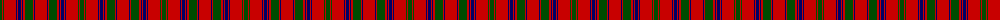

In pattern [GRGRBRBRBRGRBR](/patterns/grgrbrbrbrgrbr/).

This was sourced from weddslist.  It is a [14 stripes tartan](/stripes/stripes14/).

Original link http://www.weddslist.com/cgi-bin/tartans/pg.pl?source=rb

## Thread count
G/4 R1 G1 R12 DB1 R1 DB3 R1 DB1 R2 G8 R1 DB1 R/12

## Palette
Each colour and its ΔE from the base-6 reference it is a variant of.

| Colour | Shade | Base | ΔE (OKLab) |
|---|---|---|---|
| DB | <code style="background-color:#000064;">#000064</code> `#000064` | B <code style="background-color:#2C4084;">#2C4084</code> | 0.17 |
| G | <code style="background-color:#004C00;">#004C00</code> `#004C00` | G <code style="background-color:#006400;">#006400</code> | 0.08 |
| R | <code style="background-color:#C80000;">#C80000</code> `#C80000` | R <code style="background-color:#C80000;">#C80000</code> | 0.00 |

ID: /setts/s14/g4r1g1r12b1r1b3r1b1r2g8r1b1r12-b000064-g004c00-rc80000/
