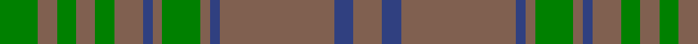

In pattern [GRGRGRBRGRBRBR](/patterns/grgrgrbrgrbrbr/).

This was sourced from weddslist.  It is a [14 stripes tartan](/stripes/stripes14/).

Original link http://www.weddslist.com/cgi-bin/tartans/pg.pl?source=sts

## Thread count
G/8 LT4 G4 LT4 G4 LT6 B2 LT2 G8 LT2 B2 LT24 B4 LT/6

## Palette
Each colour and its ΔE from the base-6 reference it is a variant of.

| Colour | Shade | Base | ΔE (OKLab) |
|---|---|---|---|
| B | <code style="background-color:#304080;">#304080</code> `#304080` | B <code style="background-color:#2A418A;">#2A418A</code> | 0.02 |
| G | <code style="background-color:#008000;">#008000</code> `#008000` | G <code style="background-color:#006100;">#006100</code> | 0.10 |
| LT | <code style="background-color:#806050;">#806050</code> `#806050` | R <code style="background-color:#CC0000;">#CC0000</code> | 0.17 |

## Nearest tartans

The nearest existing variants by ΔTartan distance.

1. [MacAlister of Glenbarr Clan Tartan Tartan Number: 910. Earliest known date: pre 1984 This version of the MacAlister of Glenbarr tartan is the same as the MacGillivray hunting tartan. This sample was taken from a piece woven by Lochcarron Weavers around 1984. See products available Copyright © Blair Urquhart, Comrie, 2015](/setts/s14/g4ga2g2ga2g2ga3b1ga1g4ga1b1ga12b2ga3~b2c2c80-g006818-ga604000~x2/) — ΔT 1.30
1. [Gray (Personal)](/setts/s18/b33g10r3g3r3g3r8b10r3b10r8g3r3g3r3g10b33r3~b5c5c5c-g006818-ra00000~x2/) — ΔT 1.31
1. [Sarna](/setts/s16/r13ra1r2ra2r2ra1r2ra5r11ra1r2g2r2ra1r2g7~g008000-r806050-rac00000~x2/) — ΔT 1.41
1. [Gray (Name)](/setts/s10/r3g33ga10r3ga3r3ga3r8g10r3~g6c6c6c-ga006818-ra00000~x2/) — ΔT 1.41
1. [Sarna (District)](/setts/s16/g13r1g2r2g2r1g2r5g11r1g2ga2g2r1g2ga7~g604000-ga006818-rc80000~x2/) — ΔT 1.66
1. [Howells](/setts/s15/b16r1g3b5r1b5g3b4g12b14y1b14g12y2r6~b785050-g005020-rdc0000-ye8c000~x2/) — ΔT 1.71
1. [Donachie of Brockloch Htg (Clan)](/setts/s10/g24r2g2ga40g25ga2g2r2g2ga20~g487048-ga003820-r880000~x2/) — ΔT 1.79
1. [MacAlister of Glenbarr Hunting](/setts/s14/g20ga3g6ga6g6ga8b2ga2g20ga2b2ga46b3ga8~b2c2c80-g006818-ga603800~x2/) — ΔT 1.83
1. [Hanna of Leith (yellow line)](/setts/s10/g9b4g2b4g2b30g9b4ba14y2~b5c5c5c-ba2888c4-g603800-yd09800~x2/) — ΔT 1.85
1. [Aberlour Bicentenary](/setts/s15/g16b6g6ba46g5ba8g5b10g6y8g48b6g6b6g16~b580b5b-ba25375f-g5c6428-yc88c00/) — ΔT 1.87

## Neighbour map

Every grey dot is one of 15726 variants placed by the first two principal components of the ΔTartan feature space (44% of its variance). Red is this tartan; blue dots are its nearest — click one to open its page.

<svg viewBox="0 0 640 380" role="img" style="max-width:100%;height:auto;border:1px solid #e0e0e0;border-radius:4px;display:block" xmlns="http://www.w3.org/2000/svg"><image href="/nn/cloud.v1.png" width="640" height="380"/><a href="/setts/s14/g4ga2g2ga2g2ga3b1ga1g4ga1b1ga12b2ga3~b2c2c80-g006818-ga604000~x2/"><circle cx="467.5" cy="234.2" r="4" fill="#3465a4"><title>MacAlister of Glenbarr Clan Tartan Tartan Number: 910. Earliest known date: pre 1984 This version of the MacAlister of Glenbarr tartan is the same as the MacGillivray hunting tartan. This sample was taken from a piece woven by Lochcarron Weavers around 1984. See products available Copyright © Blair Urquhart, Comrie, 2015</title></circle></a><a href="/setts/s18/b33g10r3g3r3g3r8b10r3b10r8g3r3g3r3g10b33r3~b5c5c5c-g006818-ra00000~x2/"><circle cx="430.2" cy="204.3" r="4" fill="#3465a4"><title>Gray (Personal)</title></circle></a><a href="/setts/s16/r13ra1r2ra2r2ra1r2ra5r11ra1r2g2r2ra1r2g7~g008000-r806050-rac00000~x2/"><circle cx="481.6" cy="202.9" r="4" fill="#3465a4"><title>Sarna</title></circle></a><a href="/setts/s10/r3g33ga10r3ga3r3ga3r8g10r3~g6c6c6c-ga006818-ra00000~x2/"><circle cx="413.1" cy="215.9" r="4" fill="#3465a4"><title>Gray (Name)</title></circle></a><a href="/setts/s16/g13r1g2r2g2r1g2r5g11r1g2ga2g2r1g2ga7~g604000-ga006818-rc80000~x2/"><circle cx="479.8" cy="205.3" r="4" fill="#3465a4"><title>Sarna (District)</title></circle></a><a href="/setts/s15/b16r1g3b5r1b5g3b4g12b14y1b14g12y2r6~b785050-g005020-rdc0000-ye8c000~x2/"><circle cx="390.2" cy="190.0" r="4" fill="#3465a4"><title>Howells</title></circle></a><a href="/setts/s10/g24r2g2ga40g25ga2g2r2g2ga20~g487048-ga003820-r880000~x2/"><circle cx="444.3" cy="212.8" r="4" fill="#3465a4"><title>Donachie of Brockloch Htg (Clan)</title></circle></a><a href="/setts/s14/g20ga3g6ga6g6ga8b2ga2g20ga2b2ga46b3ga8~b2c2c80-g006818-ga603800~x2/"><circle cx="498.3" cy="194.5" r="4" fill="#3465a4"><title>MacAlister of Glenbarr Hunting</title></circle></a><a href="/setts/s10/g9b4g2b4g2b30g9b4ba14y2~b5c5c5c-ba2888c4-g603800-yd09800~x2/"><circle cx="396.1" cy="203.2" r="4" fill="#3465a4"><title>Hanna of Leith (yellow line)</title></circle></a><a href="/setts/s15/g16b6g6ba46g5ba8g5b10g6y8g48b6g6b6g16~b580b5b-ba25375f-g5c6428-yc88c00/"><circle cx="349.6" cy="188.8" r="4" fill="#3465a4"><title>Aberlour Bicentenary</title></circle></a><circle cx="439.7" cy="218.6" r="5" fill="#c00000"/></svg>

ID: /setts/s14/g4r2g2r2g2r3b1r1g4r1b1r12b2r3~b304080-g008000-r806050~x2/
