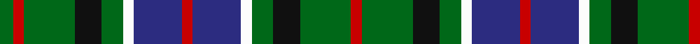

In pattern [GRGKGWBRBWGKGR](/patterns/grgkgwbrbwgkgr/).

This was sourced from register-of-tartans.  It is a [14 stripes tartan](/stripes/stripes14/).

Original link https://www.tartanregister.gov.uk/tartanDetails.aspx?ref=818

## Thread count
G/10 R8 G38 K20 G16 W8 DB36 R8 DB36 W8 G16 K20 G38 R/8

## Palette
Each colour and its ΔE from the base-6 reference it is a variant of.

| Colour | Shade | Base | ΔE (OKLab) |
|---|---|---|---|
| DB | <code style="background-color:#2C2C80;">#2C2C80</code> `#2C2C80` | B <code style="background-color:#2A418A;">#2A418A</code> | 0.06 |
| G | <code style="background-color:#006818;">#006818</code> `#006818` | G <code style="background-color:#006100;">#006100</code> | 0.02 |
| K | <code style="background-color:#101010;">#101010</code> `#101010` | K <code style="background-color:#000000;">#000000</code> | 0.17 |
| R | <code style="background-color:#C80000;">#C80000</code> `#C80000` | R <code style="background-color:#CC0000;">#CC0000</code> | 0.01 |
| W | <code style="background-color:#FCFCFC;">#FCFCFC</code> `#FCFCFC` | W <code style="background-color:#F7F7F7;">#F7F7F7</code> | 0.01 |

## Nearest tartans

The nearest existing variants by ΔTartan distance.

1. [Mandela Commemorative](/setts/s12/g8y2k6g11r2b12k12r2k6y2k4r3~b003c64-g289c18-k101010-rc80000-ye8c000~x2/) — ΔT 0.98
1. [Presbyterian Synod of Living Waters (USA)](/setts/s14/b6r2b6y3g6k1g2w2g2k1g6k1g2w2~b202060-g006818-k101010-rb03000-wc0c0c0-ye8c000~x2/) — ΔT 1.01
1. [MacKean dress Family/Clan Tartan Tartan Number: 2339. Earliest known date: 1995 This was designed as a special design for silk squares woven by D C Dalgliesh. Assumption is that all these New Zealand MacKeans are Personal tartans rather than Clan/Family. See products available Copyright © Blair Urquhart, Comrie, 2015](/setts/s16/k2g4k1g1k2b3k1w1k1b3k2g1k1g4k2r1~b2c2c80-g006818-k101010-rc80000-we0e0e0~x6/) — ΔT 1.01
1. [Keith (District)](/setts/s13/b18r5b3r5b3k20g18y4g18k20b20k6b6~b1474b4-g006818-k101010-rc80000-ye8c000/) — ΔT 1.02
1. [MacAlpine (1906)](/setts/s14/b4g1b1g6k1g6b1g1b4w1k4g1k4y1~b202060-g006818-k101010-we0e0e0-ye8c000~x4/) — ΔT 1.03
1. [Gayre Dress Clan Tartan Tartan Number: 161. Earliest known date: pre 2003 Five versions of Gayre tartan are recorded. Hunting, Dress, Bodyguard, Arisaidh and the version recorded by Lord Lyon, the Clan sett. This can be found in the Public Register of All Arms and Bearings in Scotland. (1992) See products available Copyright © Blair Urquhart, Comrie, 2015](/setts/s15/b14g4k4w4g12b4g12w4k4r6g4w4g3b4k4~b5c8ca8-g006818-k101010-rc80000-we0e0e0~x2/) — ΔT 1.06
1. [Harmony 2 & 3](/setts/s12/g11b3g4y3g3y4g3ga13gb3b3gb4g3~b3c82af-g002814-ga503c14-gb309c18-ye8c000~x2/) — ΔT 1.07
1. [Blanton (Dress)](/setts/s15/b12k2b2k2b2k10g5r3w2r3g5k10b11k2b2~b1474b4-g006818-k101010-rc80000-wffffff~x2/) — ΔT 1.08
1. [Wilson's No.194](/setts/s10/b3w1k3g5r1k3r1g5k3w1~b440044-g006818-k101010-rc80000-we0e0e0~x2/) — ΔT 1.08
1. [Encyclopedia, Britannica](/setts/s14/b18k3b6k3b6k5g12r4g12k5b18k4w5k4~b304080-g008000-k000000-rc00000-we0e0e0~x2/) — ΔT 1.09

## Neighbour map

Every grey dot is one of 15726 variants placed by the first two principal components of the ΔTartan feature space (44% of its variance). Red is this tartan; blue dots are its nearest — click one to open its page.

<svg viewBox="0 0 640 380" role="img" style="max-width:100%;height:auto;border:1px solid #e0e0e0;border-radius:4px;display:block" xmlns="http://www.w3.org/2000/svg"><image href="/nn/cloud.v1.png" width="640" height="380"/><a href="/setts/s12/g8y2k6g11r2b12k12r2k6y2k4r3~b003c64-g289c18-k101010-rc80000-ye8c000~x2/"><circle cx="108.1" cy="192.5" r="4" fill="#3465a4"><title>Mandela Commemorative</title></circle></a><a href="/setts/s14/b6r2b6y3g6k1g2w2g2k1g6k1g2w2~b202060-g006818-k101010-rb03000-wc0c0c0-ye8c000~x2/"><circle cx="106.4" cy="173.7" r="4" fill="#3465a4"><title>Presbyterian Synod of Living Waters (USA)</title></circle></a><a href="/setts/s16/k2g4k1g1k2b3k1w1k1b3k2g1k1g4k2r1~b2c2c80-g006818-k101010-rc80000-we0e0e0~x6/"><circle cx="116.1" cy="220.7" r="4" fill="#3465a4"><title>MacKean dress Family/Clan Tartan Tartan Number: 2339. Earliest known date: 1995 This was designed as a special design for silk squares woven by D C Dalgliesh. Assumption is that all these New Zealand MacKeans are Personal tartans rather than Clan/Family. See products available Copyright © Blair Urquhart, Comrie, 2015</title></circle></a><a href="/setts/s13/b18r5b3r5b3k20g18y4g18k20b20k6b6~b1474b4-g006818-k101010-rc80000-ye8c000/"><circle cx="107.0" cy="194.1" r="4" fill="#3465a4"><title>Keith (District)</title></circle></a><a href="/setts/s14/b4g1b1g6k1g6b1g1b4w1k4g1k4y1~b202060-g006818-k101010-we0e0e0-ye8c000~x4/"><circle cx="156.1" cy="194.1" r="4" fill="#3465a4"><title>MacAlpine (1906)</title></circle></a><a href="/setts/s15/b14g4k4w4g12b4g12w4k4r6g4w4g3b4k4~b5c8ca8-g006818-k101010-rc80000-we0e0e0~x2/"><circle cx="86.0" cy="194.3" r="4" fill="#3465a4"><title>Gayre Dress Clan Tartan Tartan Number: 161. Earliest known date: pre 2003 Five versions of Gayre tartan are recorded. Hunting, Dress, Bodyguard, Arisaidh and the version recorded by Lord Lyon, the Clan sett. This can be found in the Public Register of All Arms and Bearings in Scotland. (1992) See products available Copyright © Blair Urquhart, Comrie, 2015</title></circle></a><a href="/setts/s12/g11b3g4y3g3y4g3ga13gb3b3gb4g3~b3c82af-g002814-ga503c14-gb309c18-ye8c000~x2/"><circle cx="114.3" cy="205.5" r="4" fill="#3465a4"><title>Harmony 2 &amp; 3</title></circle></a><a href="/setts/s15/b12k2b2k2b2k10g5r3w2r3g5k10b11k2b2~b1474b4-g006818-k101010-rc80000-wffffff~x2/"><circle cx="131.7" cy="178.0" r="4" fill="#3465a4"><title>Blanton (Dress)</title></circle></a><a href="/setts/s10/b3w1k3g5r1k3r1g5k3w1~b440044-g006818-k101010-rc80000-we0e0e0~x2/"><circle cx="106.0" cy="219.2" r="4" fill="#3465a4"><title>Wilson's No.194</title></circle></a><a href="/setts/s14/b18k3b6k3b6k5g12r4g12k5b18k4w5k4~b304080-g008000-k000000-rc00000-we0e0e0~x2/"><circle cx="136.0" cy="187.6" r="4" fill="#3465a4"><title>Encyclopedia, Britannica</title></circle></a><circle cx="120.2" cy="202.9" r="5" fill="#c00000"/></svg>

ID: /setts/s14/g5r4g19k10g8w4b18r4b18w4g8k10g19r4~b2c2c80-g006818-k101010-rc80000-wfcfcfc~x2/
