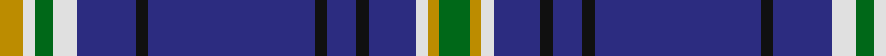

In pattern [GYWBKBKBKBWGWY](/patterns/gywbkbkbkbwgwy/).

This was sourced from register-of-tartans.  It is a [14 stripes tartan](/stripes/stripes14/).

Original link https://www.tartanregister.gov.uk/tartanDetails.aspx?ref=581

## Attestations

This cloth appears in 2 source records; the oldest owns this page.

- 01/09/2001 — Carstairs (register-of-tartans, [record](https://www.tartanregister.gov.uk/tartanDetails.aspx?ref=581))
- 2001 — Carstairs (Name) (tartans-authority, [record](http://www.tartansauthority.com/tartan-ferret/display/4032/))

## Thread count
DY/8 LN4 G6 LN8 DB20 K4 DB56 K4 DB10 K4 DB16 LN4 DY4 G/10

## Palette
Each colour and its ΔE from the base-6 reference it is a variant of.

| Colour | Shade | Base | ΔE (OKLab) |
|---|---|---|---|
| DB | <code style="background-color:#2C2C80;">#2C2C80</code> `#2C2C80` | B <code style="background-color:#2A418A;">#2A418A</code> | 0.06 |
| DY | <code style="background-color:#BC8C00;">#BC8C00</code> `#BC8C00` | Y <code style="background-color:#F2BF00;">#F2BF00</code> | 0.16 |
| G | <code style="background-color:#006818;">#006818</code> `#006818` | G <code style="background-color:#006100;">#006100</code> | 0.02 |
| K | <code style="background-color:#101010;">#101010</code> `#101010` | K <code style="background-color:#000000;">#000000</code> | 0.17 |
| LN | <code style="background-color:#E0E0E0;">#E0E0E0</code> `#E0E0E0` | W <code style="background-color:#F7F7F7;">#F7F7F7</code> | 0.07 |

## Nearest tartans

The nearest existing variants by ΔTartan distance.

1. [International Pairs (Corporate)](/setts/s10/b34y6g6r2w2r2g10y8b23w2~b2c2c80-g007460-rc80000-we0e0e0-ybc8c00~x2/) — ΔT 1.12
1. [California Riverside, University of (Corporate)](/setts/s10/b42k6b3k3b3w5b17w7y10k3~b2c2c80-k101010-wf8f8f8-ybc8c00~x2/) — ΔT 1.23
1. [Glasgow, University of Corporate Tartan Tartan Number: 2680. Earliest known date: 2002 The official livery and promotional university tartan (STS). See products available Copyright © Blair Urquhart, Comrie, 2015](/setts/s14/b2w2k2y2k7g4b22k2b22g4k7y2k2w2~b2c2c80-g006818-k101010-we0e0e0-ybc8c00~x2/) — ΔT 1.24
1. [Rankin #2](/setts/s18/b36g10r2g10w2g10r2k10b14r2b12r2b12r3b2r2b4w2~b2c2c80-g006818-k101010-rc80000-wfcfcfc~x2/) — ΔT 1.25
1. [Scotia (EWM)](/setts/s16/b58g28ga4w18b14r3b8k4b8r3b14w18ga4g28b58w4~b2c2c80-g006818-ga604000-k000000-rc80000-we0e0e0/) — ΔT 1.32
1. [Isle of Harris](/setts/s10/b10k1g2k2ba3k2g2k1b10w1~b2c2c80-ba2888c4-g289c18-k101010-wfcfcfc~x8/) — ΔT 1.32
1. [Fitzgerald (Family)](/setts/s9/r3b22r3b3k14b14ba3b3w2~b1474b4-ba3c94d4-k000000-rc80000-wfcfcfc~x2/) — ΔT 1.39
1. [Blue Brough from Orkney](/setts/s13/b4k4b2ba2k4r14k4ba4b23y6b54ba8k4~b000080-ba666666-k101010-rff0000-yffe600/) — ΔT 1.41
1. [St. Andrews University (Corporate)](/setts/s10/b6y3k2y5ba30g2k4g2ba6b4~b202060-ba2c2c80-g006818-k101010-ye8c000~x2/) — ΔT 1.41
1. [De Nardi Hunting (Personal)](/setts/s8/b30r3b3y3b3g30b36w5~b2c2c80-g006818-rc80000-wfcfcfc-ye8c000~x2/) — ΔT 1.42

## Neighbour map

Every grey dot is one of 15726 variants placed by the first two principal components of the ΔTartan feature space (44% of its variance). Red is this tartan; blue dots are its nearest — click one to open its page.

<svg viewBox="0 0 640 380" role="img" style="max-width:100%;height:auto;border:1px solid #e0e0e0;border-radius:4px;display:block" xmlns="http://www.w3.org/2000/svg"><image href="/nn/cloud.v1.png" width="640" height="380"/><a href="/setts/s10/b34y6g6r2w2r2g10y8b23w2~b2c2c80-g007460-rc80000-we0e0e0-ybc8c00~x2/"><circle cx="321.8" cy="142.3" r="4" fill="#3465a4"><title>International Pairs (Corporate)</title></circle></a><a href="/setts/s10/b42k6b3k3b3w5b17w7y10k3~b2c2c80-k101010-wf8f8f8-ybc8c00~x2/"><circle cx="350.0" cy="151.9" r="4" fill="#3465a4"><title>California Riverside, University of (Corporate)</title></circle></a><a href="/setts/s14/b2w2k2y2k7g4b22k2b22g4k7y2k2w2~b2c2c80-g006818-k101010-we0e0e0-ybc8c00~x2/"><circle cx="284.8" cy="142.3" r="4" fill="#3465a4"><title>Glasgow, University of Corporate Tartan Tartan Number: 2680. Earliest known date: 2002 The official livery and promotional university tartan (STS). See products available Copyright © Blair Urquhart, Comrie, 2015</title></circle></a><a href="/setts/s18/b36g10r2g10w2g10r2k10b14r2b12r2b12r3b2r2b4w2~b2c2c80-g006818-k101010-rc80000-wfcfcfc~x2/"><circle cx="310.2" cy="120.1" r="4" fill="#3465a4"><title>Rankin #2</title></circle></a><a href="/setts/s16/b58g28ga4w18b14r3b8k4b8r3b14w18ga4g28b58w4~b2c2c80-g006818-ga604000-k000000-rc80000-we0e0e0/"><circle cx="267.2" cy="99.0" r="4" fill="#3465a4"><title>Scotia (EWM)</title></circle></a><a href="/setts/s10/b10k1g2k2ba3k2g2k1b10w1~b2c2c80-ba2888c4-g289c18-k101010-wfcfcfc~x8/"><circle cx="282.5" cy="170.4" r="4" fill="#3465a4"><title>Isle of Harris</title></circle></a><a href="/setts/s9/r3b22r3b3k14b14ba3b3w2~b1474b4-ba3c94d4-k000000-rc80000-wfcfcfc~x2/"><circle cx="284.4" cy="165.2" r="4" fill="#3465a4"><title>Fitzgerald (Family)</title></circle></a><a href="/setts/s13/b4k4b2ba2k4r14k4ba4b23y6b54ba8k4~b000080-ba666666-k101010-rff0000-yffe600/"><circle cx="345.2" cy="97.7" r="4" fill="#3465a4"><title>Blue Brough from Orkney</title></circle></a><a href="/setts/s10/b6y3k2y5ba30g2k4g2ba6b4~b202060-ba2c2c80-g006818-k101010-ye8c000~x2/"><circle cx="298.0" cy="137.7" r="4" fill="#3465a4"><title>St. Andrews University (Corporate)</title></circle></a><a href="/setts/s8/b30r3b3y3b3g30b36w5~b2c2c80-g006818-rc80000-wfcfcfc-ye8c000~x2/"><circle cx="340.4" cy="175.5" r="4" fill="#3465a4"><title>De Nardi Hunting (Personal)</title></circle></a><circle cx="327.3" cy="126.3" r="5" fill="#c00000"/></svg>

ID: /setts/s14/g5y2w2b8k2b5k2b28k2b10w4g3w2y4~b2c2c80-g006818-k101010-we0e0e0-ybc8c00~x2/
