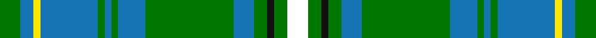

In pattern [GBYBGBGBGBGKGW](/stripes/gbybgbgbgbgkgw/).

This was sourced from register-of-tartans.  It is a [14 stripe tartan](/stripes/stripes14/).

Original link https://www.tartanregister.gov.uk/tartanDetails.aspx?ref=6021

## Register references

External register numbers recorded for this tartan.

- Scottish Register of Tartans: [6021](https://www.tartanregister.gov.uk/tartanDetails.aspx?ref=6021)

## Thread count
G/12 B8 Y4 B34 G4 B4 G4 B16 G52 B12 G8 K4 G8 W/12

## Palette
Each colour and the base-6 reference it is a variant of.

| Colour | Shade | Base |
|---|---|---|
| B | <code style="background-color:#1474B4;">#1474B4</code> `oklch(54.0% 0.129 245.1)` <small>#1474B4</small> | B <code style="background-color:#2A418A;">#2A418A</code> |
| G | <code style="background-color:#007800;">#007800</code> `oklch(49.6% 0.169 142.5)` <small>#007800</small> | G <code style="background-color:#006100;">#006100</code> |
| K | <code style="background-color:#101010;">#101010</code> `oklch(17.3% 0.000 89.9)` <small>#101010</small> | K <code style="background-color:#000000;">#000000</code> |
| W | <code style="background-color:#FFFFFF;">#FFFFFF</code> `oklch(100.0% 0.000 89.9)` <small>#FFFFFF</small> | W <code style="background-color:#F7F7F7;">#F7F7F7</code> |
| Y | <code style="background-color:#FFE600;">#FFE600</code> `oklch(91.7% 0.192 101.4)` <small>#FFE600</small> | Y <code style="background-color:#F2BF00;">#F2BF00</code> |

## Nearest tartans

The nearest existing variants by ΔTartan distance.

1. [Snodgrass](/setts/s14/k3r1ly1t11g13t5r1ly1~x4/) — ΔT 0.62
1. [Mack Original (Personal)](/setts/s13/g2r2g21k8t8k2t28k2t8k8g21w2g2~x2/) — ΔT 1.24
1. [Pina (Corporate)](/setts/s16/g2db1t6db6g4r1g18db1g1r1g1db1g4db10t6db1~x4/) — ΔT 1.26
1. [Tiger](/setts/s16/g2db1b6db10g4db1g1r1g1db1g18r1g4db6b6db1~x4/) — ΔT 1.37
1. [Snodgrass (Clan)](/setts/s8/k3r1ly1t11g13t5r1ly1~x4/) — ΔT 1.39
1. [William and Mary GALA, Inc, The](/setts/s11/k3b10g25ly2g2ly3g2ly2g25b10w3~x2/) — ΔT 1.42
1. [Boucherville (Tartan de..) District Tartan Tartan Number: 2119. Earliest known date: 1990 From the notes accompanying the petition for accreditation. "Les symboles ont cette remarquable propriete de reunir en une expression imagee des notions diverses. Ils refletent l'histoire, les croyances, les idealogies et les aspirations de groupes humains habitant un territoire precis. Les tisserands, c'est nous tous....!" See products available Copyright © Blair Urquhart, Comrie, 2015](/setts/s9/g20ly2o5w4g2o2g2o2db6~x2/) — ΔT 1.44
1. [MacConnell](/setts/s10/db22g6db5t2g22r6g5r4g9w3~x2/) — ΔT 1.46
1. [Tennessee](/setts/s10/r2db10w1m1g1r1g6m1g10w1~x2/) — ΔT 1.47
1. [Platt](/setts/s15/g8db3ly1g6r1g7db7ly1db6r1g3db12g3ly1r1~x2/) — ΔT 1.49

## Neighbour map

Every grey dot is one of 14299 variants placed by the first two principal components of the ΔTartan feature space (44% of its variance). Red is this tartan; blue dots are its nearest — click one to open its page.

<svg viewBox="0 0 640 380" role="img" style="max-width:100%;height:auto;border:1px solid #e0e0e0;border-radius:4px;display:block" xmlns="http://www.w3.org/2000/svg"><image href="/nn/cloud.v1.png" width="640" height="380"/><a href="/setts/s14/k3r1ly1t11g13t5r1ly1~x4/"><circle cx="245.1" cy="149.6" r="4" fill="#3465a4"><title>Snodgrass</title></circle></a><a href="/setts/s13/g2r2g21k8t8k2t28k2t8k8g21w2g2~x2/"><circle cx="207.8" cy="149.6" r="4" fill="#3465a4"><title>Mack Original (Personal)</title></circle></a><a href="/setts/s16/g2db1t6db6g4r1g18db1g1r1g1db1g4db10t6db1~x4/"><circle cx="262.5" cy="135.4" r="4" fill="#3465a4"><title>Pina (Corporate)</title></circle></a><a href="/setts/s16/g2db1b6db10g4db1g1r1g1db1g18r1g4db6b6db1~x4/"><circle cx="265.5" cy="138.4" r="4" fill="#3465a4"><title>Tiger</title></circle></a><a href="/setts/s8/k3r1ly1t11g13t5r1ly1~x4/"><circle cx="226.4" cy="163.2" r="4" fill="#3465a4"><title>Snodgrass (Clan)</title></circle></a><a href="/setts/s11/k3b10g25ly2g2ly3g2ly2g25b10w3~x2/"><circle cx="334.3" cy="160.6" r="4" fill="#3465a4"><title>William and Mary GALA, Inc, The</title></circle></a><a href="/setts/s9/g20ly2o5w4g2o2g2o2db6~x2/"><circle cx="258.4" cy="163.8" r="4" fill="#3465a4"><title>Boucherville (Tartan de..) District Tartan Tartan Number: 2119. Earliest known date: 1990 From the notes accompanying the petition for accreditation. &quot;Les symboles ont cette remarquable propriete de reunir en une expression imagee des notions diverses. Ils refletent l'histoire, les croyances, les idealogies et les aspirations de groupes humains habitant un territoire precis. Les tisserands, c'est nous tous....!&quot; See products available Copyright © Blair Urquhart, Comrie, 2015</title></circle></a><a href="/setts/s10/db22g6db5t2g22r6g5r4g9w3~x2/"><circle cx="246.6" cy="180.2" r="4" fill="#3465a4"><title>MacConnell</title></circle></a><a href="/setts/s10/r2db10w1m1g1r1g6m1g10w1~x2/"><circle cx="247.3" cy="162.6" r="4" fill="#3465a4"><title>Tennessee</title></circle></a><a href="/setts/s15/g8db3ly1g6r1g7db7ly1db6r1g3db12g3ly1r1~x2/"><circle cx="261.2" cy="182.5" r="4" fill="#3465a4"><title>Platt</title></circle></a><circle cx="254.1" cy="147.4" r="5" fill="#c00000"/></svg>

ID: /setts/s14/g6b4ly2b17g2b2g2b8g26b6g4k2g4w6~x2/
