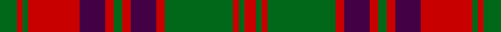

This page is one **sett** — a single exact thread-count. It belongs to the [tartan](/tartans/g6r2g2r18dp9r3g3r3dp9r3g24r2g2r4/)
(the same proportion at any scale), whose colour order is pattern [GRGRBRGRBRGRGR](/stripes/grgrbrgrbrgrgr/).

Sourced from tartans-authority.  It is a [14 stripe tartan](/stripes/stripes14/).

Original link http://www.tartansauthority.com/tartan-ferret/display/898/

## Also known as

This cloth is also recorded under:

- Stewart of Killiecrankie

## Thread count
G/12 R4 G4 R36 DP18 R6 G6 R6 DP18 R6 G48 R4 G4 R/8

## Palette

Palette: <strong>Tartan Register</strong>
<table><thead><tr><th>Colour</th><th>Threads</th><th>Shade</th><th>Base</th><th>OKLCh</th></tr></thead><tbody><tr><td>G/</td><td style="text-align:right;font-variant-numeric:tabular-nums">12</td><td><code style="background-color:#006818;">#006818</code> <small style="color:#888">#006818</small></td><td>G <code style="background-color:#006100;">#006100</code></td><td><small style="color:#888">oklch(45.0% 0.142 145.0)</small></td></tr><tr><td>R</td><td style="text-align:right;font-variant-numeric:tabular-nums">4</td><td><code style="background-color:#C80000;">#C80000</code> <small style="color:#888">#C80000</small></td><td>R <code style="background-color:#CC0000;">#CC0000</code></td><td><small style="color:#888">oklch(52.3% 0.215 29.2)</small></td></tr><tr><td>G</td><td style="text-align:right;font-variant-numeric:tabular-nums">4</td><td><code style="background-color:#006818;">#006818</code> <small style="color:#888">#006818</small></td><td>G <code style="background-color:#006100;">#006100</code></td><td><small style="color:#888">oklch(45.0% 0.142 145.0)</small></td></tr><tr><td>R</td><td style="text-align:right;font-variant-numeric:tabular-nums">36</td><td><code style="background-color:#C80000;">#C80000</code> <small style="color:#888">#C80000</small></td><td>R <code style="background-color:#CC0000;">#CC0000</code></td><td><small style="color:#888">oklch(52.3% 0.215 29.2)</small></td></tr><tr><td>DP</td><td style="text-align:right;font-variant-numeric:tabular-nums">18</td><td><code style="background-color:#440044;">#440044</code> <small style="color:#888">#440044</small></td><td>B <code style="background-color:#2A418A;">#2A418A</code></td><td><small style="color:#888">oklch(27.1% 0.125 328.4)</small></td></tr><tr><td>R</td><td style="text-align:right;font-variant-numeric:tabular-nums">6</td><td><code style="background-color:#C80000;">#C80000</code> <small style="color:#888">#C80000</small></td><td>R <code style="background-color:#CC0000;">#CC0000</code></td><td><small style="color:#888">oklch(52.3% 0.215 29.2)</small></td></tr><tr><td>G</td><td style="text-align:right;font-variant-numeric:tabular-nums">6</td><td><code style="background-color:#006818;">#006818</code> <small style="color:#888">#006818</small></td><td>G <code style="background-color:#006100;">#006100</code></td><td><small style="color:#888">oklch(45.0% 0.142 145.0)</small></td></tr><tr><td>R</td><td style="text-align:right;font-variant-numeric:tabular-nums">6</td><td><code style="background-color:#C80000;">#C80000</code> <small style="color:#888">#C80000</small></td><td>R <code style="background-color:#CC0000;">#CC0000</code></td><td><small style="color:#888">oklch(52.3% 0.215 29.2)</small></td></tr><tr><td>DP</td><td style="text-align:right;font-variant-numeric:tabular-nums">18</td><td><code style="background-color:#440044;">#440044</code> <small style="color:#888">#440044</small></td><td>B <code style="background-color:#2A418A;">#2A418A</code></td><td><small style="color:#888">oklch(27.1% 0.125 328.4)</small></td></tr><tr><td>R</td><td style="text-align:right;font-variant-numeric:tabular-nums">6</td><td><code style="background-color:#C80000;">#C80000</code> <small style="color:#888">#C80000</small></td><td>R <code style="background-color:#CC0000;">#CC0000</code></td><td><small style="color:#888">oklch(52.3% 0.215 29.2)</small></td></tr><tr><td>G</td><td style="text-align:right;font-variant-numeric:tabular-nums">48</td><td><code style="background-color:#006818;">#006818</code> <small style="color:#888">#006818</small></td><td>G <code style="background-color:#006100;">#006100</code></td><td><small style="color:#888">oklch(45.0% 0.142 145.0)</small></td></tr><tr><td>R</td><td style="text-align:right;font-variant-numeric:tabular-nums">4</td><td><code style="background-color:#C80000;">#C80000</code> <small style="color:#888">#C80000</small></td><td>R <code style="background-color:#CC0000;">#CC0000</code></td><td><small style="color:#888">oklch(52.3% 0.215 29.2)</small></td></tr><tr><td>G</td><td style="text-align:right;font-variant-numeric:tabular-nums">4</td><td><code style="background-color:#006818;">#006818</code> <small style="color:#888">#006818</small></td><td>G <code style="background-color:#006100;">#006100</code></td><td><small style="color:#888">oklch(45.0% 0.142 145.0)</small></td></tr><tr><td>R/</td><td style="text-align:right;font-variant-numeric:tabular-nums">8</td><td><code style="background-color:#C80000;">#C80000</code> <small style="color:#888">#C80000</small></td><td>R <code style="background-color:#CC0000;">#CC0000</code></td><td><small style="color:#888">oklch(52.3% 0.215 29.2)</small></td></tr></tbody></table>

## Nearest tartans

The nearest existing variants by ΔTartan distance, with this tartan at the top so the swatches line up against it.

ΔTartan

Tartan

Sett

—

<a href="/ttd/edit/#slug=g6r2g2r18dp9r3g3r3dp9r3g24r2g2r4~x2">Stewart of Urrard (Clan?)</a> <a class="nn-out" href="/setts/s14/g6r2g2r18dp9r3g3r3dp9r3g24r2g2r4~x2/" title="open its dictionary page">↗</a>

0.42

<a href="/ttd/edit/#slug=dg6r2dg2r18db9r3dg3r3db9r3dg24r2dg2r4~x2">Stuart/Stewart of Urrard</a> <a class="nn-out" href="/setts/s14/dg6r2dg2r18db9r3dg3r3db9r3dg24r2dg2r4~x2/" title="open its dictionary page">↗</a>

0.62

<a href="/ttd/edit/#slug=r28g2r2g2db12g18r2g18db12r15g2r3~x2">Frasers Highlanders (Military?)</a> <a class="nn-out" href="/setts/s12/r28g2r2g2db12g18r2g18db12r15g2r3~x2/" title="open its dictionary page">↗</a>

0.80

<a href="/ttd/edit/#slug=r6g28r6dp2r6dp19r6dp2r6g28r6dp2~x2">Wilson's No.119</a> <a class="nn-out" href="/setts/s12/r6g28r6dp2r6dp19r6dp2r6g28r6dp2~x2/" title="open its dictionary page">↗</a>

0.83

<a href="/ttd/edit/#slug=g6r2g2r18db9r3g3r3db9r3g24r2g2r4~x2">Stewart of Urrard</a> <a class="nn-out" href="/setts/s14/g6r2g2r18db9r3g3r3db9r3g24r2g2r4~x2/" title="open its dictionary page">↗</a>

0.90

<a href="/ttd/edit/#slug=r45db4r4dg48r4db4r4db15r4db4r40dg4r4dg30">Bruce Old</a> <a class="nn-out" href="/setts/s14/r45db4r4dg48r4db4r4db15r4db4r40dg4r4dg30/" title="open its dictionary page">↗</a>

0.95

<a href="/ttd/edit/#slug=db10r1db1r1g10r13g2r13g10db10r1db1~x2">Inverness, Fencibles</a> <a class="nn-out" href="/setts/s12/db10r1db1r1g10r13g2r13g10db10r1db1~x2/" title="open its dictionary page">↗</a>

1.01

<a href="/ttd/edit/#slug=r45db4r4g48r4db4r4db15r4db4r40g4r4g30">Bruce, Old</a> <a class="nn-out" href="/setts/s14/r45db4r4g48r4db4r4db15r4db4r40g4r4g30/" title="open its dictionary page">↗</a>

1.02

<a href="/ttd/edit/#slug=db28r3db3r3g20r30g4r30g20db22r3db3~x2">Fraser, Stewart of Athol</a> <a class="nn-out" href="/setts/s12/db28r3db3r3g20r30g4r30g20db22r3db3~x2/" title="open its dictionary page">↗</a>

1.03

<a href="/ttd/edit/#slug=r45dp4r4g48r4dp4r4dp15r4dp4r40g4r4g30">Bruce Old Clan Tartan Tartan Number: 876. Earliest known date: 1797 An order dated 1797 in the Wilson's of Bannockburn papers requests '50 Ells Bruce sett tartan'. As no distinction is made between 'old' and 'new' we assume that the 'new' sett, which has much in common with this one, had not been introduced. (Reduced in proportion for illustration.) See products available Copyright © Blair Urquhart, Comrie, 2015</a> <a class="nn-out" href="/setts/s14/r45dp4r4g48r4dp4r4dp15r4dp4r40g4r4g30/" title="open its dictionary page">↗</a>

1.04

<a href="/ttd/edit/#slug=db16r1db1r1g12r16g2r16g12db12r1db1~x2">Fraser, Stewart of Athol</a> <a class="nn-out" href="/setts/s12/db16r1db1r1g12r16g2r16g12db12r1db1~x2/" title="open its dictionary page">↗</a>

## Neighbour map

Every grey dot is one of 14299 variants placed by the first two principal components of the ΔTartan feature space (44% of its variance). Red is this tartan; blue dots are its nearest — click one to open its page.

<svg viewBox="0 0 640 380" role="img" style="max-width:100%;height:auto;border:1px solid #e0e0e0;border-radius:4px;display:block" xmlns="http://www.w3.org/2000/svg"><image href="/nn/cloud.v1.png" width="640" height="380"/><a href="/setts/s14/dg6r2dg2r18db9r3dg3r3db9r3dg24r2dg2r4~x2/"><circle cx="271.3" cy="171.1" r="4" fill="#3465a4"><title>Stuart/Stewart of Urrard</title></circle></a><a href="/setts/s12/r28g2r2g2db12g18r2g18db12r15g2r3~x2/"><circle cx="273.3" cy="180.0" r="4" fill="#3465a4"><title>Frasers Highlanders (Military?)</title></circle></a><a href="/setts/s12/r6g28r6dp2r6dp19r6dp2r6g28r6dp2~x2/"><circle cx="305.2" cy="179.3" r="4" fill="#3465a4"><title>Wilson's No.119</title></circle></a><a href="/setts/s14/g6r2g2r18db9r3g3r3db9r3g24r2g2r4~x2/"><circle cx="269.3" cy="172.5" r="4" fill="#3465a4"><title>Stewart of Urrard</title></circle></a><a href="/setts/s14/r45db4r4dg48r4db4r4db15r4db4r40dg4r4dg30/"><circle cx="319.3" cy="160.5" r="4" fill="#3465a4"><title>Bruce Old</title></circle></a><a href="/setts/s12/db10r1db1r1g10r13g2r13g10db10r1db1~x2/"><circle cx="251.5" cy="189.0" r="4" fill="#3465a4"><title>Inverness, Fencibles</title></circle></a><a href="/setts/s14/r45db4r4g48r4db4r4db15r4db4r40g4r4g30/"><circle cx="321.5" cy="165.0" r="4" fill="#3465a4"><title>Bruce, Old</title></circle></a><a href="/setts/s12/db28r3db3r3g20r30g4r30g20db22r3db3~x2/"><circle cx="247.3" cy="199.8" r="4" fill="#3465a4"><title>Fraser, Stewart of Athol</title></circle></a><a href="/setts/s14/r45dp4r4g48r4dp4r4dp15r4dp4r40g4r4g30/"><circle cx="331.7" cy="165.3" r="4" fill="#3465a4"><title>Bruce Old Clan Tartan Tartan Number: 876. Earliest known date: 1797 An order dated 1797 in the Wilson's of Bannockburn papers requests '50 Ells Bruce sett tartan'. As no distinction is made between 'old' and 'new' we assume that the 'new' sett, which has much in common with this one, had not been introduced. (Reduced in proportion for illustration.) See products available Copyright © Blair Urquhart, Comrie, 2015</title></circle></a><a href="/setts/s12/db16r1db1r1g12r16g2r16g12db12r1db1~x2/"><circle cx="258.3" cy="178.9" r="4" fill="#3465a4"><title>Fraser, Stewart of Athol</title></circle></a><circle cx="272.8" cy="169.9" r="5" fill="#c00000"/></svg>

ID: /setts/s14/g6r2g2r18dp9r3g3r3dp9r3g24r2g2r4~x2/
