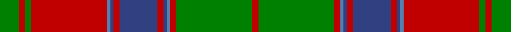

In pattern [GRGRBBRBRBBRGR](/stripes/grgrbbrbrbbrgr/).

This was sourced from weddslist.  It is a [14 stripe tartan](/stripes/stripes14/).

Original link http://www.weddslist.com/cgi-bin/tartans/pg.pl?source=sts

## Thread count
G/12 R4 G4 R48 Ba2 B2 R4 B24 R4 B2 Ba2 R4 G48 R/4

## Palette
Each colour and the base-6 reference it is a variant of.

| Colour | Shade | Base |
|---|---|---|
| B | <code style="background-color:#304080;">#304080</code> `oklch(39.4% 0.109 270.2)` <small>#304080</small> | B <code style="background-color:#2A418A;">#2A418A</code> |
| Ba | <code style="background-color:#5480B0;">#5480B0</code> `oklch(58.8% 0.089 251.5)` <small>#5480B0</small> | B <code style="background-color:#2A418A;">#2A418A</code> |
| G | <code style="background-color:#008000;">#008000</code> `oklch(52.0% 0.177 142.5)` <small>#008000</small> | G <code style="background-color:#006100;">#006100</code> |
| R | <code style="background-color:#C00000;">#C00000</code> `oklch(50.7% 0.208 29.2)` <small>#C00000</small> | R <code style="background-color:#CC0000;">#CC0000</code> |

## Nearest tartans

The nearest existing variants by ΔTartan distance, with this tartan at the top so the swatches line up against it.

ΔTartan

Tartan

Sett

—

<a href="/ttd/edit/#slug=g6r2g2r24t1db1r2db12r2db1t1r2g24r2~x2">Unidentified, coat</a> <a class="nn-out" href="/setts/s14/g6r2g2r24t1db1r2db12r2db1t1r2g24r2~x2/" title="open its dictionary page">↗</a>

0.67

<a href="/ttd/edit/#slug=r20p1r1db2r1p1r4db4g2db4g2db4g19r1p2~x2">Ladybird</a> <a class="nn-out" href="/setts/s15/r20p1r1db2r1p1r4db4g2db4g2db4g19r1p2~x2/" title="open its dictionary page">↗</a>

0.76

<a href="/ttd/edit/#slug=dg6r2dg2r24t1db1r2db12r2db1t1r2dg24r2~x2">Unidentified Coat</a> <a class="nn-out" href="/setts/s14/dg6r2dg2r24t1db1r2db12r2db1t1r2dg24r2~x2/" title="open its dictionary page">↗</a>

0.79

<a href="/ttd/edit/#slug=r4r10g7r70g7r4p21r4g85r4g7r10r4">Crieff</a> <a class="nn-out" href="/setts/s13/r4r10g7r70g7r4p21r4g85r4g7r10r4/" title="open its dictionary page">↗</a>

0.84

<a href="/ttd/edit/#slug=r3db2t1r2g24r4g2r2db8r2g2r24db2t1r2g2~x2">Stewart of Appin - 1906</a> <a class="nn-out" href="/setts/s16/r3db2t1r2g24r4g2r2db8r2g2r24db2t1r2g2~x2/" title="open its dictionary page">↗</a>

0.88

<a href="/ttd/edit/#slug=r4r10g7r70g7r4dp21r4g85r4g7r10r4">Crieff District Tartan Tartan Number: 1636. Earliest known date: 1793 Wilson's accounts of 1793 mention the Crieff tartan with no details. A manuscript dated 1800 gives details of colour but it is not until the publication of the Key Pattern Book of 1819 that this sett is revealed in full. Crieff in Perthshire was the most famous of the cattle drovers 'trysts' prior to 1700. It is a very large sett which has been proportionately reduced for this illustration. The full threadcount: Light Red 4, Red 12, Green 8, R 140, G 8, R 4, Purple 42, R 4, G 170, R 4, G 8, R 12, LR 4. See products available Copyright © Blair Urquhart, Comrie, 2015</a> <a class="nn-out" href="/setts/s13/r4r10g7r70g7r4dp21r4g85r4g7r10r4/" title="open its dictionary page">↗</a>

0.99

<a href="/ttd/edit/#slug=g2r3g2r52g2r2db28r2g42r2g2r3g2~x2">MacQuarrie 3</a> <a class="nn-out" href="/setts/s13/g2r3g2r52g2r2db28r2g42r2g2r3g2~x2/" title="open its dictionary page">↗</a>

1.18

<a href="/ttd/edit/#slug=r9db4r89db4r4db80r9db9r4db4r4g80r4db4">Fraser of Altyre</a> <a class="nn-out" href="/setts/s14/r9db4r89db4r4db80r9db9r4db4r4g80r4db4/" title="open its dictionary page">↗</a>

1.21

<a href="/ttd/edit/#slug=r3db2r2g38r2g2r2db10r2lb2r37db2r2db2r3~x2">Grant and Drummond</a> <a class="nn-out" href="/setts/s15/r3db2r2g38r2g2r2db10r2lb2r37db2r2db2r3~x2/" title="open its dictionary page">↗</a>

1.21

<a href="/ttd/edit/#slug=w1r2p2r22db1r1g8r8g8p2r1p2db9r3g1r3g22r1p2w1~x2">MacDougall 7</a> <a class="nn-out" href="/setts/s20/w1r2p2r22db1r1g8r8g8p2r1p2db9r3g1r3g22r1p2w1~x2/" title="open its dictionary page">↗</a>

1.22

<a href="/ttd/edit/#slug=db24r7g7r39db4r2db2r5g42r7db6r7~x2">Drummond</a> <a class="nn-out" href="/setts/s12/db24r7g7r39db4r2db2r5g42r7db6r7~x2/" title="open its dictionary page">↗</a>

## Neighbour map

Every grey dot is one of 14299 variants placed by the first two principal components of the ΔTartan feature space (44% of its variance). Red is this tartan; blue dots are its nearest — click one to open its page.

<svg viewBox="0 0 640 380" role="img" style="max-width:100%;height:auto;border:1px solid #e0e0e0;border-radius:4px;display:block" xmlns="http://www.w3.org/2000/svg"><image href="/nn/cloud.v1.png" width="640" height="380"/><a href="/setts/s15/r20p1r1db2r1p1r4db4g2db4g2db4g19r1p2~x2/"><circle cx="269.8" cy="114.4" r="4" fill="#3465a4"><title>Ladybird</title></circle></a><a href="/setts/s14/dg6r2dg2r24t1db1r2db12r2db1t1r2dg24r2~x2/"><circle cx="298.1" cy="108.8" r="4" fill="#3465a4"><title>Unidentified Coat</title></circle></a><a href="/setts/s13/r4r10g7r70g7r4p21r4g85r4g7r10r4/"><circle cx="327.9" cy="114.5" r="4" fill="#3465a4"><title>Crieff</title></circle></a><a href="/setts/s16/r3db2t1r2g24r4g2r2db8r2g2r24db2t1r2g2~x2/"><circle cx="326.7" cy="101.9" r="4" fill="#3465a4"><title>Stewart of Appin - 1906</title></circle></a><a href="/setts/s13/r4r10g7r70g7r4dp21r4g85r4g7r10r4/"><circle cx="336.0" cy="117.9" r="4" fill="#3465a4"><title>Crieff District Tartan Tartan Number: 1636. Earliest known date: 1793 Wilson's accounts of 1793 mention the Crieff tartan with no details. A manuscript dated 1800 gives details of colour but it is not until the publication of the Key Pattern Book of 1819 that this sett is revealed in full. Crieff in Perthshire was the most famous of the cattle drovers 'trysts' prior to 1700. It is a very large sett which has been proportionately reduced for this illustration. The full threadcount: Light Red 4, Red 12, Green 8, R 140, G 8, R 4, Purple 42, R 4, G 170, R 4, G 8, R 12, LR 4. See products available Copyright © Blair Urquhart, Comrie, 2015</title></circle></a><a href="/setts/s13/g2r3g2r52g2r2db28r2g42r2g2r3g2~x2/"><circle cx="342.5" cy="118.0" r="4" fill="#3465a4"><title>MacQuarrie 3</title></circle></a><a href="/setts/s14/r9db4r89db4r4db80r9db9r4db4r4g80r4db4/"><circle cx="310.4" cy="124.7" r="4" fill="#3465a4"><title>Fraser of Altyre</title></circle></a><a href="/setts/s15/r3db2r2g38r2g2r2db10r2lb2r37db2r2db2r3~x2/"><circle cx="321.4" cy="97.0" r="4" fill="#3465a4"><title>Grant and Drummond</title></circle></a><a href="/setts/s20/w1r2p2r22db1r1g8r8g8p2r1p2db9r3g1r3g22r1p2w1~x2/"><circle cx="252.4" cy="83.7" r="4" fill="#3465a4"><title>MacDougall 7</title></circle></a><a href="/setts/s12/db24r7g7r39db4r2db2r5g42r7db6r7~x2/"><circle cx="307.4" cy="152.7" r="4" fill="#3465a4"><title>Drummond</title></circle></a><circle cx="298.3" cy="111.5" r="5" fill="#c00000"/></svg>

ID: /setts/s14/g6r2g2r24t1db1r2db12r2db1t1r2g24r2~x2/
