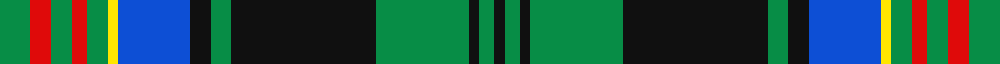

In pattern [GRGRGYBKGKGKGK](/stripes/grgrgybkgkgkgk/).

This was sourced from register-of-tartans.  It is a [14 stripe tartan](/stripes/stripes14/).

Original link https://www.tartanregister.gov.uk/tartanDetails.aspx?ref=10840

## Register references

External register numbers recorded for this tartan.

- Scottish Register of Tartans: [10840](https://www.tartanregister.gov.uk/tartanDetails.aspx?ref=10840)

## Thread count
G/12 R8 G8 R6 G8 Y4 B28 K8 G8 K56 G36 K4 G6 K/4

## Palette
Each colour and the base-6 reference it is a variant of.

| Colour | Shade | Base |
|---|---|---|
| B | <code style="background-color:#0D4FD5;">#0D4FD5</code> `oklch(48.4% 0.215 262.4)` <small>#0D4FD5</small> | B <code style="background-color:#2A418A;">#2A418A</code> |
| G | <code style="background-color:#078D46;">#078D46</code> `oklch(56.4% 0.148 151.6)` <small>#078D46</small> | G <code style="background-color:#006100;">#006100</code> |
| K | <code style="background-color:#101010;">#101010</code> `oklch(17.3% 0.000 89.9)` <small>#101010</small> | K <code style="background-color:#000000;">#000000</code> |
| R | <code style="background-color:#DF0A0A;">#DF0A0A</code> `oklch(57.0% 0.230 28.9)` <small>#DF0A0A</small> | R <code style="background-color:#CC0000;">#CC0000</code> |
| Y | <code style="background-color:#FFE600;">#FFE600</code> `oklch(91.7% 0.192 101.4)` <small>#FFE600</small> | Y <code style="background-color:#F2BF00;">#F2BF00</code> |

## Nearest tartans

The nearest existing variants by ΔTartan distance.

1. [Unidentified, B'gowrie](/setts/s15/g30ly2g5ly2g4k15db29r2db29k15g5ly2g4ly2g17~x2/) — ΔT 0.46
1. [MacKenzie](/setts/s15/r1g11k4db2k1db1k1db14k1db1k1db2k4g11w1~x4/) — ΔT 0.55
1. [Cochrane](/setts/s15/g16r2g2r1g3r1g2r2g12k12r1db16r2db8ly2~x2/) — ΔT 0.58
1. [Rankin](/setts/s16/db36g10r2g10w2g10r2g10k14r2db12r3db2r2db4w2~x2/) — ΔT 0.73
1. [O'Doherty (Glasgow) (Personal)](/setts/s13/w2db10g3db2g3k18g10ly1g3ly2g2k2ly2~x2/) — ΔT 0.81
1. [Farquharson (Clan)](/setts/s14/r8b30k4b4k4b4k56g55ly8g55k56b46k4r8/) — ΔT 0.86
1. [Scottish Rugby Union Corporate Tartan Tartan Number: 2101. Earliest known date: 1990 S.R.U. requested that the Navy of their jersey should be prominent, including the green and lilac of the thistle, and the white of the shorts. This version is approved by the Scottish Rugby Union. See products available Copyright © Blair Urquhart, Comrie, 2015](/setts/s11/dt3k2dt22k9g2lp2g2lp2g8k2w3~x2/) — ΔT 0.92
1. [O'Doherty (Name)](/setts/s13/w2dt10dg3dt2dg3k18dg10ly1dg3ly2dg2k2ly2~x2/) — ΔT 0.96
1. [Logan Rogers Hunting](/setts/s13/db11k1db1w1db1k8g8ly1g8k8db8w1db1~x2/) — ΔT 0.98
1. [Boston Pipe Band, Greater](/setts/s13/dg8r1dg2r2dg12w1k12r1t12r2t2r1t8~x4/) — ΔT 1.01

## Neighbour map

Every grey dot is one of 14299 variants placed by the first two principal components of the ΔTartan feature space (44% of its variance). Red is this tartan; blue dots are its nearest — click one to open its page.

<svg viewBox="0 0 640 380" role="img" style="max-width:100%;height:auto;border:1px solid #e0e0e0;border-radius:4px;display:block" xmlns="http://www.w3.org/2000/svg"><image href="/nn/cloud.v1.png" width="640" height="380"/><a href="/setts/s15/g30ly2g5ly2g4k15db29r2db29k15g5ly2g4ly2g17~x2/"><circle cx="178.3" cy="130.9" r="4" fill="#3465a4"><title>Unidentified, B'gowrie</title></circle></a><a href="/setts/s15/r1g11k4db2k1db1k1db14k1db1k1db2k4g11w1~x4/"><circle cx="190.3" cy="123.2" r="4" fill="#3465a4"><title>MacKenzie</title></circle></a><a href="/setts/s15/g16r2g2r1g3r1g2r2g12k12r1db16r2db8ly2~x2/"><circle cx="190.1" cy="123.7" r="4" fill="#3465a4"><title>Cochrane</title></circle></a><a href="/setts/s16/db36g10r2g10w2g10r2g10k14r2db12r3db2r2db4w2~x2/"><circle cx="214.7" cy="112.9" r="4" fill="#3465a4"><title>Rankin</title></circle></a><a href="/setts/s13/w2db10g3db2g3k18g10ly1g3ly2g2k2ly2~x2/"><circle cx="158.6" cy="122.5" r="4" fill="#3465a4"><title>O'Doherty (Glasgow) (Personal)</title></circle></a><a href="/setts/s14/r8b30k4b4k4b4k56g55ly8g55k56b46k4r8/"><circle cx="176.6" cy="148.0" r="4" fill="#3465a4"><title>Farquharson (Clan)</title></circle></a><a href="/setts/s11/dt3k2dt22k9g2lp2g2lp2g8k2w3~x2/"><circle cx="192.6" cy="144.2" r="4" fill="#3465a4"><title>Scottish Rugby Union Corporate Tartan Tartan Number: 2101. Earliest known date: 1990 S.R.U. requested that the Navy of their jersey should be prominent, including the green and lilac of the thistle, and the white of the shorts. This version is approved by the Scottish Rugby Union. See products available Copyright © Blair Urquhart, Comrie, 2015</title></circle></a><a href="/setts/s13/w2dt10dg3dt2dg3k18dg10ly1dg3ly2dg2k2ly2~x2/"><circle cx="177.1" cy="129.5" r="4" fill="#3465a4"><title>O'Doherty (Name)</title></circle></a><a href="/setts/s13/db11k1db1w1db1k8g8ly1g8k8db8w1db1~x2/"><circle cx="159.8" cy="160.4" r="4" fill="#3465a4"><title>Logan Rogers Hunting</title></circle></a><a href="/setts/s13/dg8r1dg2r2dg12w1k12r1t12r2t2r1t8~x4/"><circle cx="155.7" cy="149.9" r="4" fill="#3465a4"><title>Boston Pipe Band, Greater</title></circle></a><circle cx="184.9" cy="128.2" r="5" fill="#c00000"/></svg>

ID: /setts/s14/g6r4g4r3g4ly2b14k4g4k28g18k2g3k2~x2/
