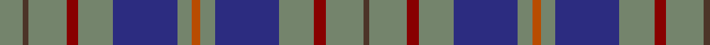

In pattern [BGRGBGRGBGRGBG](/patterns/bgrgbgrgbgrgbg/).

This was sourced from register-of-tartans.  It is a [14 stripes tartan](/stripes/stripes14/).

Original link https://www.tartanregister.gov.uk/tartanDetails.aspx?ref=1965

## Register references

External register numbers recorded for this tartan.

- Scottish Register of Tartans: [1965](https://www.tartanregister.gov.uk/tartanDetails.aspx?ref=1965)
- Scottish Tartans Authority (ITI): 2262
- Scottish Tartans World Register: 2262

## Thread count
N/16 T4 N26 DR8 N24 DB44 N10 DO6 N10 DB44 N24 DR8 N26 T/4

## Palette
Each colour and its ΔE from the base-6 reference it is a variant of.

| Colour | Shade | Base | ΔE (OKLab) |
|---|---|---|---|
| DB | <code style="background-color:#2C2C80;">#2C2C80</code> `#2C2C80` | B <code style="background-color:#2A418A;">#2A418A</code> | 0.06 |
| DO | <code style="background-color:#B84C00;">#B84C00</code> `#B84C00` | R <code style="background-color:#CC0000;">#CC0000</code> | 0.08 |
| DR | <code style="background-color:#880000;">#880000</code> `#880000` | R <code style="background-color:#CC0000;">#CC0000</code> | 0.15 |
| N | <code style="background-color:#74846C;">#74846C</code> `#74846C` | G <code style="background-color:#006100;">#006100</code> | 0.20 |
| T | <code style="background-color:#4C3428;">#4C3428</code> `#4C3428` | B <code style="background-color:#2A418A;">#2A418A</code> | 0.17 |

## Nearest tartans

The nearest existing variants by ΔTartan distance.

1. [Kildare, County (District)](/setts/s8/g8b2g13r4g12ba22g5ra3~b4c3428-ba2c2c80-g74846c-r880000-rab84c00~x2/) — ΔT 1.15
1. [American Soc of Travel Agents Corporate Tartan Tartan Number: 2316. Earliest known date: Pre 1995 Deisgned by Kinloch Anderson for the Scottish Tourist Board trained US Travel Agents. Based on Davidson since the first President of the ASTA from 1931 - 1938 was Mr E. Irvine Davis.Designed to celebrate the ASTA 1997 world conference in Glasgow. Thread count estimated from illustration. See products available Copyright © Blair Urquhart, Comrie, 2015](/setts/s16/g10b10r1b10ra1b1ra10b2ra10b1ra1b10r1b10g10w2~b2c2c80-g006818-rc80000-ra888888-we0e0e0~x2/) — ΔT 1.16
1. [Bute Heather, Grey (Fashion)](/setts/s11/y13ya2b38k13b8k8b17k2b17k4r11~b5c5c5c-k101010-r888888-ya0a0a0-yab8b8b8/) — ΔT 1.30
1. [American Society of Travel Agents, The](/setts/s11/b2g18b2g2b20r3b18ga2b2ga18w2~b304080-g808080-ga008000-rc00000-we0e0e0/) — ΔT 1.36
1. [Donegal Irish County Tartan Tartan Number: 2247. Earliest known date: 1996 One of a series of Irish District tartans designed by Polly Wittering of the House of Edgar, with colours reminiscent of the Country with soft warm colours dominating. See products available Copyright © Blair Urquhart, Comrie, 2015](/setts/s10/y3g17b3g3b3k5b18r2b8r2~b406088-g508c60-k000000-r8c0020-yd09000~x2/) — ΔT 1.43
1. [Donegal](/setts/s10/g3ga17b3ga3b3ba5b18r2b8r2~b304080-ba401000-g908000-ga008000-rc00000~x2/) — ΔT 1.45
1. [CBS (Corporate)](/setts/s15/b18ba16r11ba20k7ba7k11ba7k7ba35k52ba71r7k7r12~b2c2c80-ba5c5c5c-k101010-r888888/) — ΔT 1.47
1. [Donegal, County](/setts/s10/y3g17b3g3b3ba5b18r2b8r2~b1474b4-ba441800-g285800-r880000-ybc8c00~x2/) — ΔT 1.49
1. [Falkirk](/setts/s12/b8r27y2ra3y2r27b22k2b4k2b4k4~b304080-k000000-r806050-rac00000-yf0c000~x2/) — ΔT 1.53
1. [Dalmeny](/setts/s10/b8k1b8k2g6r1g6k2b8w1~b2c4084-g005020-k101010-rdc0000-we0e0e0~x2/) — ΔT 1.53

## Neighbour map

Every grey dot is one of 15726 variants placed by the first two principal components of the ΔTartan feature space (44% of its variance). Red is this tartan; blue dots are its nearest — click one to open its page.

<svg viewBox="0 0 640 380" role="img" style="max-width:100%;height:auto;border:1px solid #e0e0e0;border-radius:4px;display:block" xmlns="http://www.w3.org/2000/svg"><image href="/nn/cloud.v1.png" width="640" height="380"/><a href="/setts/s8/g8b2g13r4g12ba22g5ra3~b4c3428-ba2c2c80-g74846c-r880000-rab84c00~x2/"><circle cx="301.2" cy="203.3" r="4" fill="#3465a4"><title>Kildare, County (District)</title></circle></a><a href="/setts/s16/g10b10r1b10ra1b1ra10b2ra10b1ra1b10r1b10g10w2~b2c2c80-g006818-rc80000-ra888888-we0e0e0~x2/"><circle cx="224.2" cy="167.1" r="4" fill="#3465a4"><title>American Soc of Travel Agents Corporate Tartan Tartan Number: 2316. Earliest known date: Pre 1995 Deisgned by Kinloch Anderson for the Scottish Tourist Board trained US Travel Agents. Based on Davidson since the first President of the ASTA from 1931 - 1938 was Mr E. Irvine Davis.Designed to celebrate the ASTA 1997 world conference in Glasgow. Thread count estimated from illustration. See products available Copyright © Blair Urquhart, Comrie, 2015</title></circle></a><a href="/setts/s11/y13ya2b38k13b8k8b17k2b17k4r11~b5c5c5c-k101010-r888888-ya0a0a0-yab8b8b8/"><circle cx="331.7" cy="163.8" r="4" fill="#3465a4"><title>Bute Heather, Grey (Fashion)</title></circle></a><a href="/setts/s11/b2g18b2g2b20r3b18ga2b2ga18w2~b304080-g808080-ga008000-rc00000-we0e0e0/"><circle cx="261.2" cy="172.8" r="4" fill="#3465a4"><title>American Society of Travel Agents, The</title></circle></a><a href="/setts/s10/y3g17b3g3b3k5b18r2b8r2~b406088-g508c60-k000000-r8c0020-yd09000~x2/"><circle cx="246.5" cy="180.4" r="4" fill="#3465a4"><title>Donegal Irish County Tartan Tartan Number: 2247. Earliest known date: 1996 One of a series of Irish District tartans designed by Polly Wittering of the House of Edgar, with colours reminiscent of the Country with soft warm colours dominating. See products available Copyright © Blair Urquhart, Comrie, 2015</title></circle></a><a href="/setts/s10/g3ga17b3ga3b3ba5b18r2b8r2~b304080-ba401000-g908000-ga008000-rc00000~x2/"><circle cx="256.5" cy="185.9" r="4" fill="#3465a4"><title>Donegal</title></circle></a><a href="/setts/s15/b18ba16r11ba20k7ba7k11ba7k7ba35k52ba71r7k7r12~b2c2c80-ba5c5c5c-k101010-r888888/"><circle cx="310.6" cy="179.7" r="4" fill="#3465a4"><title>CBS (Corporate)</title></circle></a><a href="/setts/s10/y3g17b3g3b3ba5b18r2b8r2~b1474b4-ba441800-g285800-r880000-ybc8c00~x2/"><circle cx="263.7" cy="189.8" r="4" fill="#3465a4"><title>Donegal, County</title></circle></a><a href="/setts/s12/b8r27y2ra3y2r27b22k2b4k2b4k4~b304080-k000000-r806050-rac00000-yf0c000~x2/"><circle cx="290.1" cy="143.9" r="4" fill="#3465a4"><title>Falkirk</title></circle></a><a href="/setts/s10/b8k1b8k2g6r1g6k2b8w1~b2c4084-g005020-k101010-rdc0000-we0e0e0~x2/"><circle cx="289.4" cy="222.2" r="4" fill="#3465a4"><title>Dalmeny</title></circle></a><circle cx="283.2" cy="180.1" r="5" fill="#c00000"/></svg>

ID: /setts/s14/g8b2g13r4g12ba22g5ra3g5ba22g12r4g13b2~b4c3428-ba2c2c80-g74846c-r880000-rab84c00~x2/
