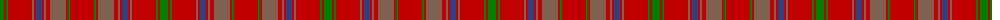

In pattern [GRGRRRBRRRRRGR](/patterns/grgrrrbrrrrrgr/).

This was sourced from weddslist.  It is a [14 stripes tartan](/stripes/stripes14/).

Original link http://www.weddslist.com/cgi-bin/tartans/pg.pl?source=sts

## Thread count
G/8 R2 G2 R24 LT2 R2 B6 R2 LT2 R4 LT16 R2 G2 R/24

## Palette
Each colour and its ΔE from the base-6 reference it is a variant of.

| Colour | Shade | Base | ΔE (OKLab) |
|---|---|---|---|
| B | <code style="background-color:#304080;">#304080</code> `#304080` | B <code style="background-color:#2C4084;">#2C4084</code> | 0.01 |
| G | <code style="background-color:#008000;">#008000</code> `#008000` | G <code style="background-color:#006400;">#006400</code> | 0.09 |
| LT | <code style="background-color:#806050;">#806050</code> `#806050` | R <code style="background-color:#C80000;">#C80000</code> | 0.17 |
| R | <code style="background-color:#C00000;">#C00000</code> `#C00000` | R <code style="background-color:#C80000;">#C80000</code> | 0.02 |

ID: /setts/s14/g8r2g2r24ra2r2b6r2ra2r4ra16r2g2r24-b304080-g008000-rc00000-ra806050/
