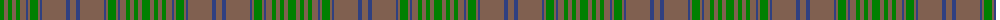

In pattern [GRGRGRBRGRBRBR](/patterns/grgrgrbrgrbrbr/).

This was sourced from weddslist.  It is a [14 stripes tartan](/stripes/stripes14/).

Original link http://www.weddslist.com/cgi-bin/tartans/pg.pl?source=sts

## Thread count
G/8 LT4 G4 LT4 G4 LT6 B2 LT2 G8 LT2 B2 LT24 B4 LT/6

## Palette
Each colour and its ΔE from the base-6 reference it is a variant of.

| Colour | Shade | Base | ΔE (OKLab) |
|---|---|---|---|
| B | <code style="background-color:#304080;">#304080</code> `#304080` | B <code style="background-color:#2C4084;">#2C4084</code> | 0.01 |
| G | <code style="background-color:#008000;">#008000</code> `#008000` | G <code style="background-color:#006400;">#006400</code> | 0.09 |
| LT | <code style="background-color:#806050;">#806050</code> `#806050` | R <code style="background-color:#C80000;">#C80000</code> | 0.17 |

## Nearest tartans

The nearest existing variants by ΔTartan distance.

1. [MacAlister of Glenbarr Clan Tartan Tartan Number: 910. Earliest known date: pre 1984 This version of the MacAlister of Glenbarr tartan is the same as the MacGillivray hunting tartan. This sample was taken from a piece woven by Lochcarron Weavers around 1984. See products available Copyright © Blair Urquhart, Comrie, 2015](/setts/s14/g8ga4g4ga4g4ga6b2ga2g8ga2b2ga24b4ga6-b2c2c80-g006818-ga604000/) — ΔT 1.27
1. [Gray (Personal)](/setts/s18/b66g20r6g6r6g6r16b20r6b20r16g6r6g6r6g20b66r6-b5c5c5c-g006818-ra00000/) — ΔT 1.29
1. [Sarna](/setts/s16/r26ra2r4ra4r4ra2r4ra10r22ra2r4g4r4ra2r4g14-g008000-r806050-rac00000/) — ΔT 1.40
1. [Gray (Name)](/setts/s10/r6g66ga20r6ga6r6ga6r16g20r6-g6c6c6c-ga006818-ra00000/) — ΔT 1.41
1. [Sarna (District)](/setts/s16/g26r2g4r4g4r2g4r10g22r2g4ga4g4r2g4ga14-g604000-ga006818-rc80000/) — ΔT 1.66
1. [Howells](/setts/s15/b32r2g6b10r2b10g6b8g24b28y2b28g24y4r12-b785050-g005020-rdc0000-ye8c000/) — ΔT 1.70
1. [Donachie of Brockloch Htg (Clan)](/setts/s10/g48r4g4ga80g50ga4g4r4g4ga40-g487048-ga003820-r880000/) — ΔT 1.78
1. [MacAlister of Glenbarr Hunting](/setts/s14/g40ga6g12ga12g12ga16b4ga4g40ga4b4ga92b6ga16-b2c2c80-g006818-ga603800/) — ΔT 1.81
1. [Hanna of Leith (yellow line)](/setts/s10/g18b8g4b8g4b60g18b8ba28y4-b5c5c5c-ba2888c4-g603800-yd09800/) — ΔT 1.84
1. [Aberlour Bicentenary](/setts/s15/g16b6g6ba46g5ba8g5b10g6y8g48b6g6b6g16-b580b5b-ba25375f-g5c6428-yc88c00/) — ΔT 1.86

## Neighbour map

Every grey dot is one of 15726 variants placed by the first two principal components of the ΔTartan feature space (44% of its variance). Red is this tartan; blue dots are its nearest — click one to open its page.

<svg viewBox="0 0 640 380" role="img" style="max-width:100%;height:auto;border:1px solid #e0e0e0;border-radius:4px;display:block" xmlns="http://www.w3.org/2000/svg"><image href="/nn/cloud.v1.png" width="640" height="380"/><a href="/setts/s14/g8ga4g4ga4g4ga6b2ga2g8ga2b2ga24b4ga6-b2c2c80-g006818-ga604000/"><circle cx="465.5" cy="236.2" r="4" fill="#3465a4"><title>MacAlister of Glenbarr Clan Tartan Tartan Number: 910. Earliest known date: pre 1984 This version of the MacAlister of Glenbarr tartan is the same as the MacGillivray hunting tartan. This sample was taken from a piece woven by Lochcarron Weavers around 1984. See products available Copyright © Blair Urquhart, Comrie, 2015</title></circle></a><a href="/setts/s18/b66g20r6g6r6g6r16b20r6b20r16g6r6g6r6g20b66r6-b5c5c5c-g006818-ra00000/"><circle cx="427.8" cy="206.5" r="4" fill="#3465a4"><title>Gray (Personal)</title></circle></a><a href="/setts/s16/r26ra2r4ra4r4ra2r4ra10r22ra2r4g4r4ra2r4g14-g008000-r806050-rac00000/"><circle cx="479.9" cy="203.9" r="4" fill="#3465a4"><title>Sarna</title></circle></a><a href="/setts/s10/r6g66ga20r6ga6r6ga6r16g20r6-g6c6c6c-ga006818-ra00000/"><circle cx="411.5" cy="217.0" r="4" fill="#3465a4"><title>Gray (Name)</title></circle></a><a href="/setts/s16/g26r2g4r4g4r2g4r10g22r2g4ga4g4r2g4ga14-g604000-ga006818-rc80000/"><circle cx="478.2" cy="206.0" r="4" fill="#3465a4"><title>Sarna (District)</title></circle></a><a href="/setts/s15/b32r2g6b10r2b10g6b8g24b28y2b28g24y4r12-b785050-g005020-rdc0000-ye8c000/"><circle cx="388.6" cy="190.7" r="4" fill="#3465a4"><title>Howells</title></circle></a><a href="/setts/s10/g48r4g4ga80g50ga4g4r4g4ga40-g487048-ga003820-r880000/"><circle cx="442.4" cy="213.6" r="4" fill="#3465a4"><title>Donachie of Brockloch Htg (Clan)</title></circle></a><a href="/setts/s14/g40ga6g12ga12g12ga16b4ga4g40ga4b4ga92b6ga16-b2c2c80-g006818-ga603800/"><circle cx="495.4" cy="196.4" r="4" fill="#3465a4"><title>MacAlister of Glenbarr Hunting</title></circle></a><a href="/setts/s10/g18b8g4b8g4b60g18b8ba28y4-b5c5c5c-ba2888c4-g603800-yd09800/"><circle cx="393.4" cy="205.6" r="4" fill="#3465a4"><title>Hanna of Leith (yellow line)</title></circle></a><a href="/setts/s15/g16b6g6ba46g5ba8g5b10g6y8g48b6g6b6g16-b580b5b-ba25375f-g5c6428-yc88c00/"><circle cx="347.6" cy="190.0" r="4" fill="#3465a4"><title>Aberlour Bicentenary</title></circle></a><circle cx="438.2" cy="219.7" r="5" fill="#c00000"/></svg>

ID: /setts/s14/g8r4g4r4g4r6b2r2g8r2b2r24b4r6-b304080-g008000-r806050/
