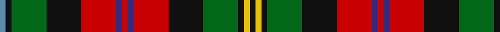

**Bands:** [BKGKRBRBRKGKYK](/stripes/bkgkrbrbrkgkyk/) · **Stripes:** [T K G K R DB R DB R K G K LY K](/stripes/stripes14/) T K G K R DB R DB R K G K LY K

This was sourced from register-of-tartans.  It is a [14 band tartan](/bands/bands14/).

Original link https://www.tartanregister.gov.uk/tartanDetails.aspx?ref=3568

## Attestations

This cloth appears in 2 source records; the oldest owns this page.

- 01/03/2006 — Rossi (Personal) (register-of-tartans, [record](https://www.tartanregister.gov.uk/tartanDetails.aspx?ref=3568))
- 2006 March — Rossi (Personal) (tartans-authority, [record](http://www.tartansauthority.com/tartan-ferret/display/6897/))

## Register references

External register numbers recorded for this tartan.

- Scottish Register of Tartans: [3568](https://www.tartanregister.gov.uk/tartanDetails.aspx?ref=3568)
- Scottish Tartans Authority (ITI): 6897

## Thread count
B/4 K4 G24 K24 R24 DB4 R4 DB4 R24 K24 G24 K4 Y4 K/4

## Palette
Each colour and its ΔE from the base-6 reference it is a variant of.

| Colour | Shade | Base | ΔE (OKLab) |
|---|---|---|---|
| B | <code style="background-color:#5C8CA8;">#5C8CA8</code> `#5C8CA8` | B <code style="background-color:#2A418A;">#2A418A</code> | 0.23 |
| DB | <code style="background-color:#2C2C80;">#2C2C80</code> `#2C2C80` | B <code style="background-color:#2A418A;">#2A418A</code> | 0.06 |
| G | <code style="background-color:#006818;">#006818</code> `#006818` | G <code style="background-color:#006100;">#006100</code> | 0.02 |
| K | <code style="background-color:#101010;">#101010</code> `#101010` | K <code style="background-color:#000000;">#000000</code> | 0.17 |
| R | <code style="background-color:#C80000;">#C80000</code> `#C80000` | R <code style="background-color:#CC0000;">#CC0000</code> | 0.01 |
| Y | <code style="background-color:#E8C000;">#E8C000</code> `#E8C000` | Y <code style="background-color:#F2BF00;">#F2BF00</code> | 0.02 |

## Nearest tartans

The nearest existing variants by ΔTartan distance.

1. [Unidentified No 3](/setts/s16/r2k2r5t5k1t1k1t5dg6ly1dg6r6w1r1k1r1~x2/) — ΔT 1.01
1. [MacPherson 9](/setts/s15/r6db1r6g8ly1k6db4k1db2k1db4r4w1k1r1~x2/) — ΔT 1.02
1. [Wilson's No.109](/setts/s14/r5g15dp8ly2k3r11g8r11k3ly2dp8g15r5w2~x2/) — ΔT 1.02
1. [Bowie (white lines) (Name)](/setts/s13/db8r2db3r4db13w2y13w2dg13r4dg4lo2dg8~x2/) — ΔT 1.03
1. [Unnamed No 158, Silk Fragment](/setts/s13/db8k1r4k1r4k1r4k1g8k1ly1r1w1~x2/) — ΔT 1.04
1. [Caledonia - 1819 (Wilsons') No.155](/setts/s14/r9t8k2t2k2t8k16ly3dg18r10k3r10w2r5~x2/) — ΔT 1.05
1. [Norwich No.158](/setts/s13/g8k1ly1r1w1db8k1r4k1r4k1r4k1~x2/) — ΔT 1.06
1. [Unnamed, No 3](/setts/s16/r2k2r5t5k1t1k1t5g6ly1g6r6w1r1k1r1~x2/) — ΔT 1.06
1. [MacPherson #6](/setts/s15/r6db1r6dg8ly1k6db4k1db2k1db4r4w1k1r1~x2/) — ΔT 1.11
1. [Bowie (Dalgety) Family Tartan Tartan Number: 434. Earliest known date: 1970-80 The name Bowie or Buie is associated with Argyllshire and the islands of Jura, Uist and Bute. The design comes from J. Dalgety, a weaving manufacturer who specializes in tartan. The date of the tartan is assumed. See products available Copyright © Blair Urquhart, Comrie, 2015](/setts/s13/db8r2db3r4db13w2dr13w2g13r4g4ly2g8~x2/) — ΔT 1.11

## Neighbour map

Every grey dot is one of 14313 variants placed by the first two principal components of the ΔTartan feature space (44% of its variance). Red is this tartan; blue dots are its nearest — click one to open its page.

<svg viewBox="0 0 640 380" role="img" style="max-width:100%;height:auto;border:1px solid #e0e0e0;border-radius:4px;display:block" xmlns="http://www.w3.org/2000/svg"><image href="/nn/cloud.v1.png" width="640" height="380"/><a href="/setts/s16/r2k2r5t5k1t1k1t5dg6ly1dg6r6w1r1k1r1~x2/"><circle cx="85.3" cy="149.4" r="4" fill="#3465a4"><title>Unidentified No 3</title></circle></a><a href="/setts/s15/r6db1r6g8ly1k6db4k1db2k1db4r4w1k1r1~x2/"><circle cx="91.2" cy="136.9" r="4" fill="#3465a4"><title>MacPherson 9</title></circle></a><a href="/setts/s14/r5g15dp8ly2k3r11g8r11k3ly2dp8g15r5w2~x2/"><circle cx="120.5" cy="162.6" r="4" fill="#3465a4"><title>Wilson's No.109</title></circle></a><a href="/setts/s13/db8r2db3r4db13w2y13w2dg13r4dg4lo2dg8~x2/"><circle cx="69.5" cy="163.9" r="4" fill="#3465a4"><title>Bowie (white lines) (Name)</title></circle></a><a href="/setts/s13/db8k1r4k1r4k1r4k1g8k1ly1r1w1~x2/"><circle cx="107.4" cy="128.9" r="4" fill="#3465a4"><title>Unnamed No 158, Silk Fragment</title></circle></a><a href="/setts/s14/r9t8k2t2k2t8k16ly3dg18r10k3r10w2r5~x2/"><circle cx="97.8" cy="140.6" r="4" fill="#3465a4"><title>Caledonia - 1819 (Wilsons') No.155</title></circle></a><a href="/setts/s13/g8k1ly1r1w1db8k1r4k1r4k1r4k1~x2/"><circle cx="121.3" cy="134.3" r="4" fill="#3465a4"><title>Norwich No.158</title></circle></a><a href="/setts/s16/r2k2r5t5k1t1k1t5g6ly1g6r6w1r1k1r1~x2/"><circle cx="71.8" cy="144.8" r="4" fill="#3465a4"><title>Unnamed, No 3</title></circle></a><a href="/setts/s15/r6db1r6dg8ly1k6db4k1db2k1db4r4w1k1r1~x2/"><circle cx="107.8" cy="141.8" r="4" fill="#3465a4"><title>MacPherson #6</title></circle></a><a href="/setts/s13/db8r2db3r4db13w2dr13w2g13r4g4ly2g8~x2/"><circle cx="82.9" cy="168.8" r="4" fill="#3465a4"><title>Bowie (Dalgety) Family Tartan Tartan Number: 434. Earliest known date: 1970-80 The name Bowie or Buie is associated with Argyllshire and the islands of Jura, Uist and Bute. The design comes from J. Dalgety, a weaving manufacturer who specializes in tartan. The date of the tartan is assumed. See products available Copyright © Blair Urquhart, Comrie, 2015</title></circle></a><circle cx="106.9" cy="160.2" r="5" fill="#c00000"/></svg>

ID: /setts/s14/k1ly1k1g6k6r6db1r1db1r6k6g6k1t1~x4/
