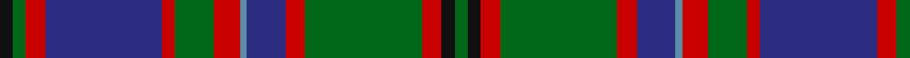

In pattern [GKRGRBBRGRBRGK](/stripes/gkrgrbbrgrbrgk/).

This was sourced from register-of-tartans.  It is a [14 stripe tartan](/stripes/stripes14/).

Original link https://www.tartanregister.gov.uk/tartanDetails.aspx?ref=1394

## Also known as

This cloth is also recorded under:

- Glen Orchy #2 or MacIntyre
- Glen Orchy or MacIntyre
- Glen Orchy, or MacIntyre

## Attestations

This cloth appears in 4 source records; the oldest owns this page.

- 01/01/1822 — Glen Orchy #2 or MacIntyre (register-of-tartans, [record](https://www.tartanregister.gov.uk/tartanDetails.aspx?ref=1394))
- 1822 — Glen Orchy #2 (District) (tartans-authority, [record](http://www.tartansauthority.com/tartan-ferret/display/812/))
- undated — Glen Orchy, or MacIntyre (weddslist, [record](http://www.weddslist.com/cgi-bin/tartans/pg.pl?source=sts))
- undated — Glen Orchy or MacIntyre District Tartan Tartan Number: 812. Earliest known date: 1893 The Glen Orchy sett is sometimes known as the MacIntyre and Glenorchy, although the MacIntyres occupied only part of the Glen. See products available Copyright © Blair Urquhart, Comrie, 2015 (house-of-tartan, [record](http://www.house-of-tartan.scotland.net/house/TartanViewjs.asp?colr=Def&tnam=812))

## Register references

External register numbers recorded for this tartan.

- Scottish Register of Tartans: [1394](https://www.tartanregister.gov.uk/tartanDetails.aspx?ref=1394)
- Scottish Tartans Authority (ITI): 812
- Scottish Tartans World Register: 812

## Thread count
K/4 G4 R6 DB36 R4 G12 R8 B2 DB12 R6 G36 R6 K4 G/4

## Palette
Each colour and the base-6 reference it is a variant of.

| Colour | Shade | Base |
|---|---|---|
| B | <code style="background-color:#5C8CA8;">#5C8CA8</code> `oklch(61.7% 0.067 235.0)` <small>#5C8CA8</small> | B <code style="background-color:#2A418A;">#2A418A</code> |
| DB | <code style="background-color:#2C2C80;">#2C2C80</code> `oklch(35.0% 0.138 276.6)` <small>#2C2C80</small> | B <code style="background-color:#2A418A;">#2A418A</code> |
| G | <code style="background-color:#006818;">#006818</code> `oklch(45.0% 0.142 145.0)` <small>#006818</small> | G <code style="background-color:#006100;">#006100</code> |
| K | <code style="background-color:#101010;">#101010</code> `oklch(17.3% 0.000 89.9)` <small>#101010</small> | K <code style="background-color:#000000;">#000000</code> |
| R | <code style="background-color:#C80000;">#C80000</code> `oklch(52.3% 0.215 29.2)` <small>#C80000</small> | R <code style="background-color:#CC0000;">#CC0000</code> |

## Nearest tartans

The nearest existing variants by ΔTartan distance, with this tartan at the top so the swatches line up against it.

ΔTartan

Tartan

Sett

—

<a href="/ttd/edit/#slug=k2g2r3db18r2g6r4t1db6r3g18r3k2g2~x2">Glen Orchy #2 or MacIntyre</a> <a class="nn-out" href="/setts/s14/k2g2r3db18r2g6r4t1db6r3g18r3k2g2~x2/" title="open its dictionary page">↗</a>

0.64

<a href="/ttd/edit/#slug=g3db2r1db17r2g8r4t1db8r2g17r2r1db3t1~x2">Glenorchy - National Archives</a> <a class="nn-out" href="/setts/s15/g3db2r1db17r2g8r4t1db8r2g17r2r1db3t1~x2/" title="open its dictionary page">↗</a>

0.73

<a href="/ttd/edit/#slug=dg16r2dg2r1dg3r1dg2r2dg12k12r1db16r2db8ly2~x2">Cochrane (1984)</a> <a class="nn-out" href="/setts/s15/dg16r2dg2r1dg3r1dg2r2dg12k12r1db16r2db8ly2~x2/" title="open its dictionary page">↗</a>

0.77

<a href="/ttd/edit/#slug=g3r2r1db18r2g8r4t1db8r2g18r2r1db3t1~x2">Glen Orchy</a> <a class="nn-out" href="/setts/s15/g3r2r1db18r2g8r4t1db8r2g18r2r1db3t1~x2/" title="open its dictionary page">↗</a>

0.81

<a href="/ttd/edit/#slug=o9w2o18k3o3k3o3k12n30k6n6r6">Urquhart (Fashion)</a> <a class="nn-out" href="/setts/s12/o9w2o18k3o3k3o3k12n30k6n6r6/" title="open its dictionary page">↗</a>

0.82

<a href="/ttd/edit/#slug=db20r2db2r5db30r2k32w2dg30r5dg4r2dg4w2">MacDonald of Clanranald #5</a> <a class="nn-out" href="/setts/s14/db20r2db2r5db30r2k32w2dg30r5dg4r2dg4w2/" title="open its dictionary page">↗</a>

0.85

<a href="/ttd/edit/#slug=g19r1g2r2g15r1dt13w1db2r2db21r1w3~x2">Ontario (Official)</a> <a class="nn-out" href="/setts/s13/g19r1g2r2g15r1dt13w1db2r2db21r1w3~x2/" title="open its dictionary page">↗</a>

0.89

<a href="/ttd/edit/#slug=dg16r2dg2r7dg31w3k32r2db31r7db2r2db16~x2">MacDonald of Clanranald #2</a> <a class="nn-out" href="/setts/s13/dg16r2dg2r7dg31w3k32r2db31r7db2r2db16~x2/" title="open its dictionary page">↗</a>

0.93

<a href="/ttd/edit/#slug=db36dg10r2dg10w2dg10r2dg10k14r2db12r3db2r2db4w2~x2">Rankin</a> <a class="nn-out" href="/setts/s16/db36dg10r2dg10w2dg10r2dg10k14r2db12r3db2r2db4w2~x2/" title="open its dictionary page">↗</a>

0.97

<a href="/ttd/edit/#slug=k10r26k2r4k2r26k3g36k3g30k3y2">Pope of Wales</a> <a class="nn-out" href="/setts/s12/k10r26k2r4k2r26k3g36k3g30k3y2/" title="open its dictionary page">↗</a>

0.99

<a href="/ttd/edit/#slug=r4k2db16k16g16ly4g16k16db1k1db1k1db1k1db8r2~x2">Farquharson</a> <a class="nn-out" href="/setts/s16/r4k2db16k16g16ly4g16k16db1k1db1k1db1k1db8r2~x2/" title="open its dictionary page">↗</a>

## Neighbour map

Every grey dot is one of 14299 variants placed by the first two principal components of the ΔTartan feature space (44% of its variance). Red is this tartan; blue dots are its nearest — click one to open its page.

<svg viewBox="0 0 640 380" role="img" style="max-width:100%;height:auto;border:1px solid #e0e0e0;border-radius:4px;display:block" xmlns="http://www.w3.org/2000/svg"><image href="/nn/cloud.v1.png" width="640" height="380"/><a href="/setts/s15/g3db2r1db17r2g8r4t1db8r2g17r2r1db3t1~x2/"><circle cx="249.4" cy="131.9" r="4" fill="#3465a4"><title>Glenorchy - National Archives</title></circle></a><a href="/setts/s15/dg16r2dg2r1dg3r1dg2r2dg12k12r1db16r2db8ly2~x2/"><circle cx="233.1" cy="144.9" r="4" fill="#3465a4"><title>Cochrane (1984)</title></circle></a><a href="/setts/s15/g3r2r1db18r2g8r4t1db8r2g18r2r1db3t1~x2/"><circle cx="241.6" cy="126.6" r="4" fill="#3465a4"><title>Glen Orchy</title></circle></a><a href="/setts/s12/o9w2o18k3o3k3o3k12n30k6n6r6/"><circle cx="194.1" cy="146.2" r="4" fill="#3465a4"><title>Urquhart (Fashion)</title></circle></a><a href="/setts/s14/db20r2db2r5db30r2k32w2dg30r5dg4r2dg4w2/"><circle cx="203.5" cy="131.4" r="4" fill="#3465a4"><title>MacDonald of Clanranald #5</title></circle></a><a href="/setts/s13/g19r1g2r2g15r1dt13w1db2r2db21r1w3~x2/"><circle cx="237.1" cy="122.7" r="4" fill="#3465a4"><title>Ontario (Official)</title></circle></a><a href="/setts/s13/dg16r2dg2r7dg31w3k32r2db31r7db2r2db16~x2/"><circle cx="182.1" cy="145.3" r="4" fill="#3465a4"><title>MacDonald of Clanranald #2</title></circle></a><a href="/setts/s16/db36dg10r2dg10w2dg10r2dg10k14r2db12r3db2r2db4w2~x2/"><circle cx="251.0" cy="131.2" r="4" fill="#3465a4"><title>Rankin</title></circle></a><a href="/setts/s12/k10r26k2r4k2r26k3g36k3g30k3y2/"><circle cx="209.2" cy="134.7" r="4" fill="#3465a4"><title>Pope of Wales</title></circle></a><a href="/setts/s16/r4k2db16k16g16ly4g16k16db1k1db1k1db1k1db8r2~x2/"><circle cx="182.0" cy="135.8" r="4" fill="#3465a4"><title>Farquharson</title></circle></a><circle cx="225.6" cy="130.9" r="5" fill="#c00000"/></svg>

ID: /setts/s14/k2g2r3db18r2g6r4t1db6r3g18r3k2g2~x2/
