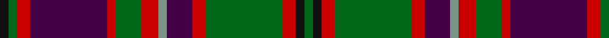

This page is one **sett** — a single exact thread-count. It belongs to the [tartan](/tartans/k2g2r3dp18r2g6r4y2dp6r3g18r3k2g2/)
(the same proportion at any scale), whose colour order is pattern [GKRGRBGRGRBRGK](/stripes/gkrgrbgrgrbrgk/).

Sourced from register-of-tartans.  It is a [14 stripe tartan](/stripes/stripes14/).

Original link https://www.tartanregister.gov.uk/tartanDetails.aspx?ref=5059

## Register references

External register numbers recorded for this tartan.

- Scottish Register of Tartans: [5059](https://www.tartanregister.gov.uk/tartanDetails.aspx?ref=5059)
- Scottish Tartans Authority (ITI): 3395

## Thread count
K/4 G4 R6 DP36 R4 G12 R8 LG4 DP12 R6 G36 R6 K4 G/4

## Palette

Palette: <strong>Tartan Register</strong>
<table><thead><tr><th>Colour</th><th>Threads</th><th>Shade</th><th>Base</th><th>OKLCh</th></tr></thead><tbody><tr><td>K/</td><td style="text-align:right;font-variant-numeric:tabular-nums">4</td><td><code style="background-color:#101010;">#101010</code> <small style="color:#888">#101010</small></td><td>K <code style="background-color:#000000;">#000000</code></td><td><small style="color:#888">oklch(17.3% 0.000 89.9)</small></td></tr><tr><td>G</td><td style="text-align:right;font-variant-numeric:tabular-nums">4</td><td><code style="background-color:#006818;">#006818</code> <small style="color:#888">#006818</small></td><td>G <code style="background-color:#006100;">#006100</code></td><td><small style="color:#888">oklch(45.0% 0.142 145.0)</small></td></tr><tr><td>R</td><td style="text-align:right;font-variant-numeric:tabular-nums">6</td><td><code style="background-color:#C80000;">#C80000</code> <small style="color:#888">#C80000</small></td><td>R <code style="background-color:#CC0000;">#CC0000</code></td><td><small style="color:#888">oklch(52.3% 0.215 29.2)</small></td></tr><tr><td>DP</td><td style="text-align:right;font-variant-numeric:tabular-nums">36</td><td><code style="background-color:#440044;">#440044</code> <small style="color:#888">#440044</small></td><td>B <code style="background-color:#2A418A;">#2A418A</code></td><td><small style="color:#888">oklch(27.1% 0.125 328.4)</small></td></tr><tr><td>R</td><td style="text-align:right;font-variant-numeric:tabular-nums">4</td><td><code style="background-color:#C80000;">#C80000</code> <small style="color:#888">#C80000</small></td><td>R <code style="background-color:#CC0000;">#CC0000</code></td><td><small style="color:#888">oklch(52.3% 0.215 29.2)</small></td></tr><tr><td>G</td><td style="text-align:right;font-variant-numeric:tabular-nums">12</td><td><code style="background-color:#006818;">#006818</code> <small style="color:#888">#006818</small></td><td>G <code style="background-color:#006100;">#006100</code></td><td><small style="color:#888">oklch(45.0% 0.142 145.0)</small></td></tr><tr><td>R</td><td style="text-align:right;font-variant-numeric:tabular-nums">8</td><td><code style="background-color:#C80000;">#C80000</code> <small style="color:#888">#C80000</small></td><td>R <code style="background-color:#CC0000;">#CC0000</code></td><td><small style="color:#888">oklch(52.3% 0.215 29.2)</small></td></tr><tr><td>LG</td><td style="text-align:right;font-variant-numeric:tabular-nums">4</td><td><code style="background-color:#789484;">#789484</code> <small style="color:#888">#789484</small></td><td>G <code style="background-color:#006100;">#006100</code></td><td><small style="color:#888">oklch(64.0% 0.040 160.0)</small></td></tr><tr><td>DP</td><td style="text-align:right;font-variant-numeric:tabular-nums">12</td><td><code style="background-color:#440044;">#440044</code> <small style="color:#888">#440044</small></td><td>B <code style="background-color:#2A418A;">#2A418A</code></td><td><small style="color:#888">oklch(27.1% 0.125 328.4)</small></td></tr><tr><td>R</td><td style="text-align:right;font-variant-numeric:tabular-nums">6</td><td><code style="background-color:#C80000;">#C80000</code> <small style="color:#888">#C80000</small></td><td>R <code style="background-color:#CC0000;">#CC0000</code></td><td><small style="color:#888">oklch(52.3% 0.215 29.2)</small></td></tr><tr><td>G</td><td style="text-align:right;font-variant-numeric:tabular-nums">36</td><td><code style="background-color:#006818;">#006818</code> <small style="color:#888">#006818</small></td><td>G <code style="background-color:#006100;">#006100</code></td><td><small style="color:#888">oklch(45.0% 0.142 145.0)</small></td></tr><tr><td>R</td><td style="text-align:right;font-variant-numeric:tabular-nums">6</td><td><code style="background-color:#C80000;">#C80000</code> <small style="color:#888">#C80000</small></td><td>R <code style="background-color:#CC0000;">#CC0000</code></td><td><small style="color:#888">oklch(52.3% 0.215 29.2)</small></td></tr><tr><td>K</td><td style="text-align:right;font-variant-numeric:tabular-nums">4</td><td><code style="background-color:#101010;">#101010</code> <small style="color:#888">#101010</small></td><td>K <code style="background-color:#000000;">#000000</code></td><td><small style="color:#888">oklch(17.3% 0.000 89.9)</small></td></tr><tr><td>G/</td><td style="text-align:right;font-variant-numeric:tabular-nums">4</td><td><code style="background-color:#006818;">#006818</code> <small style="color:#888">#006818</small></td><td>G <code style="background-color:#006100;">#006100</code></td><td><small style="color:#888">oklch(45.0% 0.142 145.0)</small></td></tr></tbody></table>

## Nearest tartans

The nearest existing variants by ΔTartan distance, with this tartan at the top so the swatches line up against it.

ΔTartan

Tartan

Sett

—

<a href="/ttd/edit/#slug=k2g2r3dp18r2g6r4y2dp6r3g18r3k2g2~x2">MacIntyre and Glenorchy</a> <a class="nn-out" href="/setts/s14/k2g2r3dp18r2g6r4y2dp6r3g18r3k2g2~x2/" title="open its dictionary page">↗</a>

0.71

<a href="/ttd/edit/#slug=y3dg19r2dg2r2db10r17dg2r2dg2r3t2r3t3~x2">Manx Heritage</a> <a class="nn-out" href="/setts/s14/y3dg19r2dg2r2db10r17dg2r2dg2r3t2r3t3~x2/" title="open its dictionary page">↗</a>

0.80

<a href="/ttd/edit/#slug=y4lr2y2lr3y20k6do4k2do2k2do16o3~x2">Dorcas</a> <a class="nn-out" href="/setts/s12/y4lr2y2lr3y20k6do4k2do2k2do16o3~x2/" title="open its dictionary page">↗</a>

0.90

<a href="/ttd/edit/#slug=r3dy16db2dy2db2dy3db6o20lr3o2lr2o3~x2">Callum, Brown (Fashion)</a> <a class="nn-out" href="/setts/s12/r3dy16db2dy2db2dy3db6o20lr3o2lr2o3~x2/" title="open its dictionary page">↗</a>

0.98

<a href="/ttd/edit/#slug=o2o2o2o16n10k3n2k2n2k10ly2~x2">Dryburgh</a> <a class="nn-out" href="/setts/s11/o2o2o2o16n10k3n2k2n2k10ly2~x2/" title="open its dictionary page">↗</a>

0.99

<a href="/ttd/edit/#slug=o3g19r2g2r2db10r17g2r2g2r3t2r3t3~x2">Manx Heritage</a> <a class="nn-out" href="/setts/s14/o3g19r2g2r2db10r17g2r2g2r3t2r3t3~x2/" title="open its dictionary page">↗</a>

1.03

<a href="/ttd/edit/#slug=n12k2n2k2n2k12r12k1ly2k1r12k12n12k1r2~x2">Flaumandrum</a> <a class="nn-out" href="/setts/s15/n12k2n2k2n2k12r12k1ly2k1r12k12n12k1r2~x2/" title="open its dictionary page">↗</a>

1.04

<a href="/ttd/edit/#slug=dg22r4dg2r2dg2r4dg12k12r2db10r4db4ly3~x2">Cochrane (1974)</a> <a class="nn-out" href="/setts/s13/dg22r4dg2r2dg2r4dg12k12r2db10r4db4ly3~x2/" title="open its dictionary page">↗</a>

1.06

<a href="/ttd/edit/#slug=k10n2k2n2k3n10o16o2o2o2o2o2o16n10k3n2k2n2k10ly2~x2">Dryburgh Clan Tartan Tartan Number: 6422. Earliest known date: 2004 Based on Kerr, and the colours of the Dryburgh coat of arms including the 3 martlet birds, matriculated for William J. Dryburgh. See products available Copyright © Blair Urquhart, Comrie, 2015</a> <a class="nn-out" href="/setts/s20/k10n2k2n2k3n10o16o2o2o2o2o2o16n10k3n2k2n2k10ly2~x2/" title="open its dictionary page">↗</a>

1.07

<a href="/ttd/edit/#slug=dp2r3dg2db2r6dg16r2db4dg2r16dg8dp2r4lb2">MacKinnon</a> <a class="nn-out" href="/setts/s14/dp2r3dg2db2r6dg16r2db4dg2r16dg8dp2r4lb2/" title="open its dictionary page">↗</a>

1.09

<a href="/ttd/edit/#slug=lb3k1do12k1do1k2do1k6o12k1lo1~x4">MacCandlish Dress Grey</a> <a class="nn-out" href="/setts/s11/lb3k1do12k1do1k2do1k6o12k1lo1~x4/" title="open its dictionary page">↗</a>

## Neighbour map

Every grey dot is one of 14299 variants placed by the first two principal components of the ΔTartan feature space (44% of its variance). Red is this tartan; blue dots are its nearest — click one to open its page.

<svg viewBox="0 0 640 380" role="img" style="max-width:100%;height:auto;border:1px solid #e0e0e0;border-radius:4px;display:block" xmlns="http://www.w3.org/2000/svg"><image href="/nn/cloud.v1.png" width="640" height="380"/><a href="/setts/s14/y3dg19r2dg2r2db10r17dg2r2dg2r3t2r3t3~x2/"><circle cx="221.7" cy="146.5" r="4" fill="#3465a4"><title>Manx Heritage</title></circle></a><a href="/setts/s12/y4lr2y2lr3y20k6do4k2do2k2do16o3~x2/"><circle cx="208.6" cy="153.9" r="4" fill="#3465a4"><title>Dorcas</title></circle></a><a href="/setts/s12/r3dy16db2dy2db2dy3db6o20lr3o2lr2o3~x2/"><circle cx="204.5" cy="145.7" r="4" fill="#3465a4"><title>Callum, Brown (Fashion)</title></circle></a><a href="/setts/s11/o2o2o2o16n10k3n2k2n2k10ly2~x2/"><circle cx="164.6" cy="162.6" r="4" fill="#3465a4"><title>Dryburgh</title></circle></a><a href="/setts/s14/o3g19r2g2r2db10r17g2r2g2r3t2r3t3~x2/"><circle cx="221.1" cy="144.8" r="4" fill="#3465a4"><title>Manx Heritage</title></circle></a><a href="/setts/s15/n12k2n2k2n2k12r12k1ly2k1r12k12n12k1r2~x2/"><circle cx="204.9" cy="159.4" r="4" fill="#3465a4"><title>Flaumandrum</title></circle></a><a href="/setts/s13/dg22r4dg2r2dg2r4dg12k12r2db10r4db4ly3~x2/"><circle cx="209.1" cy="158.7" r="4" fill="#3465a4"><title>Cochrane (1974)</title></circle></a><a href="/setts/s20/k10n2k2n2k3n10o16o2o2o2o2o2o16n10k3n2k2n2k10ly2~x2/"><circle cx="165.7" cy="142.7" r="4" fill="#3465a4"><title>Dryburgh Clan Tartan Tartan Number: 6422. Earliest known date: 2004 Based on Kerr, and the colours of the Dryburgh coat of arms including the 3 martlet birds, matriculated for William J. Dryburgh. See products available Copyright © Blair Urquhart, Comrie, 2015</title></circle></a><a href="/setts/s14/dp2r3dg2db2r6dg16r2db4dg2r16dg8dp2r4lb2/"><circle cx="214.6" cy="152.7" r="4" fill="#3465a4"><title>MacKinnon</title></circle></a><a href="/setts/s11/lb3k1do12k1do1k2do1k6o12k1lo1~x4/"><circle cx="179.1" cy="140.9" r="4" fill="#3465a4"><title>MacCandlish Dress Grey</title></circle></a><circle cx="194.4" cy="150.7" r="5" fill="#c00000"/></svg>

ID: /setts/s14/k2g2r3dp18r2g6r4y2dp6r3g18r3k2g2~x2/
