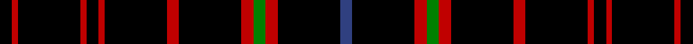

In pattern [BKRGRKRKRKRKRK](/stripes/bkrgrkrkrkrkrk/).

This was sourced from weddslist.  It is a [14 stripe tartan](/stripes/stripes14/).

Original link http://www.weddslist.com/cgi-bin/tartans/pg.pl?source=sts

## Also known as

This cloth is also recorded under:

- Hebridean 7

## Thread count
K/4 R2 K20 R2 K4 R2 K20 R4 K20 R4 G4 R4 K20 B/4

## Palette
Each colour and the base-6 reference it is a variant of.

| Colour | Shade | Base |
|---|---|---|
| B | <code style="background-color:#304080;">#304080</code> `oklch(39.4% 0.109 270.2)` <small>#304080</small> | B <code style="background-color:#2A418A;">#2A418A</code> |
| G | <code style="background-color:#008000;">#008000</code> `oklch(52.0% 0.177 142.5)` <small>#008000</small> | G <code style="background-color:#006100;">#006100</code> |
| K | <code style="background-color:#000000;">#000000</code> `oklch(0.0% 0.000 0.0)` <small>#000000</small> | K <code style="background-color:#000000;">#000000</code> |
| R | <code style="background-color:#C00000;">#C00000</code> `oklch(50.7% 0.208 29.2)` <small>#C00000</small> | R <code style="background-color:#CC0000;">#CC0000</code> |

## Nearest tartans

The nearest existing variants by ΔTartan distance.

1. [Hebridean 6](/setts/s18/k2r1k10r1k2r1k10r1k2r1k10r2k10r2dg2r2k10db2~x2/) — ΔT 0.65
1. [Gold-Smith (Personal)](/setts/s13/r2k25dy2k20do5k2do4k3do3k4do2k6ly2~x2/) — ΔT 1.26
1. [Hebridean](/setts/s14/k2r1k10r1k2r1k10r2k10r2dg2r2k10db2~x2/) — ΔT 1.52
1. [Stewart Mourning](/setts/s11/k68y11k16y4k4y4k4y19k14w4k14/) — ΔT 1.76
1. [Hebrides #11](/setts/s14/k3r2k17r3k17r3g3r3k17b3k4r1k17r2~x2/) — ΔT 1.83
1. [Justus](/setts/s6/k8ly1k1r1k4db1~x12/) — ΔT 1.89
1. [Black (Hebridean) (Artefact)](/setts/s14/k17db3k4r1k17r2k3r2k17r3k17r3g3r3~x2/) — ΔT 1.93
1. [Wyse (2016)](/setts/s9/k8k3k8r2k20t6k8t6o2~x2/) — ΔT 1.96
1. [Valdres, Kvam and Vang](/setts/s11/k4w1r4k2g2r3k2k20r2k2r2/) — ΔT 2.04
1. [Unidentified 11](/setts/s7/k24g3r3k24r2k2r2/) — ΔT 2.04

## Neighbour map

Every grey dot is one of 14299 variants placed by the first two principal components of the ΔTartan feature space (44% of its variance). Red is this tartan; blue dots are its nearest — click one to open its page.

<svg viewBox="0 0 640 380" role="img" style="max-width:100%;height:auto;border:1px solid #e0e0e0;border-radius:4px;display:block" xmlns="http://www.w3.org/2000/svg"><image href="/nn/cloud.v1.png" width="640" height="380"/><a href="/setts/s18/k2r1k10r1k2r1k10r1k2r1k10r2k10r2dg2r2k10db2~x2/"><circle cx="457.1" cy="178.3" r="4" fill="#3465a4"><title>Hebridean 6</title></circle></a><a href="/setts/s13/r2k25dy2k20do5k2do4k3do3k4do2k6ly2~x2/"><circle cx="429.8" cy="154.6" r="4" fill="#3465a4"><title>Gold-Smith (Personal)</title></circle></a><a href="/setts/s14/k2r1k10r1k2r1k10r2k10r2dg2r2k10db2~x2/"><circle cx="460.6" cy="190.6" r="4" fill="#3465a4"><title>Hebridean</title></circle></a><a href="/setts/s11/k68y11k16y4k4y4k4y19k14w4k14/"><circle cx="458.4" cy="167.3" r="4" fill="#3465a4"><title>Stewart Mourning</title></circle></a><a href="/setts/s14/k3r2k17r3k17r3g3r3k17b3k4r1k17r2~x2/"><circle cx="501.7" cy="174.0" r="4" fill="#3465a4"><title>Hebrides #11</title></circle></a><a href="/setts/s6/k8ly1k1r1k4db1~x12/"><circle cx="472.4" cy="225.3" r="4" fill="#3465a4"><title>Justus</title></circle></a><a href="/setts/s14/k17db3k4r1k17r2k3r2k17r3k17r3g3r3~x2/"><circle cx="507.8" cy="177.0" r="4" fill="#3465a4"><title>Black (Hebridean) (Artefact)</title></circle></a><a href="/setts/s9/k8k3k8r2k20t6k8t6o2~x2/"><circle cx="336.0" cy="196.4" r="4" fill="#3465a4"><title>Wyse (2016)</title></circle></a><a href="/setts/s11/k4w1r4k2g2r3k2k20r2k2r2/"><circle cx="411.8" cy="133.2" r="4" fill="#3465a4"><title>Valdres, Kvam and Vang</title></circle></a><a href="/setts/s7/k24g3r3k24r2k2r2/"><circle cx="548.8" cy="218.4" r="4" fill="#3465a4"><title>Unidentified 11</title></circle></a><circle cx="437.5" cy="186.4" r="5" fill="#c00000"/></svg>

ID: /setts/s14/k2r1k10r1k2r1k10r2k10r2g2r2k10db2~x2/
