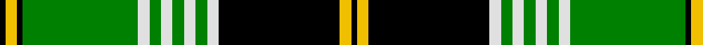

In pattern [KYKGWGWGWGWKYK](/patterns/kykgwgwgwgwkyk/).

This was sourced from weddslist.  It is a [14 stripes tartan](/stripes/stripes14/).

Original link http://www.weddslist.com/cgi-bin/tartans/pg.pl?source=sts

## Thread count
K/2 Y4 K2 G40 LN4 G4 LN4 G4 LN4 G4 LN4 K42 Y4 K/2

## Palette
Each colour and its ΔE from the base-6 reference it is a variant of.

| Colour | Shade | Base | ΔE (OKLab) |
|---|---|---|---|
| G | <code style="background-color:#008000;">#008000</code> `#008000` | G <code style="background-color:#006400;">#006400</code> | 0.09 |
| K | <code style="background-color:#000000;">#000000</code> `#000000` | K <code style="background-color:#000000;">#000000</code> | 0.00 |
| LN | <code style="background-color:#E0E0E0;">#E0E0E0</code> `#E0E0E0` | W <code style="background-color:#F4F4F0;">#F4F4F0</code> | 0.06 |
| Y | <code style="background-color:#F0C000;">#F0C000</code> `#F0C000` | Y <code style="background-color:#E8C000;">#E8C000</code> | 0.01 |

## Nearest tartans

The nearest existing variants by ΔTartan distance.

1. [Hammarby Football Club](/setts/s14/k2y4k36w4g4w4g4w4g4w4g44k2y4k2-g006818-k101010-wc0c0c0-yd09800/) — ΔT 1.06
1. [Park](/setts/s12/g6r4g6r8g68k4g4k4g8k32b32r6-b304080-g008000-k000000-rc00000/) — ΔT 1.23
1. [Armstrong](/setts/s10/r6b24k2b2k2b4k24g60k2g4-b304080-g008000-k000000-rc00000/) — ΔT 1.40
1. [MacKirgan](/setts/s11/g4b4w2r4w2b6g2b24g36w2r4-b000050-g008000-rc00000-we0e0e0/) — ΔT 1.45
1. [Murray-Hetherington (Personal) Name Tartan Tartan Number: 10700. Earliest known date: 18 September 2012 After years of wearing the Murray of Atholl tartan, the registrant has chosen to register a tartan in his own name. He belongs to a family that has intermarried with the Murrays for many years and bears the additional surname of Murray. The underlying design of this personal tartan is based on details derived from the Blair Atholl tartan with due and proper differences to distinguish it. The colours used were specifically chosen to represent the colours found in the Murray of Atholl sett. The addition of three white stripes alludes to the three silver stars of the Murrays. The black and white also reflect the principal heraldic colours in the registrant's coat of arms granted to him by Garter King of Arms (England) and Norroy and Ulster King of Arms. The tartan, for the registrant, his immediate family, and their descendants to wear, maintains the strong link with the Murray Clan. See products available Copyright © Blair Urquhart, Comrie, 2015](/setts/s12/g4k4g56k8r12b12k24w4k4w4k4w4-b000080-g008b00-k101010-rff0000-wffffff/) — ΔT 1.47
1. [Keirnan](/setts/s10/w4g8k12r4k4r4k6r4g40w2-g008000-k000000-rc00000-we0e0e0/) — ΔT 1.47
1. [MacDonald Hunting](/setts/s13/g48w2g4w4b4w2b24w2b4w4b4w2ba24-b443428-ba002814-g309c18-we0e0e0/) — ΔT 1.52
1. [MacDonald, hunting](/setts/s13/g48w2g4w4b4w2b24w2b4w4b4w2ga24-b403030-g30a010-ga003000-we0e0e0/) — ΔT 1.54
1. [Sutherland, Old](/setts/s12/g12w4g48k24b6k4b4k4b24r2b2r6-b304080-g008000-k000000-rc00000-we0e0e0/) — ΔT 1.56
1. [Courtet-Meyer (Personal)](/setts/s14/k30w2k2w2k2w2k2g30r2g30y4r10y4w6-g006818-k101010-rc8002c-wfcfcfc-ybc8c00/) — ΔT 1.56

## Neighbour map

Every grey dot is one of 15726 variants placed by the first two principal components of the ΔTartan feature space (44% of its variance). Red is this tartan; blue dots are its nearest — click one to open its page.

<svg viewBox="0 0 640 380" role="img" style="max-width:100%;height:auto;border:1px solid #e0e0e0;border-radius:4px;display:block" xmlns="http://www.w3.org/2000/svg"><image href="/nn/cloud.v1.png" width="640" height="380"/><a href="/setts/s14/k2y4k36w4g4w4g4w4g4w4g44k2y4k2-g006818-k101010-wc0c0c0-yd09800/"><circle cx="270.2" cy="104.8" r="4" fill="#3465a4"><title>Hammarby Football Club</title></circle></a><a href="/setts/s12/g6r4g6r8g68k4g4k4g8k32b32r6-b304080-g008000-k000000-rc00000/"><circle cx="259.3" cy="131.8" r="4" fill="#3465a4"><title>Park</title></circle></a><a href="/setts/s10/r6b24k2b2k2b4k24g60k2g4-b304080-g008000-k000000-rc00000/"><circle cx="288.4" cy="115.1" r="4" fill="#3465a4"><title>Armstrong</title></circle></a><a href="/setts/s11/g4b4w2r4w2b6g2b24g36w2r4-b000050-g008000-rc00000-we0e0e0/"><circle cx="260.1" cy="128.8" r="4" fill="#3465a4"><title>MacKirgan</title></circle></a><a href="/setts/s12/g4k4g56k8r12b12k24w4k4w4k4w4-b000080-g008b00-k101010-rff0000-wffffff/"><circle cx="183.6" cy="112.0" r="4" fill="#3465a4"><title>Murray-Hetherington (Personal) Name Tartan Tartan Number: 10700. Earliest known date: 18 September 2012 After years of wearing the Murray of Atholl tartan, the registrant has chosen to register a tartan in his own name. He belongs to a family that has intermarried with the Murrays for many years and bears the additional surname of Murray. The underlying design of this personal tartan is based on details derived from the Blair Atholl tartan with due and proper differences to distinguish it. The colours used were specifically chosen to represent the colours found in the Murray of Atholl sett. The addition of three white stripes alludes to the three silver stars of the Murrays. The black and white also reflect the principal heraldic colours in the registrant's coat of arms granted to him by Garter King of Arms (England) and Norroy and Ulster King of Arms. The tartan, for the registrant, his immediate family, and their descendants to wear, maintains the strong link with the Murray Clan. See products available Copyright © Blair Urquhart, Comrie, 2015</title></circle></a><a href="/setts/s10/w4g8k12r4k4r4k6r4g40w2-g008000-k000000-rc00000-we0e0e0/"><circle cx="284.6" cy="128.6" r="4" fill="#3465a4"><title>Keirnan</title></circle></a><a href="/setts/s13/g48w2g4w4b4w2b24w2b4w4b4w2ba24-b443428-ba002814-g309c18-we0e0e0/"><circle cx="227.5" cy="105.8" r="4" fill="#3465a4"><title>MacDonald Hunting</title></circle></a><a href="/setts/s13/g48w2g4w4b4w2b24w2b4w4b4w2ga24-b403030-g30a010-ga003000-we0e0e0/"><circle cx="225.8" cy="105.3" r="4" fill="#3465a4"><title>MacDonald, hunting</title></circle></a><a href="/setts/s12/g12w4g48k24b6k4b4k4b24r2b2r6-b304080-g008000-k000000-rc00000-we0e0e0/"><circle cx="206.1" cy="107.9" r="4" fill="#3465a4"><title>Sutherland, Old</title></circle></a><a href="/setts/s14/k30w2k2w2k2w2k2g30r2g30y4r10y4w6-g006818-k101010-rc8002c-wfcfcfc-ybc8c00/"><circle cx="211.7" cy="108.8" r="4" fill="#3465a4"><title>Courtet-Meyer (Personal)</title></circle></a><circle cx="227.0" cy="96.5" r="5" fill="#c00000"/></svg>

ID: /setts/s14/k2y4k42w4g4w4g4w4g4w4g40k2y4k2-g008000-k000000-we0e0e0-yf0c000/
