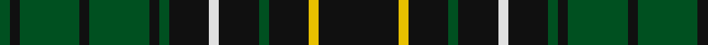

In pattern [GKGKGKGKWKGKYK](/patterns/gkgkgkgkwkgkyk/).

This was sourced from register-of-tartans.  It is a [14 stripes tartan](/stripes/stripes14/).

Original link https://www.tartanregister.gov.uk/tartanDetails.aspx?ref=2274

## Thread count
G/4 K4 G24 K4 G24 K4 G4 K16 LN4 K16 G4 K16 Y4 K/32

## Palette
Each colour and its ΔE from the base-6 reference it is a variant of.

| Colour | Shade | Base | ΔE (OKLab) |
|---|---|---|---|
| G | <code style="background-color:#005020;">#005020</code> `#005020` | G <code style="background-color:#006100;">#006100</code> | 0.07 |
| K | <code style="background-color:#101010;">#101010</code> `#101010` | K <code style="background-color:#000000;">#000000</code> | 0.17 |
| LN | <code style="background-color:#E0E0E0;">#E0E0E0</code> `#E0E0E0` | W <code style="background-color:#F7F7F7;">#F7F7F7</code> | 0.07 |
| Y | <code style="background-color:#E8C000;">#E8C000</code> `#E8C000` | Y <code style="background-color:#F2BF00;">#F2BF00</code> | 0.02 |

## Nearest tartans

The nearest existing variants by ΔTartan distance.

1. [Pike (Personal)](/setts/s11/g20k6g6k40b6k10ga6k40g6k6g20-b780078-g006818-ga289c18-k101010/) — ΔT 0.70
1. [Hopetoun Rejected design](/setts/s14/g44b4k4g8k48y4k48g8k8g44k8g8k48y4-b2c4084-g005020-k101010-ye8c000/) — ΔT 1.07
1. [MacAlpine Clan Tartan Tartan Number: 2024. Earliest known date: 1908 'The Clans, Sept and Regiments of the Scottish Highlands' (1908) by Frank Adam, is the first document of the tartan. The history of the Clan MacAlpine is obscure. The Siol Alpin is claimed as the origin of a number of clans, but as D.C. Stewart remarks, "belongs rather to mythology than to history." It is considered to be a branch of the royal Clan Alpin, of the Kings of Dalriada. The tartan is similar to the hunting MacLean, but for the yellow lines. Other tartans connected with Siol Alpin are red. See products available Copyright © Blair Urquhart, Comrie, 2015](/setts/s14/k16y4k16g4k16w4k16g4k4g24k4g24k4g4-g006818-k101010-we0e0e0-ye8c000/) — ΔT 1.12
1. [Ross Hunting](/setts/s14/g8b12g6b4g6b4g6k10g6k10g40r6g8r6-b3c82af-g005020-k101010-rdc0000/) — ΔT 1.24
1. [Sawicki, Peter (Personal)](/setts/s13/k20g4k4b4g28y2g28b4k20g8k4g4k4-b1c1c50-g006438-k101010-ybc8c00/) — ΔT 1.31
1. [Bruce of Crionaich (Personal)](/setts/s11/r4g32b8g8b24g4b24g8b8g32y4-b00004d-g264026-rcc1100-yf9e210/) — ΔT 1.33
1. [Stuart/Stewart Hunting #4](/setts/s16/k6g20y4g20k18g4k18g20r4g20k6g4k10g4k10g4-g005020-k101010-rdc0000-ye8c000/) — ΔT 1.33
1. [Hopetoun Corporate Tartan Tartan Number: 722. Earliest known date: 1984 Based on Marquess of Linlithgow's family colours of gold and blue See products available Copyright © Blair Urquhart, Comrie, 2015](/setts/s12/g44k8g8k42y4k8y4k42g8k4b4g44-b2c2c80-g006818-k101010-ye8c000/) — ΔT 1.35
1. [Davidson](/setts/s11/r2b12g2b2g16k2g16k2g2k12r2-b000052-g11450d-k000000-raa0000/) — ΔT 1.38
1. [Davidson](/setts/s11/r1b6g1b1g8k1g8k1g1k6r1-b000052-g11450d-k000000-raa0000/) — ΔT 1.38

## Neighbour map

Every grey dot is one of 15726 variants placed by the first two principal components of the ΔTartan feature space (44% of its variance). Red is this tartan; blue dots are its nearest — click one to open its page.

<svg viewBox="0 0 640 380" role="img" style="max-width:100%;height:auto;border:1px solid #e0e0e0;border-radius:4px;display:block" xmlns="http://www.w3.org/2000/svg"><image href="/nn/cloud.v1.png" width="640" height="380"/><a href="/setts/s11/g20k6g6k40b6k10ga6k40g6k6g20-b780078-g006818-ga289c18-k101010/"><circle cx="336.8" cy="222.5" r="4" fill="#3465a4"><title>Pike (Personal)</title></circle></a><a href="/setts/s14/g44b4k4g8k48y4k48g8k8g44k8g8k48y4-b2c4084-g005020-k101010-ye8c000/"><circle cx="365.1" cy="194.8" r="4" fill="#3465a4"><title>Hopetoun Rejected design</title></circle></a><a href="/setts/s14/k16y4k16g4k16w4k16g4k4g24k4g24k4g4-g006818-k101010-we0e0e0-ye8c000/"><circle cx="256.0" cy="213.3" r="4" fill="#3465a4"><title>MacAlpine Clan Tartan Tartan Number: 2024. Earliest known date: 1908 'The Clans, Sept and Regiments of the Scottish Highlands' (1908) by Frank Adam, is the first document of the tartan. The history of the Clan MacAlpine is obscure. The Siol Alpin is claimed as the origin of a number of clans, but as D.C. Stewart remarks, &quot;belongs rather to mythology than to history.&quot; It is considered to be a branch of the royal Clan Alpin, of the Kings of Dalriada. The tartan is similar to the hunting MacLean, but for the yellow lines. Other tartans connected with Siol Alpin are red. See products available Copyright © Blair Urquhart, Comrie, 2015</title></circle></a><a href="/setts/s14/g8b12g6b4g6b4g6k10g6k10g40r6g8r6-b3c82af-g005020-k101010-rdc0000/"><circle cx="329.3" cy="187.4" r="4" fill="#3465a4"><title>Ross Hunting</title></circle></a><a href="/setts/s13/k20g4k4b4g28y2g28b4k20g8k4g4k4-b1c1c50-g006438-k101010-ybc8c00/"><circle cx="339.1" cy="189.3" r="4" fill="#3465a4"><title>Sawicki, Peter (Personal)</title></circle></a><a href="/setts/s11/r4g32b8g8b24g4b24g8b8g32y4-b00004d-g264026-rcc1100-yf9e210/"><circle cx="311.7" cy="227.0" r="4" fill="#3465a4"><title>Bruce of Crionaich (Personal)</title></circle></a><a href="/setts/s16/k6g20y4g20k18g4k18g20r4g20k6g4k10g4k10g4-g005020-k101010-rdc0000-ye8c000/"><circle cx="295.2" cy="244.0" r="4" fill="#3465a4"><title>Stuart/Stewart Hunting #4</title></circle></a><a href="/setts/s12/g44k8g8k42y4k8y4k42g8k4b4g44-b2c2c80-g006818-k101010-ye8c000/"><circle cx="288.3" cy="185.8" r="4" fill="#3465a4"><title>Hopetoun Corporate Tartan Tartan Number: 722. Earliest known date: 1984 Based on Marquess of Linlithgow's family colours of gold and blue See products available Copyright © Blair Urquhart, Comrie, 2015</title></circle></a><a href="/setts/s11/r2b12g2b2g16k2g16k2g2k12r2-b000052-g11450d-k000000-raa0000/"><circle cx="266.1" cy="205.6" r="4" fill="#3465a4"><title>Davidson</title></circle></a><a href="/setts/s11/r1b6g1b1g8k1g8k1g1k6r1-b000052-g11450d-k000000-raa0000/"><circle cx="266.1" cy="205.6" r="4" fill="#3465a4"><title>Davidson</title></circle></a><circle cx="318.8" cy="207.4" r="5" fill="#c00000"/></svg>

ID: /setts/s14/k32y4k16g4k16w4k16g4k4g24k4g24k4g4-g005020-k101010-we0e0e0-ye8c000/
