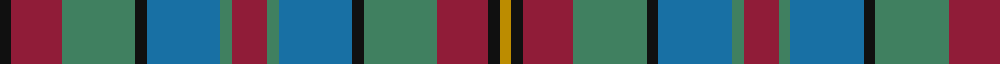

In pattern [KRGKBGRGBKGRKY](/stripes/krgkbgrgbkgrky/).

This was sourced from register-of-tartans.  It is a [14 stripe tartan](/stripes/stripes14/).

Original link https://www.tartanregister.gov.uk/tartanDetails.aspx?ref=3263

## Register references

External register numbers recorded for this tartan.

- Scottish Register of Tartans: [3263](https://www.tartanregister.gov.uk/tartanDetails.aspx?ref=3263)
- Scottish Tartans Authority (ITI): 2681
- Scottish Tartans World Register: 2681

## Thread count
K/6 DR26 G38 K6 B38 G6 DR18 G6 B38 K6 G38 DR26 K6 DY/6

## Palette
Each colour and the base-6 reference it is a variant of.

| Colour | Shade | Base |
|---|---|---|
| B | <code style="background-color:#1870A4;">#1870A4</code> `oklch(52.2% 0.113 241.2)` <small>#1870A4</small> | B <code style="background-color:#2A418A;">#2A418A</code> |
| DR | <code style="background-color:#901C38;">#901C38</code> `oklch(43.2% 0.150 13.1)` <small>#901C38</small> | R <code style="background-color:#CC0000;">#CC0000</code> |
| DY | <code style="background-color:#BC8C00;">#BC8C00</code> `oklch(66.8% 0.137 84.1)` <small>#BC8C00</small> | Y <code style="background-color:#F2BF00;">#F2BF00</code> |
| G | <code style="background-color:#408060;">#408060</code> `oklch(54.8% 0.084 160.1)` <small>#408060</small> | G <code style="background-color:#006100;">#006100</code> |
| K | <code style="background-color:#101010;">#101010</code> `oklch(17.3% 0.000 89.9)` <small>#101010</small> | K <code style="background-color:#000000;">#000000</code> |

## Nearest tartans

The nearest existing variants by ΔTartan distance, with this tartan at the top so the swatches line up against it.

ΔTartan

Tartan

Sett

—

<a href="/ttd/edit/#slug=k3r13g19k3b19g3r9g3b19k3g19r13k3lo3~x2">Orkney</a> <a class="nn-out" href="/setts/s14/k3r13g19k3b19g3r9g3b19k3g19r13k3lo3~x2/" title="open its dictionary page">↗</a>

1.10

<a href="/ttd/edit/#slug=dt12dy2ly2dy2dt2dy10g10dy3g12dy10dt11r2ly2~x2">MacVicker (Name)</a> <a class="nn-out" href="/setts/s13/dt12dy2ly2dy2dt2dy10g10dy3g12dy10dt11r2ly2~x2/" title="open its dictionary page">↗</a>

1.16

<a href="/ttd/edit/#slug=db22g4db4g17o17g17db4g4db22ly8o8r8~x2">Niagara Falls</a> <a class="nn-out" href="/setts/s12/db22g4db4g17o17g17db4g4db22ly8o8r8~x2/" title="open its dictionary page">↗</a>

1.18

<a href="/ttd/edit/#slug=dg12r2dg4r5dg16lo2k16r2db16r5db4r2db12~x2">Macallan</a> <a class="nn-out" href="/setts/s13/dg12r2dg4r5dg16lo2k16r2db16r5db4r2db12~x2/" title="open its dictionary page">↗</a>

1.19

<a href="/ttd/edit/#slug=db22g4db4g17dy17g17db4g4db22ly8dy8r8~x2">Niagra Falls Trade Tartan Tartan Number: 1915. Earliest known date: 1967 Designed to be used in the refurbishing of Johnstons of Elgin new mill shop and based on the colours of the mill shop house style. The lighter square is represented here as green from the 'Antique' colour range, a speciality of Johnstons of Elgin. See products available Copyright © Blair Urquhart, Comrie, 2015</a> <a class="nn-out" href="/setts/s12/db22g4db4g17dy17g17db4g4db22ly8dy8r8~x2/" title="open its dictionary page">↗</a>

1.19

<a href="/ttd/edit/#slug=r9g3b19k3g19r13k3lo3~x2">Orkney (District?)</a> <a class="nn-out" href="/setts/s8/r9g3b19k3g19r13k3lo3~x2/" title="open its dictionary page">↗</a>

1.22

<a href="/ttd/edit/#slug=dg10lo2dg3r4dg13k13r2b13r4b3r2b10~x2">Bowie (Lochcarron)</a> <a class="nn-out" href="/setts/s12/dg10lo2dg3r4dg13k13r2b13r4b3r2b10~x2/" title="open its dictionary page">↗</a>

1.24

<a href="/ttd/edit/#slug=db18dy4db3dy3db3dy18g18r10g18dy18db18dy3r10~x2">Murray of Atholl</a> <a class="nn-out" href="/setts/s13/db18dy4db3dy3db3dy18g18r10g18dy18db18dy3r10~x2/" title="open its dictionary page">↗</a>

1.24

<a href="/ttd/edit/#slug=o8dt8o4dt28dt12n6dt12r4n8r4n29lb6">Kinloch Anderson Granite (Corporate)</a> <a class="nn-out" href="/setts/s12/o8dt8o4dt28dt12n6dt12r4n8r4n29lb6/" title="open its dictionary page">↗</a>

1.25

<a href="/ttd/edit/#slug=db18o4db3o3db3o18g18r10g18o18db18o3r10~x2">Murray of Atholl</a> <a class="nn-out" href="/setts/s13/db18o4db3o3db3o18g18r10g18o18db18o3r10~x2/" title="open its dictionary page">↗</a>

1.25

<a href="/ttd/edit/#slug=db4ly3db17r7w2o7w2db7g17o3g4~x2">Asman Hunting</a> <a class="nn-out" href="/setts/s11/db4ly3db17r7w2o7w2db7g17o3g4~x2/" title="open its dictionary page">↗</a>

## Neighbour map

Every grey dot is one of 14299 variants placed by the first two principal components of the ΔTartan feature space (44% of its variance). Red is this tartan; blue dots are its nearest — click one to open its page.

<svg viewBox="0 0 640 380" role="img" style="max-width:100%;height:auto;border:1px solid #e0e0e0;border-radius:4px;display:block" xmlns="http://www.w3.org/2000/svg"><image href="/nn/cloud.v1.png" width="640" height="380"/><a href="/setts/s13/dt12dy2ly2dy2dt2dy10g10dy3g12dy10dt11r2ly2~x2/"><circle cx="164.8" cy="218.2" r="4" fill="#3465a4"><title>MacVicker (Name)</title></circle></a><a href="/setts/s12/db22g4db4g17o17g17db4g4db22ly8o8r8~x2/"><circle cx="142.1" cy="219.6" r="4" fill="#3465a4"><title>Niagara Falls</title></circle></a><a href="/setts/s13/dg12r2dg4r5dg16lo2k16r2db16r5db4r2db12~x2/"><circle cx="143.1" cy="189.1" r="4" fill="#3465a4"><title>Macallan</title></circle></a><a href="/setts/s12/db22g4db4g17dy17g17db4g4db22ly8dy8r8~x2/"><circle cx="140.8" cy="220.0" r="4" fill="#3465a4"><title>Niagra Falls Trade Tartan Tartan Number: 1915. Earliest known date: 1967 Designed to be used in the refurbishing of Johnstons of Elgin new mill shop and based on the colours of the mill shop house style. The lighter square is represented here as green from the 'Antique' colour range, a speciality of Johnstons of Elgin. See products available Copyright © Blair Urquhart, Comrie, 2015</title></circle></a><a href="/setts/s8/r9g3b19k3g19r13k3lo3~x2/"><circle cx="151.6" cy="221.4" r="4" fill="#3465a4"><title>Orkney (District?)</title></circle></a><a href="/setts/s12/dg10lo2dg3r4dg13k13r2b13r4b3r2b10~x2/"><circle cx="123.9" cy="201.5" r="4" fill="#3465a4"><title>Bowie (Lochcarron)</title></circle></a><a href="/setts/s13/db18dy4db3dy3db3dy18g18r10g18dy18db18dy3r10~x2/"><circle cx="159.8" cy="235.3" r="4" fill="#3465a4"><title>Murray of Atholl</title></circle></a><a href="/setts/s12/o8dt8o4dt28dt12n6dt12r4n8r4n29lb6/"><circle cx="135.5" cy="187.4" r="4" fill="#3465a4"><title>Kinloch Anderson Granite (Corporate)</title></circle></a><a href="/setts/s13/db18o4db3o3db3o18g18r10g18o18db18o3r10~x2/"><circle cx="144.1" cy="227.7" r="4" fill="#3465a4"><title>Murray of Atholl</title></circle></a><a href="/setts/s11/db4ly3db17r7w2o7w2db7g17o3g4~x2/"><circle cx="154.8" cy="173.8" r="4" fill="#3465a4"><title>Asman Hunting</title></circle></a><circle cx="152.5" cy="201.7" r="5" fill="#c00000"/></svg>

ID: /setts/s14/k3r13g19k3b19g3r9g3b19k3g19r13k3lo3~x2/
