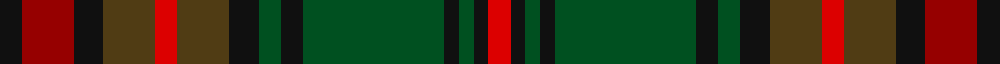

In pattern [KRKGRGKGKGKGKR](/stripes/krkgrgkgkgkgkr/).

This was sourced from register-of-tartans.  It is a [14 stripe tartan](/stripes/stripes14/).

Original link https://www.tartanregister.gov.uk/tartanDetails.aspx?ref=73

## Register references

External register numbers recorded for this tartan.

- Scottish Register of Tartans: [73](https://www.tartanregister.gov.uk/tartanDetails.aspx?ref=73)
- Scottish Tartans World Register: 1182

## Thread count
K/6 DR14 K8 T14 R6 T14 K8 G6 K6 G38 K4 G4 K4 R/6

## Palette
Each colour and the base-6 reference it is a variant of.

| Colour | Shade | Base |
|---|---|---|
| DR | <code style="background-color:#960000;">#960000</code> `oklch(42.3% 0.173 29.2)` <small>#960000</small> | R <code style="background-color:#CC0000;">#CC0000</code> |
| G | <code style="background-color:#005020;">#005020</code> `oklch(37.7% 0.105 149.6)` <small>#005020</small> | G <code style="background-color:#006100;">#006100</code> |
| K | <code style="background-color:#101010;">#101010</code> `oklch(17.3% 0.000 89.9)` <small>#101010</small> | K <code style="background-color:#000000;">#000000</code> |
| R | <code style="background-color:#DC0000;">#DC0000</code> `oklch(56.2% 0.230 29.2)` <small>#DC0000</small> | R <code style="background-color:#CC0000;">#CC0000</code> |
| T | <code style="background-color:#503C14;">#503C14</code> `oklch(37.0% 0.062 81.8)` <small>#503C14</small> | G <code style="background-color:#006100;">#006100</code> |

## Nearest tartans

The nearest existing variants by ΔTartan distance, with this tartan at the top so the swatches line up against it.

ΔTartan

Tartan

Sett

—

<a href="/ttd/edit/#slug=k3r7k4dy7r3dy7k4dg3k3dg19k2dg2k2r3~x2">Anderson (Coulson Bonner #1)</a> <a class="nn-out" href="/setts/s14/k3r7k4dy7r3dy7k4dg3k3dg19k2dg2k2r3~x2/" title="open its dictionary page">↗</a>

0.90

<a href="/ttd/edit/#slug=r3g6k1lo1k1g6r2dy2k2dy9k2~x4">MacAart (Personal)</a> <a class="nn-out" href="/setts/s11/r3g6k1lo1k1g6r2dy2k2dy9k2~x4/" title="open its dictionary page">↗</a>

0.99

<a href="/ttd/edit/#slug=do10r4do4r4do20k20r3g20r4g4lo4~x2">Cameron of Erracht (WCWM)</a> <a class="nn-out" href="/setts/s11/do10r4do4r4do20k20r3g20r4g4lo4~x2/" title="open its dictionary page">↗</a>

1.19

<a href="/ttd/edit/#slug=k3r9k4dy9y3dy9k4g26k2y3~x2">Cavan, County</a> <a class="nn-out" href="/setts/s10/k3r9k4dy9y3dy9k4g26k2y3~x2/" title="open its dictionary page">↗</a>

1.20

<a href="/ttd/edit/#slug=do24g5n2k14dr2k3g3k3n14do6k4do3g2~x2">Berwick (Fashion)</a> <a class="nn-out" href="/setts/s13/do24g5n2k14dr2k3g3k3n14do6k4do3g2~x2/" title="open its dictionary page">↗</a>

1.24

<a href="/ttd/edit/#slug=dy9k2dy2r2g6k1lo1k1g6r3~x4">MacAart (Personal)</a> <a class="nn-out" href="/setts/s10/dy9k2dy2r2g6k1lo1k1g6r3~x4/" title="open its dictionary page">↗</a>

1.27

<a href="/ttd/edit/#slug=g9db2dy3db2dy5db2dy3lo3dy6lo3dy3db2dy5db2dy3db2g16r3db2r3g7~x2">Limerick Irish County Tartan Tartan Number: 2272. Earliest known date: 1996 One of a series of Irish District tartans designed by Polly Wittering of the House of Edgar, with colours reminiscent of the Country with soft warm colours dominating. See products available Copyright © Blair Urquhart, Comrie, 2015</a> <a class="nn-out" href="/setts/s21/g9db2dy3db2dy5db2dy3lo3dy6lo3dy3db2dy5db2dy3db2g16r3db2r3g7~x2/" title="open its dictionary page">↗</a>

1.28

<a href="/ttd/edit/#slug=dg6dg3dg22k2dg4k14dg5k3ly5k3dg20k4lo4~x2">Celtic Football Club (2005)</a> <a class="nn-out" href="/setts/s13/dg6dg3dg22k2dg4k14dg5k3ly5k3dg20k4lo4~x2/" title="open its dictionary page">↗</a>

1.31

<a href="/ttd/edit/#slug=y3k2dg18k4y15k4o6k4y2ly3~x2">Fitzsimmons</a> <a class="nn-out" href="/setts/s10/y3k2dg18k4y15k4o6k4y2ly3~x2/" title="open its dictionary page">↗</a>

1.32

<a href="/ttd/edit/#slug=dy9k2dy2r2g6k1ly1k1g6r3~x2">MacAart Family Tartan Tartan Number: 1477. Earliest known date: pre 2003 Restricted See products available Copyright © Blair Urquhart, Comrie, 2015</a> <a class="nn-out" href="/setts/s10/dy9k2dy2r2g6k1ly1k1g6r3~x2/" title="open its dictionary page">↗</a>

1.33

<a href="/ttd/edit/#slug=r3g20k2dt3k12dt3k2r20g3r20k2dt3k12dt3k2g20r3dt2~x2">Matthew Gloag Corporate Tartan Tartan Number: 2397. Earliest known date: 1996 Designed by Gillian Kirkwood of House of Edgar in 1996 for Matthew Gloag &amp; Son Ltd who were established in 1800 as a whisky blenders and makers of the Famous Grouse Whisky. The company is based in Perth, Scotland and now (2002) has a major new visitor attraction at Crieff, 17 miles west of Perth. See products available Copyright © Blair Urquhart, Comrie, 2015</a> <a class="nn-out" href="/setts/s18/r3g20k2dt3k12dt3k2r20g3r20k2dt3k12dt3k2g20r3dt2~x2/" title="open its dictionary page">↗</a>

## Neighbour map

Every grey dot is one of 14299 variants placed by the first two principal components of the ΔTartan feature space (44% of its variance). Red is this tartan; blue dots are its nearest — click one to open its page.

<svg viewBox="0 0 640 380" role="img" style="max-width:100%;height:auto;border:1px solid #e0e0e0;border-radius:4px;display:block" xmlns="http://www.w3.org/2000/svg"><image href="/nn/cloud.v1.png" width="640" height="380"/><a href="/setts/s11/r3g6k1lo1k1g6r2dy2k2dy9k2~x4/"><circle cx="195.0" cy="207.6" r="4" fill="#3465a4"><title>MacAart (Personal)</title></circle></a><a href="/setts/s11/do10r4do4r4do20k20r3g20r4g4lo4~x2/"><circle cx="167.7" cy="205.6" r="4" fill="#3465a4"><title>Cameron of Erracht (WCWM)</title></circle></a><a href="/setts/s10/k3r9k4dy9y3dy9k4g26k2y3~x2/"><circle cx="206.6" cy="176.5" r="4" fill="#3465a4"><title>Cavan, County</title></circle></a><a href="/setts/s13/do24g5n2k14dr2k3g3k3n14do6k4do3g2~x2/"><circle cx="252.4" cy="185.6" r="4" fill="#3465a4"><title>Berwick (Fashion)</title></circle></a><a href="/setts/s10/dy9k2dy2r2g6k1lo1k1g6r3~x4/"><circle cx="217.3" cy="216.0" r="4" fill="#3465a4"><title>MacAart (Personal)</title></circle></a><a href="/setts/s21/g9db2dy3db2dy5db2dy3lo3dy6lo3dy3db2dy5db2dy3db2g16r3db2r3g7~x2/"><circle cx="180.2" cy="181.2" r="4" fill="#3465a4"><title>Limerick Irish County Tartan Tartan Number: 2272. Earliest known date: 1996 One of a series of Irish District tartans designed by Polly Wittering of the House of Edgar, with colours reminiscent of the Country with soft warm colours dominating. See products available Copyright © Blair Urquhart, Comrie, 2015</title></circle></a><a href="/setts/s13/dg6dg3dg22k2dg4k14dg5k3ly5k3dg20k4lo4~x2/"><circle cx="187.2" cy="184.2" r="4" fill="#3465a4"><title>Celtic Football Club (2005)</title></circle></a><a href="/setts/s10/y3k2dg18k4y15k4o6k4y2ly3~x2/"><circle cx="163.5" cy="186.7" r="4" fill="#3465a4"><title>Fitzsimmons</title></circle></a><a href="/setts/s10/dy9k2dy2r2g6k1ly1k1g6r3~x2/"><circle cx="190.5" cy="198.7" r="4" fill="#3465a4"><title>MacAart Family Tartan Tartan Number: 1477. Earliest known date: pre 2003 Restricted See products available Copyright © Blair Urquhart, Comrie, 2015</title></circle></a><a href="/setts/s18/r3g20k2dt3k12dt3k2r20g3r20k2dt3k12dt3k2g20r3dt2~x2/"><circle cx="208.5" cy="172.7" r="4" fill="#3465a4"><title>Matthew Gloag Corporate Tartan Tartan Number: 2397. Earliest known date: 1996 Designed by Gillian Kirkwood of House of Edgar in 1996 for Matthew Gloag &amp; Son Ltd who were established in 1800 as a whisky blenders and makers of the Famous Grouse Whisky. The company is based in Perth, Scotland and now (2002) has a major new visitor attraction at Crieff, 17 miles west of Perth. See products available Copyright © Blair Urquhart, Comrie, 2015</title></circle></a><circle cx="190.1" cy="186.6" r="5" fill="#c00000"/></svg>

ID: /setts/s14/k3r7k4dy7r3dy7k4dg3k3dg19k2dg2k2r3~x2/
