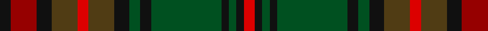

In pattern [KRKGRGKGKGKGKR](/patterns/krkgrgkgkgkgkr/).

This was sourced from register-of-tartans.  It is a [14 stripes tartan](/stripes/stripes14/).

Original link https://www.tartanregister.gov.uk/tartanDetails.aspx?ref=73

## Register references

External register numbers recorded for this tartan.

- Scottish Register of Tartans: [73](https://www.tartanregister.gov.uk/tartanDetails.aspx?ref=73)
- Scottish Tartans World Register: 1182

## Thread count
K/6 DR14 K8 T14 R6 T14 K8 G6 K6 G38 K4 G4 K4 R/6

## Palette
Each colour and its ΔE from the base-6 reference it is a variant of.

| Colour | Shade | Base | ΔE (OKLab) |
|---|---|---|---|
| DR | <code style="background-color:#960000;">#960000</code> `#960000` | R <code style="background-color:#CC0000;">#CC0000</code> | 0.12 |
| G | <code style="background-color:#005020;">#005020</code> `#005020` | G <code style="background-color:#006100;">#006100</code> | 0.07 |
| K | <code style="background-color:#101010;">#101010</code> `#101010` | K <code style="background-color:#000000;">#000000</code> | 0.17 |
| R | <code style="background-color:#DC0000;">#DC0000</code> `#DC0000` | R <code style="background-color:#CC0000;">#CC0000</code> | 0.03 |
| T | <code style="background-color:#503C14;">#503C14</code> `#503C14` | G <code style="background-color:#006100;">#006100</code> | 0.14 |

## Nearest tartans

The nearest existing variants by ΔTartan distance.

1. [MacAart (Personal)](/setts/s11/r3g6k1y1k1g6r2ga2k2ga9k2~g006818-ga604000-k101010-r880000-yd09800~x4/) — ΔT 0.90
1. [Cameron of Erracht (WCWM)](/setts/s11/b10r4b4r4b20k20r3g20r4g4y4~b4c3428-g408060-k101010-r880000-ybc8c00~x2/) — ΔT 0.99
1. [Cavan, County](/setts/s10/g3k2ga26k4gb9g3gb9k4r9k3~g8c7038-ga006818-gb604000-k101010-rc80000~x2/) — ΔT 1.19
1. [Berwick (Fashion)](/setts/s13/b24g5ba2k14bb2k3g3k3ba14b6k4b3g2~b4c3428-ba5c5c5c-bb680028-g408060-k101010~x2/) — ΔT 1.21
1. [MacAart (Personal)](/setts/s10/g9k2g2r2ga6k1y1k1ga6r3~g604000-ga006818-k101010-r880000-yd09800~x4/) — ΔT 1.24
1. [Limerick Irish County Tartan Tartan Number: 2272. Earliest known date: 1996 One of a series of Irish District tartans designed by Polly Wittering of the House of Edgar, with colours reminiscent of the Country with soft warm colours dominating. See products available Copyright © Blair Urquhart, Comrie, 2015](/setts/s21/g9b2ga3b2ga5b2ga3y3ga6y3ga3b2ga5b2ga3b2g16r3b2r3g7~b004874-g3c6838-ga28200c-r8c0020-yd09000~x2/) — ΔT 1.26
1. [Celtic Football Club (2005)](/setts/s13/g6ga3g22k2g4k14ga5k3y5k3ga20k4ya4~g003820-ga285800-k101010-yc4bc68-yabc8c00~x2/) — ΔT 1.27
1. [Fitzsimmons](/setts/s10/g3k2ga18k4g15k4r6k4g2y3~g886c34-ga003820-k101010-r8c5818-ybcac6c~x2/) — ΔT 1.32
1. [MacAart Family Tartan Tartan Number: 1477. Earliest known date: pre 2003 Restricted See products available Copyright © Blair Urquhart, Comrie, 2015](/setts/s10/g9k2g2r2ga6k1y1k1ga6r3~g604000-ga006818-k101010-rc80000-ye8c000~x2/) — ΔT 1.32
1. [Matthew Gloag Corporate Tartan Tartan Number: 2397. Earliest known date: 1996 Designed by Gillian Kirkwood of House of Edgar in 1996 for Matthew Gloag & Son Ltd who were established in 1800 as a whisky blenders and makers of the Famous Grouse Whisky. The company is based in Perth, Scotland and now (2002) has a major new visitor attraction at Crieff, 17 miles west of Perth. See products available Copyright © Blair Urquhart, Comrie, 2015](/setts/s18/r3g20k2b3k12b3k2r20g3r20k2b3k12b3k2g20r3b2~b003c64-g006818-k101010-r880000~x2/) — ΔT 1.33

## Neighbour map

Every grey dot is one of 15726 variants placed by the first two principal components of the ΔTartan feature space (44% of its variance). Red is this tartan; blue dots are its nearest — click one to open its page.

<svg viewBox="0 0 640 380" role="img" style="max-width:100%;height:auto;border:1px solid #e0e0e0;border-radius:4px;display:block" xmlns="http://www.w3.org/2000/svg"><image href="/nn/cloud.v1.png" width="640" height="380"/><a href="/setts/s11/r3g6k1y1k1g6r2ga2k2ga9k2~g006818-ga604000-k101010-r880000-yd09800~x4/"><circle cx="193.1" cy="197.9" r="4" fill="#3465a4"><title>MacAart (Personal)</title></circle></a><a href="/setts/s11/b10r4b4r4b20k20r3g20r4g4y4~b4c3428-g408060-k101010-r880000-ybc8c00~x2/"><circle cx="165.6" cy="198.1" r="4" fill="#3465a4"><title>Cameron of Erracht (WCWM)</title></circle></a><a href="/setts/s10/g3k2ga26k4gb9g3gb9k4r9k3~g8c7038-ga006818-gb604000-k101010-rc80000~x2/"><circle cx="204.6" cy="168.6" r="4" fill="#3465a4"><title>Cavan, County</title></circle></a><a href="/setts/s13/b24g5ba2k14bb2k3g3k3ba14b6k4b3g2~b4c3428-ba5c5c5c-bb680028-g408060-k101010~x2/"><circle cx="250.4" cy="174.0" r="4" fill="#3465a4"><title>Berwick (Fashion)</title></circle></a><a href="/setts/s10/g9k2g2r2ga6k1y1k1ga6r3~g604000-ga006818-k101010-r880000-yd09800~x4/"><circle cx="215.7" cy="205.7" r="4" fill="#3465a4"><title>MacAart (Personal)</title></circle></a><a href="/setts/s21/g9b2ga3b2ga5b2ga3y3ga6y3ga3b2ga5b2ga3b2g16r3b2r3g7~b004874-g3c6838-ga28200c-r8c0020-yd09000~x2/"><circle cx="177.7" cy="171.7" r="4" fill="#3465a4"><title>Limerick Irish County Tartan Tartan Number: 2272. Earliest known date: 1996 One of a series of Irish District tartans designed by Polly Wittering of the House of Edgar, with colours reminiscent of the Country with soft warm colours dominating. See products available Copyright © Blair Urquhart, Comrie, 2015</title></circle></a><a href="/setts/s13/g6ga3g22k2g4k14ga5k3y5k3ga20k4ya4~g003820-ga285800-k101010-yc4bc68-yabc8c00~x2/"><circle cx="184.2" cy="175.2" r="4" fill="#3465a4"><title>Celtic Football Club (2005)</title></circle></a><a href="/setts/s10/g3k2ga18k4g15k4r6k4g2y3~g886c34-ga003820-k101010-r8c5818-ybcac6c~x2/"><circle cx="161.0" cy="180.7" r="4" fill="#3465a4"><title>Fitzsimmons</title></circle></a><a href="/setts/s10/g9k2g2r2ga6k1y1k1ga6r3~g604000-ga006818-k101010-rc80000-ye8c000~x2/"><circle cx="188.7" cy="192.1" r="4" fill="#3465a4"><title>MacAart Family Tartan Tartan Number: 1477. Earliest known date: pre 2003 Restricted See products available Copyright © Blair Urquhart, Comrie, 2015</title></circle></a><a href="/setts/s18/r3g20k2b3k12b3k2r20g3r20k2b3k12b3k2g20r3b2~b003c64-g006818-k101010-r880000~x2/"><circle cx="206.2" cy="166.0" r="4" fill="#3465a4"><title>Matthew Gloag Corporate Tartan Tartan Number: 2397. Earliest known date: 1996 Designed by Gillian Kirkwood of House of Edgar in 1996 for Matthew Gloag &amp; Son Ltd who were established in 1800 as a whisky blenders and makers of the Famous Grouse Whisky. The company is based in Perth, Scotland and now (2002) has a major new visitor attraction at Crieff, 17 miles west of Perth. See products available Copyright © Blair Urquhart, Comrie, 2015</title></circle></a><circle cx="188.1" cy="177.0" r="5" fill="#c00000"/></svg>

ID: /setts/s14/k3r7k4g7ra3g7k4ga3k3ga19k2ga2k2ra3~g503c14-ga005020-k101010-r960000-radc0000~x2/
