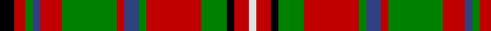

In pattern [KRGBRGRBGRGKRW](/patterns/krgbrgrbgrgkrw/).

This was sourced from weddslist.  It is a [14 stripes tartan](/stripes/stripes14/).

Original link http://www.weddslist.com/cgi-bin/tartans/pg.pl?source=sts

## Thread count
K/8 R6 G4 B4 R12 G30 R4 B8 G4 R30 G14 K4 R8 LN/4

## Palette
Each colour and its ΔE from the base-6 reference it is a variant of.

| Colour | Shade | Base | ΔE (OKLab) |
|---|---|---|---|
| B | <code style="background-color:#304080;">#304080</code> `#304080` | B <code style="background-color:#2A418A;">#2A418A</code> | 0.02 |
| G | <code style="background-color:#008000;">#008000</code> `#008000` | G <code style="background-color:#006100;">#006100</code> | 0.10 |
| K | <code style="background-color:#000000;">#000000</code> `#000000` | K <code style="background-color:#000000;">#000000</code> | 0.00 |
| LN | <code style="background-color:#E0E0E0;">#E0E0E0</code> `#E0E0E0` | W <code style="background-color:#F7F7F7;">#F7F7F7</code> | 0.07 |
| R | <code style="background-color:#C00000;">#C00000</code> `#C00000` | R <code style="background-color:#CC0000;">#CC0000</code> | 0.03 |

## Nearest tartans

The nearest existing variants by ΔTartan distance.

1. [Gayre (Clan)](/setts/s15/r20g4k4w4g16r4g16w4k4r6g4w4g3r6k4~g006818-k101010-rc80000-wc0c0c0~x2/) — ΔT 0.74
1. [MacKinnon #5](/setts/s14/k4r3g2b2r6g15r2b4g2r15g7k2r4w2~b2c4084-g005020-k101010-rdc0000-we0e0e0~x2/) — ΔT 0.77
1. [Gayre Bodyguard (Clan)](/setts/s15/r18g4k4w4g16b4g16w4k4r5g4w4g3r5k4~b1c1c50-g006818-k101010-rc80000-we0e0e0~x2/) — ΔT 0.85
1. [Maguire](/setts/s13/g18r18k3r3b3r3b4r3k9r4g18w6k3~b2c2c80-g006818-k101010-rc80000-wfcfcfc~x2/) — ΔT 0.87
1. [Highland Spring (1985)](/setts/s12/r16k2r9g12y2g10b3k2b3k2b3r10~b64a0f0-g3c7828-k000000-rc82800-yc88c00~x2/) — ΔT 0.88
1. [MacKinnon](/setts/s14/b2r3g2ba2r6g16r2ba4g2r16g8b2r4w2~b5a3094-ba000064-g004c00-rc80000-wd0d0d0/) — ΔT 0.89
1. [MacKinnon 5](/setts/s14/b2r3g2ba2r6g16r2ba4g2r16g8b2r4w2~b800080-ba304080-g008000-rc00000-we0e0e0~x2/) — ΔT 0.92
1. [MacKinnon #2](/setts/s14/b2r3g2ba2r6g16r2ba4g2r16g8b2r4w2~b3c82af-ba2c4084-g005020-rdc0000-we0e0e0~x2/) — ΔT 0.94
1. [MacKinnon 10](/setts/s14/b3r4g3ba3r7g17r3ba5g4r21g7b3r6w3~b800080-ba304080-g008000-rc00000-we0e0e0~x2/) — ΔT 0.98
1. [Nicolson](/setts/s13/b2r11g2r11g21r2k9ba2b11r11g2r11b2~b304080-ba5480b0-g008000-k000000-rc00000~x2/) — ΔT 0.99

## Neighbour map

Every grey dot is one of 15726 variants placed by the first two principal components of the ΔTartan feature space (44% of its variance). Red is this tartan; blue dots are its nearest — click one to open its page.

<svg viewBox="0 0 640 380" role="img" style="max-width:100%;height:auto;border:1px solid #e0e0e0;border-radius:4px;display:block" xmlns="http://www.w3.org/2000/svg"><image href="/nn/cloud.v1.png" width="640" height="380"/><a href="/setts/s15/r20g4k4w4g16r4g16w4k4r6g4w4g3r6k4~g006818-k101010-rc80000-wc0c0c0~x2/"><circle cx="149.3" cy="163.8" r="4" fill="#3465a4"><title>Gayre (Clan)</title></circle></a><a href="/setts/s14/k4r3g2b2r6g15r2b4g2r15g7k2r4w2~b2c4084-g005020-k101010-rdc0000-we0e0e0~x2/"><circle cx="191.3" cy="155.9" r="4" fill="#3465a4"><title>MacKinnon #5</title></circle></a><a href="/setts/s15/r18g4k4w4g16b4g16w4k4r5g4w4g3r5k4~b1c1c50-g006818-k101010-rc80000-we0e0e0~x2/"><circle cx="138.7" cy="165.6" r="4" fill="#3465a4"><title>Gayre Bodyguard (Clan)</title></circle></a><a href="/setts/s13/g18r18k3r3b3r3b4r3k9r4g18w6k3~b2c2c80-g006818-k101010-rc80000-wfcfcfc~x2/"><circle cx="128.1" cy="166.2" r="4" fill="#3465a4"><title>Maguire</title></circle></a><a href="/setts/s12/r16k2r9g12y2g10b3k2b3k2b3r10~b64a0f0-g3c7828-k000000-rc82800-yc88c00~x2/"><circle cx="193.2" cy="164.5" r="4" fill="#3465a4"><title>Highland Spring (1985)</title></circle></a><a href="/setts/s14/b2r3g2ba2r6g16r2ba4g2r16g8b2r4w2~b5a3094-ba000064-g004c00-rc80000-wd0d0d0/"><circle cx="213.2" cy="152.3" r="4" fill="#3465a4"><title>MacKinnon</title></circle></a><a href="/setts/s14/b2r3g2ba2r6g16r2ba4g2r16g8b2r4w2~b800080-ba304080-g008000-rc00000-we0e0e0~x2/"><circle cx="216.8" cy="152.0" r="4" fill="#3465a4"><title>MacKinnon 5</title></circle></a><a href="/setts/s14/b2r3g2ba2r6g16r2ba4g2r16g8b2r4w2~b3c82af-ba2c4084-g005020-rdc0000-we0e0e0~x2/"><circle cx="214.4" cy="150.2" r="4" fill="#3465a4"><title>MacKinnon #2</title></circle></a><a href="/setts/s14/b3r4g3ba3r7g17r3ba5g4r21g7b3r6w3~b800080-ba304080-g008000-rc00000-we0e0e0~x2/"><circle cx="209.4" cy="162.1" r="4" fill="#3465a4"><title>MacKinnon 10</title></circle></a><a href="/setts/s13/b2r11g2r11g21r2k9ba2b11r11g2r11b2~b304080-ba5480b0-g008000-k000000-rc00000~x2/"><circle cx="199.7" cy="153.9" r="4" fill="#3465a4"><title>Nicolson</title></circle></a><circle cx="176.4" cy="152.9" r="5" fill="#c00000"/></svg>

ID: /setts/s14/k4r3g2b2r6g15r2b4g2r15g7k2r4w2~b304080-g008000-k000000-rc00000-we0e0e0~x2/
